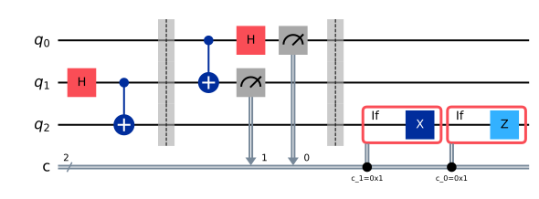

# Chapter 7. Multiple Qubits and Entanglement

> **Status:** prereviewed · **Phase:** 1 · **Sections drafted:** 14 / 14

[← Previous: Chapter 6](06-the-qubit.md) · [Table of Contents](../../README.md) · [Next: Chapter 8 →](../part-04-gates-and-circuits/08-quantum-gates.md)

Chapter 6 introduced one qubit. Most of the interesting physics — and all of the *scalable* computational advantage we care about — lives in systems of many qubits, where the state space grows exponentially and where states can exhibit correlations that no local classical model reproduces (§7.9 makes this precise). This chapter builds that machinery: the tensor product, product vs. entangled states, the Bell zoo, the EPR/Bell argument that quantum correlations cannot be reproduced by any local hidden-variable model, the Schmidt decomposition, partial traces, and entanglement as a resource that powers teleportation, superdense coding, and quantum cryptography.

> **How to read this chapter.** If you skipped Chapter 5, the postulate of composite systems (§5.5) and the partial trace (§5.12) are the operational prerequisites. Sections 7.1–7.5 are mandatory; §7.9 (Bell inequalities) and §7.10 (Schmidt) can be skimmed on a first pass and revisited when you reach the algorithms in Part 6.

## 7.1 Tensor-Product State Construction

A single qubit lives in $\mathcal{H} = \mathbb{C}^2$. Two qubits live in $\mathcal{H}_A \otimes \mathcal{H}_B = \mathbb{C}^2 \otimes \mathbb{C}^2 = \mathbb{C}^4$. The tensor product $\otimes$ is the algebraic operation that combines the state spaces of independent subsystems into the state space of the joint system. It is bilinear and associative, but — crucially — not every vector in $\mathcal{H}_A \otimes \mathcal{H}_B$ is of the form $|\psi\rangle_A \otimes |\phi\rangle_B$. That asymmetry is the mathematical seed of entanglement.

Concretely, given $|a\rangle = \alpha_0 |0\rangle + \alpha_1 |1\rangle$ and $|b\rangle = \beta_0 |0\rangle + \beta_1 |1\rangle$, the tensor product is

$$
|a\rangle \otimes |b\rangle \;=\; \alpha_0 \beta_0 |00\rangle + \alpha_0 \beta_1 |01\rangle + \alpha_1 \beta_0 |10\rangle + \alpha_1 \beta_1 |11\rangle.
$$

Notational shorthands: $|a\rangle \otimes |b\rangle = |a\rangle|b\rangle = |ab\rangle$, and for basis states $|0\rangle \otimes |1\rangle = |01\rangle$. The convention used throughout this book is that the leftmost ket is the most-significant, *first* qubit — $x_1$ in the book's $x_1 \ldots x_n$ labeling (§4.2) — matching the bit-string ordering: $|01\rangle$ means the first qubit is in $|0\rangle$, the second in $|1\rangle$. (Heads-up on labels: Qiskit numbers qubits from the *least*-significant end, so Qiskit's qubit 0 is this book's rightmost, last qubit — see §4.2, §4.8, and Appendix A before comparing with code.)

For matrices and operators acting on the joint space, the tensor product is the Kronecker product. If $A$ acts on $\mathcal{H}_A$ and $B$ acts on $\mathcal{H}_B$, then $A \otimes B$ acts on $\mathcal{H}_A \otimes \mathcal{H}_B$ by

$$
(A \otimes B)(|a\rangle \otimes |b\rangle) \;=\; (A|a\rangle) \otimes (B|b\rangle),
$$

extended by linearity. The matrix form, in the basis $\\{|00\rangle, |01\rangle, |10\rangle, |11\rangle\\}$, is the block matrix obtained by replacing each entry $A_{ij}$ with the block $A_{ij} B$.

## 7.2 Multi-Qubit Dimensionality

An $n$-qubit system lives in $(\mathbb{C}^2)^{\otimes n} = \mathbb{C}^{2^n}$. The computational basis has $2^n$ elements, labeled by bit strings $|x_1 x_2 \cdots x_n\rangle$ with $x_i \in \\{0,1\\}$. A general pure state is therefore

$$
|\psi\rangle \;=\; \sum_{x \in \\{0,1\\}^n} \alpha_x |x\rangle, \qquad \sum_x |\alpha_x|^2 = 1,
$$

specified by $2^n$ complex amplitudes (minus one for the normalization constraint and one for the irrelevant global phase, leaving $2 \cdot 2^n - 2$ real parameters). For $n = 300$, this is more amplitudes than there are atoms in the observable universe. This exponential scaling is what makes classical simulation of quantum systems hard, and it is the resource quantum algorithms try to exploit.

Two warnings about this exponential. First, it does not mean a quantum computer "tries all answers at once" — that slogan misleads more than it teaches, because measurement collapses the superposition to a single bit string. Quantum algorithms work by arranging interference so that the right answer becomes likely to be observed. Second, the exponential is in the dimension of state space, not in the number of meaningfully distinguishable states one can prepare in practice; noise and decoherence severely limit what an actual device can hold.

## 7.3 Product States

A state $|\psi\rangle \in \mathcal{H}_A \otimes \mathcal{H}_B$ is a **product state** (also called **separable** in the pure-state setting) if it can be written as

$$
|\psi\rangle \;=\; |\phi\rangle_A \otimes |\chi\rangle_B
$$

for some $|\phi\rangle_A \in \mathcal{H}_A$ and $|\chi\rangle_B \in \mathcal{H}_B$. For multipartite systems, the definition generalizes factor by factor: $|\psi\rangle = |\phi_1\rangle \otimes |\phi_2\rangle \otimes \cdots \otimes |\phi_n\rangle$.

Product states are the "boring" states from the standpoint of quantum information: the subsystems are independent. Measuring one tells you nothing about the others, and the joint description carries no more information than the list of single-qubit descriptions. Crucially, $n$ qubits in a product state require only $O(n)$ real parameters to specify — not $2^n$. Whenever a quantum system stays in product form under known local evolution, classical simulation is tractable ("close to" product needs an explicit error guarantee before the same conclusion holds — Chapter 24).

A quick test: if $|\psi\rangle = \alpha_{00}|00\rangle + \alpha_{01}|01\rangle + \alpha_{10}|10\rangle + \alpha_{11}|11\rangle$ is a product state, then $\alpha_{00} \alpha_{11} = \alpha_{01} \alpha_{10}$ (cross-ratio condition). This is the determinant of the $2\times 2$ matrix of amplitudes; in §7.10 we will recognize it as the statement that the matrix has rank one.

## 7.4 Entangled States

A pure state that is **not** a product state is **entangled**. The canonical first example is

$$
|\Phi^+\rangle \;=\; \frac{1}{\sqrt{2}}\bigl(|00\rangle + |11\rangle\bigr).
$$

Try to factor it as $(\alpha|0\rangle + \beta|1\rangle) \otimes (\gamma|0\rangle + \delta|1\rangle)$. Expanding gives $\alpha\gamma|00\rangle + \alpha\delta|01\rangle + \beta\gamma|10\rangle + \beta\delta|11\rangle$, so we need $\alpha\delta = \beta\gamma = 0$ but $\alpha\gamma = \beta\delta = 1/\sqrt{2}$. The first conditions force at least one of $\alpha,\delta$ and at least one of $\beta,\gamma$ to be zero, which contradicts the second. No factorization exists. The state is entangled.

Entanglement is a property of the joint state, not of either subsystem in isolation, and it is preserved under local unitaries: applying $U_A \otimes U_B$ to an entangled state yields another entangled state. What entanglement makes possible is correlations that — for suitable measurement choices — exceed anything a local classical model can produce, in the precise sense made operational by Bell's theorem (§7.9). (For many other measurement sets, and for many entangled mixed states, the observed statistics remain classically reproducible; entanglement is the enabling resource, not a guarantee of visible nonclassicality.) It is also what most quantum algorithms that achieve a speedup rely on: a pure-state computation that stays unentangled can be simulated classically in $O(n)$ space, and growing multipartite entanglement is *necessary* for any exponential speedup in the pure-state setting (Jozsa–Linden 2003). Entanglement is not the whole story, though — certain mixed-state
models (such as one-clean-qubit / DQC1) are believed hard to
simulate classically while generating little entanglement by
standard bipartite measures, evidence that entanglement alone is
not the full accounting (the DQC1 advantage itself is conjectural,
not proven).

## 7.5 Bell States

The **Bell states** are the four maximally entangled two-qubit states

$$
\begin{aligned}
|\Phi^+\rangle &\;=\; \tfrac{1}{\sqrt{2}}\bigl(|00\rangle + |11\rangle\bigr), \\\\
|\Phi^-\rangle &\;=\; \tfrac{1}{\sqrt{2}}\bigl(|00\rangle - |11\rangle\bigr), \\\\
|\Psi^+\rangle &\;=\; \tfrac{1}{\sqrt{2}}\bigl(|01\rangle + |10\rangle\bigr), \\\\
|\Psi^-\rangle &\;=\; \tfrac{1}{\sqrt{2}}\bigl(|01\rangle - |10\rangle\bigr).
\end{aligned}
$$

They form an orthonormal basis of $\mathbb{C}^2 \otimes \mathbb{C}^2$ — the **Bell basis** — and any two-qubit state can be expanded in it. They are produced by the canonical circuit

$$
|0\rangle|0\rangle \;\xrightarrow{H \otimes I}\; \tfrac{1}{\sqrt{2}}(|0\rangle+|1\rangle)|0\rangle \;\xrightarrow{\mathrm{CNOT}}\; |\Phi^+\rangle,
$$

applying $H$ to the first qubit and then CNOT with first qubit as control. The other three Bell states come from the same circuit exactly: $|01\rangle \mapsto |\Psi^+\rangle$, $|10\rangle \mapsto |\Phi^-\rangle$, and $|11\rangle \mapsto |\Psi^-\rangle$ (note the order — the $H$ acts on the first qubit, so flipping the *second* input bit toggles $\Phi \leftrightarrow \Psi$ and flipping the first toggles the sign). The singlet $|\Psi^-\rangle$ has the additional symmetry of being antisymmetric under qubit exchange and rotationally invariant: $(U \otimes U)|\Psi^-\rangle = |\Psi^-\rangle$ (up to a global phase) for every single-qubit unitary $U$.

## 7.6 GHZ and W States

Genuine multipartite entanglement comes in inequivalent flavors. For three qubits, two paradigmatic classes are

$$
|\mathrm{GHZ}\rangle \;=\; \frac{1}{\sqrt{2}}\bigl(|000\rangle + |111\rangle\bigr), \qquad |W\rangle \;=\; \frac{1}{\sqrt{3}}\bigl(|001\rangle + |010\rangle + |100\rangle\bigr).
$$

They cannot be converted into one another by local operations and classical communication (LOCC) — they sit in different SLOCC (stochastic LOCC — LOCC allowed to succeed
only with some probability) classes — and they behave very differently under loss. If you trace out one qubit of $|\mathrm{GHZ}\rangle$, the remaining two are in a classical mixture of $|00\rangle$ and $|11\rangle$ with no remaining entanglement. If you trace out one qubit of $|W\rangle$, the remaining two are still entangled. GHZ is "fragile" and used in extremal tests of nonlocality (Greenberger-Horne-Zeilinger contradiction); W is "robust" and useful as a memory state for distributed protocols.

The GHZ state generalizes to $n$ qubits as $(|0^n\rangle + |1^n\rangle)/\sqrt{2}$; the W state as the uniform superposition over single-excitation strings. Preparing GHZ on $n$ qubits requires only one $H$ and $n{-}1$ CNOTs; preparing W requires a more involved staircase circuit.

## 7.7 EPR Intuition

In 1935, Einstein, Podolsky, and Rosen argued that quantum mechanics is incomplete by exhibiting two-particle states with perfectly correlated measurement outcomes that — in their reading — implied either action at a distance or hidden variables determining the outcomes locally. Their argument used position-momentum correlations of a continuous system; Bohm reformulated it for the spin singlet $|\Psi^-\rangle$, which is the version most relevant here.

The intuition: if Alice and Bob each hold one qubit of $|\Psi^-\rangle$ and both measure in the computational basis, their outcomes are perfectly anticorrelated — every time Alice gets $0$, Bob gets $1$, and vice versa. The same holds in any basis $\\{|\psi\rangle, |\psi^{\perp}\rangle\\}$: measure in the same basis, get opposite results with probability one. Classically, the cleanest explanation is that the qubits carry pre-determined labels and the measurement just reveals them. Bell showed this explanation cannot reproduce all the quantum predictions.

## 7.8 Quantum vs. Classical Correlations

Before stating Bell's inequality, it helps to see what classical correlations can and cannot do. A classical correlated source distributes pairs $(a, b)$ drawn from some joint distribution $P(a, b)$ over labels. Each party, on receiving its label, can apply any (possibly randomized) function $f_A(a, s)$, $f_B(b, t)$ to produce an outcome, where $s, t$ are local random bits. The set of joint outcome distributions reachable this way is the **local-hidden-variable (LHV) polytope**.

Quantum correlations from a shared entangled state can sit outside this polytope. The empirical signature is that certain linear combinations of correlation functions exceed the bound that any LHV model can achieve. The next section turns that observation into a sharp inequality.

## 7.9 Bell Inequalities

The simplest and most-tested form is the **CHSH inequality**. Alice chooses one of two measurement settings $A_0, A_1$ with outcomes $\pm 1$; Bob chooses one of two settings $B_0, B_1$ with outcomes $\pm 1$. Define the CHSH statistic (in the quantum case it is the expectation of the CHSH *operator* $\mathcal{B} = A_0 \otimes (B_0 + B_1) + A_1 \otimes (B_0 - B_1)$, with the four local observables measured on separated subsystems)

$$
S \;=\; \langle A_0 B_0 \rangle + \langle A_0 B_1 \rangle + \langle A_1 B_0 \rangle - \langle A_1 B_1 \rangle,
$$

where $\langle X Y\rangle = E[XY]$ is the expectation of the product of outcomes. (The minus sign sits on the $A_1 B_1$ term by convention; permuting which of the four correlators is subtracted only changes the sign or labeling of $S$, not the bounds below.)

**Classical bound.** For any local hidden-variable model, $|S| \leq 2$. The proof is one line: for any fixed values $a_0, a_1, b_0, b_1 \in \\{-1,+1\\}$, the algebraic identity $a_0 b_0 + a_0 b_1 + a_1 b_0 - a_1 b_1 = a_0(b_0+b_1) + a_1(b_0-b_1)$ has magnitude at most $2$, since one of $b_0 \pm b_1$ is $0$ and the other is $\pm 2$. Averaging over any joint distribution preserves the bound.

**Quantum bound (Tsirelson).** For quantum states and observables with eigenvalues in $[-1, 1]$,

$$
|S| \;\leq\; 2\sqrt{2}.
$$

It is saturated by the singlet $|\Psi^-\rangle$ with the right measurement angles: take Alice's settings $A_0 = Z$, $A_1 = X$, and Bob's $B_0 = -(Z+X)/\sqrt{2}$, $B_1 = -(Z-X)/\sqrt{2}$. On the singlet $\langle(\hat a\cdot\vec\sigma)\otimes(\hat b\cdot\vec\sigma)\rangle = -\hat a\cdot\hat b$, so with these settings each of $\langle A_0 B_0\rangle, \langle A_0 B_1\rangle, \langle A_1 B_0\rangle$ equals $+\tfrac{1}{\sqrt 2}$ and $\langle A_1 B_1\rangle = -\tfrac{1}{\sqrt 2}$, giving $S = 2\sqrt 2$. (The overall sign of $S$ is conventional — dropping the minus signs on Bob's settings flips it to $-2\sqrt 2$ — but $|S| = 2\sqrt 2$ either way.)

The experimental verdict — from Aspect's experiments in the 1980s through the loophole-free tests of 2015 — is that nature violates the classical bound. Local hidden variables — granted the locality, freedom-of-choice, and fair-sampling assumptions the experiments test (§3.8 and the Prelude spell out the fine print) — are ruled out as a model of physical reality. Quantum mechanics correctly predicts the observed values up to the Tsirelson bound.

A separate fact, often confused with Bell-inequality violation, is that this correlation **cannot be used to signal**. Alice's marginal distribution is independent of Bob's choice of setting; the violation is visible only when the two sides compare records and compute the correlator. No information travels faster than light.

## 7.10 Schmidt Decomposition

For any bipartite pure state $|\psi\rangle_{AB} \in \mathcal{H}_A \otimes \mathcal{H}_B$, there exist orthonormal sets $\\{|u_i\rangle\\} \subset \mathcal{H}_A$ and $\\{|v_i\rangle\\} \subset \mathcal{H}_B$ and non-negative real numbers $\lambda_i$ with $\sum_i \lambda_i^2 = 1$ such that

$$
|\psi\rangle_{AB} \;=\; \sum_{i=1}^{r} \lambda_i |u_i\rangle_A \otimes |v_i\rangle_B.
$$

The number $r$ of nonzero $\lambda_i$ is the **Schmidt rank**; the $\lambda_i$ are the **Schmidt coefficients**. The decomposition is unique up to paired phase choices on the Schmidt vectors — with correlated unitary freedom inside degenerate coefficient subspaces and arbitrary basis completion on zero coefficients — with rank bounded by $r \le \min(\dim \mathcal{H}_A, \dim \mathcal{H}_B)$; it follows from the singular value decomposition of the amplitude matrix $C$ defined by $|\psi\rangle = \sum_{jk} C_{jk} |j\rangle_A |k\rangle_B$.

Two consequences are worth memorizing. **First**: a pure bipartite state is a product state iff its Schmidt rank is $1$. The cross-ratio condition from §7.3 ($\alpha_{00}\alpha_{11} = \alpha_{01}\alpha_{10}$) is exactly the rank-one condition on $C$. **Second**: the reduced density matrices on $A$ and $B$ have the same nonzero spectrum, $\\{\lambda_i^2\\}$. So a state is maximally entangled (uniform Schmidt coefficients $\lambda_i = 1/\sqrt{d}$, with $d = \min(d_A, d_B)$) iff the smaller subsystem's reduced state is the maximally mixed $I/d$ (the larger subsystem's marginal is maximally mixed on the $d$-dimensional Schmidt support).

The Schmidt rank is invariant under local unitaries: $U_A \otimes U_B$ cannot increase or decrease it. So the rank itself, and more generally the multiset of Schmidt coefficients, is an entanglement invariant for pure bipartite states.

## 7.11 Reduced States and Partial Trace

The partial trace (defined in §5.12) turns a joint state $\rho_{AB}$ into the reduced state $\rho_A = \mathrm{Tr}_B(\rho_{AB})$ that correctly predicts every outcome of any measurement performed on $A$ alone. For a pure bipartite state with Schmidt decomposition as above,

$$
\rho_A \;=\; \mathrm{Tr}_B\bigl(|\psi\rangle\langle \psi|_{AB}\bigr) \;=\; \sum_i \lambda_i^2 |u_i\rangle\langle u_i|,
$$

and analogously for $\rho_B$. In particular, for the Bell state $|\Phi^+\rangle$ the reduced state on either qubit is

$$
\rho_A \;=\; \tfrac{1}{2}\bigl(|0\rangle\langle 0| + |1\rangle\langle 1|\bigr) \;=\; \tfrac{I}{2}.
$$

This is the maximally mixed single-qubit state. From Alice's local perspective, her qubit's readout looks like a fair coin: every orthonormal-basis measurement gives uniform outcome statistics (a biased POVM need not). All the structure that distinguishes $|\Phi^+\rangle$ from other states with the same marginal lives in the correlations with Bob's qubit, which Alice cannot access without communication. This is also why entanglement does not allow signaling: local marginals are insensitive to any operation on the other side whose outcome is not communicated — conditioning on a communicated outcome does, of course, change the conditional description.

## 7.12 Entanglement as a Resource

Entanglement is consumed and produced by protocols. Three canonical examples:

**Teleportation.** Alice and Bob share one Bell pair. Alice has an unknown qubit $|\psi\rangle$ she wants to send to Bob. She performs a Bell-basis measurement on her unknown qubit together with her half of the shared pair, getting two classical bits as outcome. She sends those bits over a classical channel. Bob applies one of four single-qubit corrections, indexed by Alice's two bits $(m_1 m_2)$: $00 \to I$, $01 \to X$, $10 \to Z$, $11 \to ZX$ (apply $X$ first, then $Z$, so the composite operator is $Z \cdot X$, read right to left), and now holds $|\psi\rangle$. No qubit traveled; one ebit (one maximally entangled pair — the unit
of entanglement) and two classical bits were consumed.

**Superdense coding.** Reverse roles: Alice and Bob share one Bell pair. Alice applies one of four local operations ($I$, $X$, $Z$, $ZX$, using the same operator order as the teleportation corrections above) to her half, depending on a two-bit message, and sends the qubit to Bob. Bob measures both qubits in the Bell basis and recovers the two bits. One qubit transmission, aided by one ebit, carries two classical bits.

**Entanglement-based key distribution (Ekert).** Alice and Bob share many Bell pairs. They measure each pair in randomly chosen bases and use a subset of outcomes to estimate the CHSH value $S$. A measured $S$ close to $2\sqrt{2}$ bounds how much any eavesdropper can know about the remaining outcomes; turning that bound into a secret key takes error reconciliation, privacy amplification, and a finite-statistics security analysis (Chapter 27 — device-independent variants make the CHSH test itself the security anchor). An eavesdropper's interaction shows up as a reduced $S$.

The unifying message: an ebit (one maximally entangled pair) is a quantifiable resource, and the canonical bipartite communication protocols can be analyzed as conversions among ebits, qubits, and classical bits.

## 7.13 Entanglement Measures

For pure bipartite states, there is essentially one good measure: the **entropy of entanglement**,

$$
E(|\psi\rangle_{AB}) \;=\; S(\rho_A) \;=\; -\sum_i \lambda_i^2 \log_2 \lambda_i^2,
$$

where $S$ is the von Neumann entropy and the $\lambda_i$ are the Schmidt coefficients. It is zero on product states, $\log_2 d$ on a maximally entangled state of two $d$-dimensional systems (so $1$ on a Bell pair, in units of ebits), and monotone non-increasing under LOCC (on
average — individual measurement branches can fluctuate upward). Operationally, $E$ equals both the asymptotic rate at which Bell pairs can be distilled from copies of $|\psi\rangle$ and the rate at which Bell pairs are required to prepare them — pure-state entanglement is reversible in the asymptotic limit.

Mixed-state entanglement is much subtler. The natural definition — **entanglement of formation** — is the minimum average pure-state entanglement over all decompositions $\rho = \sum_i p_i |\psi_i\rangle\langle \psi_i|$. Distinct from this is the **distillable entanglement**, the maximum rate at which Bell pairs can be extracted by LOCC. The two are equal for pure states (and equal to $E(|\psi\rangle)$), but they differ in general, and there exist **bound entangled** states with positive entanglement of formation but zero distillable entanglement. A practical computable proxy for bipartite mixed states is the **negativity** $\mathcal{N}(\rho) = (\\|\rho^{T_B}\\|_1 - 1)/2$, where $T_B$ is the partial transpose; nonzero negativity is sufficient but not necessary for entanglement.

For multipartite states, no single measure plays the role $E$ plays in the bipartite case: there are inequivalent classes of entanglement (GHZ vs. W, §7.6) and a proliferation of incomparable measures. In practice, you choose the measure that matches the resource you actually care about — distillable Bell pairs, fidelity of a target state, or violation of a particular Bell inequality.

## 7.14 Bridge to Chapter 8

Chapters 5–7 give the static picture: states of one or many qubits, what counts as a state, and how composite states can be entangled. Chapter 8 turns to dynamics: which unitaries can we apply, what is a universal gate set, and how do we decompose an arbitrary $n$-qubit unitary into single- and two-qubit pieces? The Bell-state preparation circuit at the end of §7.5 is already a small instance of that program; from here on, circuits are the central object.

**Sanity checks before moving on.**

1. Verify that $|\Phi^+\rangle, |\Phi^-\rangle, |\Psi^+\rangle, |\Psi^-\rangle$ are mutually orthogonal and normalized.
2. Show that applying $H \otimes I$ followed by CNOT (control on the first qubit) to each of $|00\rangle, |01\rangle, |10\rangle, |11\rangle$ produces the four Bell states (up to sign).
3. Compute the reduced state of the first qubit of the GHZ state and confirm it is $I/2$.
4. For $|\psi\rangle = \tfrac{1}{2}(|00\rangle + |01\rangle + |10\rangle + |11\rangle)$, find a single-qubit factorization and conclude $|\psi\rangle$ is a product state.
5. Verify the Tsirelson saturation: with $A_0 = Z$, $A_1 = X$ on the singlet and the Bob settings in §7.9, compute each correlator $\langle A_i B_j\rangle$ explicitly.

---

[← Previous: Chapter 6](06-the-qubit.md) · [Table of Contents](../../README.md) · [Next: Chapter 8 →](../part-04-gates-and-circuits/08-quantum-gates.md)
