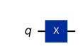
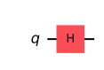
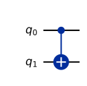
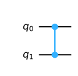
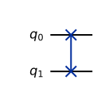
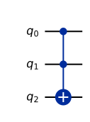

# Chapter 8. Quantum Gates

> **Status:** draft · **Phase:** 2 · **Sections drafted:** 14 / 14

[← Previous: Chapter 7](../part-03-qubits/07-multiple-qubits-and-entanglement.md) · [Table of Contents](../../README.md) · [Next: Chapter 9 →](09-quantum-circuits.md)

Chapters 5–7 fixed the static picture: states, composite systems, entanglement. This chapter introduces the dynamics that a quantum computer can actually realise. Gates are unitaries acting on one or two qubits at a time; circuits are sequences of gates; and the questions of practical interest are which gates one can implement on a given device, which finite sets of gates are universal, and how to compile an arbitrary unitary down to those primitives. The chapter is heavy on matrices — open Appendix B alongside it for the gate cheat sheet.

> **How to read this chapter.** §§8.1–8.6 are mandatory; everything later assumes them. §§8.9–8.11 (universality, Clifford+T, Solovay–Kitaev) are essential before reading Part 8 on quantum error correction but can be deferred on a first algorithmic pass. §§8.12–8.14 (native gates, parameterised gates, synthesis) become important once you start running circuits on real hardware (Part 9) or designing variational algorithms (Part 6).

## 8.1 Reversibility and Unitary Evolution

Postulate 2 (§5.2) says that closed-system evolution is unitary: $|\psi'\rangle = U|\psi\rangle$ with $U^{\dagger}U = U U^{\dagger} = I$. Unitarity is a strong constraint, and the quantum-computing model takes it as the definition of a gate: a quantum gate on $n$ qubits is any element of the unitary group $\mathrm{U}(2^n)$.

Three consequences are worth saying explicitly. **Reversibility**: every gate has an inverse, namely $U^{\dagger}$, which is also a valid gate. There is no quantum analogue of the classical AND or OR gate, both of which lose bits; the quantum versions must be made reversible by adding output wires (as Toffoli does for AND). **Norm preservation**: $\\|U|\psi\rangle\\| = \\||\psi\rangle\\|$, so states remain unit-norm under any sequence of gates. **Linearity**: $U(\alpha|\psi_1\rangle + \beta|\psi_2\rangle) = \alpha U|\psi_1\rangle + \beta U|\psi_2\rangle$ — a gate acts on every basis component of a superposition at once. This linear action is *not* a computational speedup by itself; useful advantage requires arranging interference (§10.2, §13.1), not merely touching every component.

A useful operator identity: if $H$ is Hermitian ($H = H^{\dagger}$), then $U = e^{-iHt}$ is unitary for any real $t$. So gates can always be exhibited as exponentials of Hermitian generators; the generator $H$ is the *Hamiltonian* one would engineer in hardware to realise the gate over time $t$.

## 8.2 Pauli Gates

The single-qubit Pauli matrices are

$$
X = \begin{pmatrix} 0 & 1 \\\\ 1 & 0 \end{pmatrix}, \qquad Y = \begin{pmatrix} 0 & -i \\\\ i & 0 \end{pmatrix}, \qquad Z = \begin{pmatrix} 1 & 0 \\\\ 0 & -1 \end{pmatrix}.
$$

Each is Hermitian and unitary, with $X^2 = Y^2 = Z^2 = I$, and they anticommute in pairs: $\\{X, Y\\} = \\{Y, Z\\} = \\{Z, X\\} = 0$. They span the traceless Hermitian $2\times 2$ matrices, so every single-qubit Hamiltonian is a real linear combination $H = h_0 I + \vec h \cdot \vec\sigma$ and every single-qubit unitary is of the form $e^{-i\alpha} R_{\hat n}(\theta)$ for some axis $\hat n$ and angle $\theta$ (§8.5).

Operationally: $X$ is the "quantum NOT" — it swaps $|0\rangle \leftrightarrow |1\rangle$. $Z$ is the "phase flip" — it flips the sign of $|1\rangle$ and leaves $|0\rangle$ alone. $Y = iXZ$ does both. In the Bloch picture (§6.8), each Pauli implements a $\pi$ rotation about the corresponding axis. Pauli operators also generate the Pauli group, which is the backbone of stabiliser formalism (Part 8) and of error-correction code construction.

## 8.3 Hadamard Gate

The Hadamard gate is

$$
H = \frac{1}{\sqrt{2}}\begin{pmatrix} 1 & 1 \\\\ 1 & -1 \end{pmatrix}.
$$

It maps the computational basis to the Hadamard basis:

$$
H|0\rangle = \tfrac{1}{\sqrt 2}(|0\rangle + |1\rangle) = |+\rangle, \qquad H|1\rangle = \tfrac{1}{\sqrt 2}(|0\rangle - |1\rangle) = |-\rangle,
$$

and back: $H|+\rangle = |0\rangle$, $H|-\rangle = |1\rangle$. So $H^2 = I$, and $H$ is its own inverse. It is the single most important single-qubit gate in algorithms: $H^{\otimes n}|0^n\rangle$ is the uniform superposition over all $2^n$ bit strings, which is where Deutsch–Jozsa, Grover, Shor's order-finding subroutine, and the whole "quantum parallelism" picture begin.

$H$ is also the change-of-basis matrix between the $Z$ eigenbasis and the $X$ eigenbasis. Concretely, $HXH = Z$ and $HZH = X$. Two distinct uses of this identity are worth separating. As an *operator* conjugation it is symmetric — $HXH = Z$ has an $H$ on each side. As a *measurement* procedure it is not: to measure the observable $X$ you apply a single $H$ and then read out in the computational ($Z$) basis, because $H$ rotates the $X$-eigenbasis onto the $Z$-eigenbasis. There is no second $H$ — the measurement consumes the rotated state, so only the one basis-change gate before readout is needed (the two $\pm 1$ outcomes are then read as the $X$-eigenvalues, which is bookkeeping, not a gate). This "$X$ via $H$ then $Z$" pattern is used constantly when compiling Pauli-basis measurements (§11.7).

## 8.4 S, T, and Phase Gates

Both $S$ (the **phase gate**) and $T$ (sometimes called the $\pi/8$ gate) are diagonal:

$$
S = \begin{pmatrix} 1 & 0 \\\\ 0 & i \end{pmatrix} = \sqrt{Z}, \qquad T = \begin{pmatrix} 1 & 0 \\\\ 0 & e^{i\pi/4} \end{pmatrix} = \sqrt[4]{Z}.
$$

In words: $S$ adds a $\pi/2$ phase to the $|1\rangle$ amplitude; $T$ adds a $\pi/4$ phase. The more general phase gate is $P(\varphi) = \mathrm{diag}(1, e^{i\varphi})$; $S = P(\pi/2)$ and $T = P(\pi/4)$.

$S$ and $T$ matter because, together with $H$ and CNOT, $T$ promotes the Clifford group (which is classically simulable, §8.10) to a universal set. The $T$ gate is also the dominant cost in fault-tolerant compilations: in most surface-code schemes, Clifford gates are nearly free but every $T$ gate consumes a magic state. Reducing T-count is a major preoccupation of compilation research (§8.14, Chapter 23).

## 8.5 Rotation Gates

The single-qubit rotation gates about the $X$, $Y$, $Z$ axes are

$$
R_X(\theta) = e^{-i\theta X/2}, \qquad R_Y(\theta) = e^{-i\theta Y/2}, \qquad R_Z(\theta) = e^{-i\theta Z/2}.
$$

Expanding the exponentials gives the explicit matrices

$$
R_X(\theta) = \begin{pmatrix} \cos\tfrac{\theta}{2} & -i\sin\tfrac{\theta}{2} \\\\ -i\sin\tfrac{\theta}{2} & \cos\tfrac{\theta}{2} \end{pmatrix}, \qquad R_Z(\theta) = \begin{pmatrix} e^{-i\theta/2} & 0 \\\\ 0 & e^{i\theta/2} \end{pmatrix}.
$$

The half-angle is the same half-angle from the Bloch parametrisation (§6.8) — Bloch-sphere rotations are $2\pi$-periodic, but the underlying unitary picks up a sign and is only $4\pi$-periodic, hence the factor of two.

Any single-qubit unitary can be decomposed as $U = e^{i\alpha} R_Z(\beta) R_Y(\gamma) R_Z(\delta)$ (the *Z–Y–Z decomposition*) for some real $\alpha, \beta, \gamma, \delta$, or equivalently $R_Z(\beta) R_X(\gamma) R_Z(\delta)$. Many hardware platforms expose continuous-angle $R_X$ and $R_Z$ as native gates; the compiler's job is to express user-level unitaries in terms of those (§8.12, §8.14).

## 8.6 Two-Qubit Gates

The single most useful two-qubit gate is **CNOT** (controlled-NOT), with matrix in the $|00\rangle, |01\rangle, |10\rangle, |11\rangle$ basis

$$
\mathrm{CNOT} = \begin{pmatrix} 1 & 0 & 0 & 0 \\\\ 0 & 1 & 0 & 0 \\\\ 0 & 0 & 0 & 1 \\\\ 0 & 0 & 1 & 0 \end{pmatrix}.
$$

It flips the target qubit (the second one, by convention here) iff the control qubit is $|1\rangle$. Combined with $H$, it generates the Bell states (§7.5).

Closely related are **CZ** (controlled-Z), which adds a minus sign to $|11\rangle$ and is symmetric in the two qubits; **SWAP**, which exchanges the two qubits; and **iSWAP** and **$\sqrt{\mathrm{SWAP}}$**, which are convenient native gates on some superconducting architectures. Useful identities to memorise:

$$
\mathrm{CZ} = (I \otimes H)\\,\mathrm{CNOT}\\,(I \otimes H), \qquad \mathrm{SWAP} = \mathrm{CNOT}_{12}\\,\mathrm{CNOT}_{21}\\,\mathrm{CNOT}_{12},
$$

so on a device that only offers CNOTs you can synthesise CZ and SWAP, at the cost of one or three CNOTs respectively.

Two-qubit gates are the *expensive* resource on hardware: they are slower, noisier, and require careful calibration. Most of the optimisation effort in a compiler is about minimising the two-qubit gate count and routing them around limited connectivity (§8.14, Chapter 23).

## 8.7 Controlled and Multi-Controlled Gates

For any single-qubit unitary $U$, the controlled version $\mathrm{C}(U)$ acts on two qubits as

$$
\mathrm{C}(U)|0\rangle|\psi\rangle = |0\rangle|\psi\rangle, \qquad \mathrm{C}(U)|1\rangle|\psi\rangle = |1\rangle U|\psi\rangle.
$$

CNOT is $\mathrm{C}(X)$; CZ is $\mathrm{C}(Z)$; controlled phase gates $\mathrm{C}P(\varphi)$ are central in the quantum Fourier transform (Chapter 14).

Multi-controlled gates extend the same idea: $\mathrm{C}^k(U)$ applies $U$ to the target iff all $k$ controls are in $|1\rangle$. The three-qubit case $\mathrm{C}^2(X) = $ Toffoli is universal for classical reversible computation. The cost of $\mathrm{C}^k(U)$ depends on whether spare ancilla qubits are available, and the canonical decompositions all trace back to Barenco et al. (1995): with one clean ancilla a $k$-controlled-NOT decomposes into $O(k)$ Toffolis; with a single dirty (borrowed, arbitrarily initialised) ancilla it is still $O(k)$ elementary gates; and ancilla-free constructions cost $O(k^2)$ gates. The $O(k)$-Toffoli figure quoted here is the representative case with a clean ancilla. The cost growth with $k$ is one of the constant headaches of circuit synthesis; ancilla qubits, when available, buy substantial savings.

> Barenco, Bennett, Cleve, DiVincenzo, Margolus, Shor, Sleator, Smolin, Weinfurter, "Elementary gates for quantum computation," *Phys. Rev. A* **52**, 3457 (1995), arXiv:quant-ph/9503016.

## 8.8 Toffoli and Fredkin Gates

**Toffoli** ($\mathrm{CCX}$) flips the target iff both controls are $|1\rangle$. It is universal for classical reversible computation, which means any classical circuit can be lifted into a quantum circuit using only Toffolis — at the cost of additional ancilla qubits to absorb the irreversible information.

**Fredkin** ($\mathrm{CSWAP}$) swaps two target qubits conditioned on a control. It is also classically universal and is the natural primitive when the underlying classical operation is a permutation. Both Toffoli and Fredkin can be decomposed into Clifford + T circuits: the standard Toffoli decomposition uses six CNOTs, seven $T$ / $T^{\dagger}$ gates, and two $H$ gates. Reducing the $T$-cost of Toffoli (and of long Toffoli chains arising in arithmetic) is a recurring theme in fault-tolerant compilation.

## 8.9 Universal Gate Sets

A **universal gate set** is a finite collection of gates whose products can approximate any unitary in $\mathrm{U}(2^n)$ to arbitrary precision (in some operator norm). Two facts make universality work:

1. Any unitary on $n$ qubits can be exactly decomposed into single-qubit unitaries and CNOTs. This is a *finite* decomposition into a *continuous* set of single-qubit gates.
2. Any single-qubit unitary can be approximated to within $\epsilon$ using a finite gate set, for example $\\{H, T\\}$ (see §8.10 and §8.11).

Combining the two, $\\{H, T, \mathrm{CNOT}\\}$ is universal. Other common universal sets include $\\{H, S, \mathrm{CNOT}, \mathrm{Toffoli}\\}$; any single non-Clifford single-qubit gate together with Clifford generators; and any "generic" two-qubit entangling gate (one that creates entanglement from a product state) together with all single-qubit unitaries. In fact $\\{H, \mathrm{Toffoli}\\}$ alone is already computationally universal — the gates densely generate the real-orthogonal group $\mathrm{SO}(2^n)$, so they approximate any real unitary directly and any complex computation through a one-qubit real-encoding overhead (Shi 2003; Aharonov 2003); adding $S$ (the full Clifford group) gives the standard fault-tolerant generating set.

> Y. Shi, "Both Toffoli and Controlled-NOT need little help to do universal quantum computation," *Quantum Inf. Comput.* **3**, 84 (2003), arXiv:quant-ph/0205115; D. Aharonov, "A Simple Proof that Toffoli and Hadamard are Quantum Universal," arXiv:quant-ph/0301040 (2003).

The relevance for hardware: a platform that exposes any one entangling two-qubit gate plus arbitrary single-qubit rotations is, in principle, computationally universal. Whether those primitives are *practically* good enough — low enough error, fast enough, well-calibrated enough — is a separate question, addressed in Part 9.

## 8.10 Clifford + T

The **Clifford group** on $n$ qubits is the normaliser of the Pauli group: the unitaries that map Pauli operators to Pauli operators under conjugation. Its single-qubit generators are $H$ and $S$; its two-qubit generator is CNOT. So $\\{H, S, \mathrm{CNOT}\\}$ generates all of Clifford.

The Gottesman–Knill theorem says that any circuit built only from Clifford gates, applied to a computational-basis state and followed by computational-basis measurement, can be efficiently simulated classically. Clifford circuits, by themselves, give no quantum advantage. Yet Clifford operations are essential because they form the "free" layer in most fault-tolerant codes (Chapter 19): they map encoded states to encoded states transversally, with minimal overhead.

Adding any one non-Clifford gate restores universality. The canonical choice is $T$, giving **Clifford + T** = $\\{H, S, \mathrm{CNOT}, T\\}$. Universality plus efficient classical simulation up to T-gates is the structural reason quantum advantage in fault-tolerant settings is captured by the *T-count* — the number of $T$ gates in a compiled circuit. Magic-state distillation is the technology that supplies the resources to implement each $T$ on encoded qubits.

## 8.11 Solovay–Kitaev Theorem

The **Solovay–Kitaev theorem** makes the universality statement effective. It says that for any universal single-qubit gate set $\mathcal{G}$ closed under inverse and any target unitary $U \in \mathrm{SU}(2)$, there is a sequence of elements of $\mathcal{G}$ of length

$$
L \;=\; O\bigl(\log^{c}(1/\epsilon)\bigr)
$$

that approximates $U$ to error $\epsilon$ in operator norm, with $c \approx 3.97$ in the standard constructive analysis (Dawson–Nielsen 2005; tighter analyses push the generic exponent down toward $c \approx 2$). Constructive algorithms exist, but for the high-precision regime needed in fault-tolerant compilation, special-purpose synthesisers like **gridsynth** produce shorter $T$-sequences than generic Solovay–Kitaev.

A separate, sharper result governs the specific case that actually matters in practice — synthesising a single-qubit $z$-rotation in the Clifford+T basis. The Ross–Selinger algorithm (2016) is near-optimal and achieves a $T$-count of $3\log_2(1/\epsilon) + O(\log\log(1/\epsilon))$ — *linear* in $\log(1/\epsilon)$, i.e. effective exponent $c \approx 1$. This $c \approx 1$ figure refers to Clifford+T $z$-rotation synthesis and should not be confused with the generic Solovay–Kitaev exponent above, which applies to an arbitrary universal gate set and an arbitrary $\mathrm{SU}(2)$ target.

> C. M. Dawson and M. A. Nielsen, "The Solovay–Kitaev algorithm," *Quantum Inf. Comput.* **6**, 81 (2006), arXiv:quant-ph/0505030; N. J. Ross and P. Selinger, "Optimal ancilla-free Clifford+T approximation of z-rotations," *Quantum Inf. Comput.* **16**, 901 (2016), arXiv:1403.2975.

What this means practically: any continuous rotation gate $R_Z(\theta)$ used in an algorithm can, in the fault-tolerant pipeline, be replaced by a discrete sequence of $H$ and $T$ at logarithmic cost in precision. The $\theta$-dependence in the algorithm becomes a per-gate compilation cost, not an inflation of asymptotic complexity.

## 8.12 Native Gate Sets

> **Moving-target warning — snapshot as of May 2026.** The vendor chips and native-gate-set details named in this section reflect the 2026 hardware landscape and *date quickly* (the native-set *structure* is the durable part). If you are reading a draft, re-verify any specific device or vendor claim against current documentation before relying on it.

Real hardware does not implement abstract gates; it implements whatever unitary the physical control pulses generate, calibrated to a target. The **native gate set** of a device is the small alphabet the compiler is allowed to assume.

Some common native sets, as a snapshot of the 2026 hardware landscape (the specific vendor chips named below date quickly; the *structure* of each native set is the durable part):

- **Superconducting (transmons), Google/IBM-style**: arbitrary single-qubit $R_Z(\theta)$ (virtual, free), $R_X(\pi/2)$ ("sqrt-X"), and a two-qubit entangler — typically CZ via tunable couplers (current IBM Heron-class processors and Google's Willow-class processors) or cross-resonance CNOT on older fixed-coupling IBM devices, with iSWAP-family / fSim entanglers on older Google Sycamore-class chips. Recent IBM Heron also exposes parameterised "fractional" gates for variational algorithms.
- **Trapped ions (IonQ-, Quantinuum-style)**: arbitrary single-qubit rotations and a Mølmer–Sørensen entangling gate $\mathrm{XX}(\theta) = e^{-i\theta X\otimes X/2}$, often all-to-all (no routing needed).
- **Neutral atoms (QuEra-, Pasqal-style)**: global single-qubit rotations and Rydberg-mediated $\mathrm{CZ}$ or multi-qubit blockade gates.
- **Photonic / measurement-based platforms**: state preparation, beam-splitter/phase shifters, and adaptive measurements, with the gate model emerging from a fusion or cluster-state pattern.

The compiler's job is to lower a logical circuit, written in the abstract gate set, into the native set, while respecting connectivity, gate fidelities, and timing. Two devices with different native sets are not directly interchangeable: a circuit "tuned" for one will usually be suboptimal on another.

## 8.13 Parameterized Gates

A **parameterised gate** is a unitary whose form depends on one or more continuous parameters: $R_Z(\theta)$, $R_X(\theta)$, $\mathrm{CR}_Z(\theta)$, $\mathrm{XX}(\theta)$, and so on. Two regimes use parameterised gates extensively.

**Variational algorithms** (VQE, QAOA, Chapter 15). The circuit $U(\vec\theta)$ is a parameterised *ansatz*, and a classical optimiser tunes $\vec\theta$ to minimise some cost function evaluated by repeated measurement. The dominant question becomes how to compute gradients: the **parameter-shift rule** says, for any gate of the form $e^{-i\theta P/2}$ with $P$ Hermitian and eigenvalues $\pm 1$, that

$$
\partial_\theta \langle O \rangle(\theta) \;=\; \tfrac{1}{2}\bigl[\langle O\rangle(\theta + \tfrac{\pi}{2}) - \langle O\rangle(\theta - \tfrac{\pi}{2})\bigr].
$$

The gradient is therefore exactly computable from two additional circuit evaluations at shifted parameters, with no finite-difference approximation. Generalisations exist for gates with more eigenvalues.

**Quantum simulation** (Trotter circuits, Chapter 16). Approximating $e^{-iHt}$ for a problem Hamiltonian decomposed as $H = \sum_k H_k$ uses $\mathrm{Trotter}_{\Delta t} = \prod_k e^{-i H_k \Delta t}$ with $\Delta t = t/N$ — each Trotter step is a layer of parameterised exponentials of the $H_k$.

## 8.14 Gate Decomposition and Synthesis

**Synthesis** is the process of compiling a target unitary into a sequence of gates from a chosen set. Three regimes are relevant.

**Single-qubit synthesis.** Any $U \in \mathrm{SU}(2)$ decomposes exactly into Z–Y–Z or Z–X–Z form (§8.5). For discrete gate sets, use Solovay–Kitaev (§8.11) or specialised Clifford+T synthesisers.

**Two-qubit synthesis.** Any two-qubit unitary can be implemented with at most three CNOTs and a constant number of single-qubit gates. The exact number is determined by the entangling power of $U$, classified by the **KAK decomposition**: $U = (A_1 \otimes A_2)\\,e^{-i(c_x XX + c_y YY + c_z ZZ)}\\,(B_1 \otimes B_2)$ for single-qubit $A_i, B_i$ and real $c_x, c_y, c_z$. The point $(c_x, c_y, c_z)$ (taking $c_x \ge c_y \ge |c_z|$) lives in the *Weyl chamber* and determines the CNOT cost: a generic point needs three CNOTs; any point on the $c_z = 0$ face needs at most two (iSWAP sits here, at $(\pi/4, \pi/4, 0)$); a point locally equivalent to CNOT needs one; a purely local gate needs none. On hardware whose native entangler is iSWAP or fSim rather than CNOT, the relevant cost is counted in that native gate instead.

**Multi-qubit synthesis.** For arbitrary $n$, exact synthesis uses at most $O(4^n)$ CNOTs; finding optimal or near-optimal circuits is the central problem of compilation. Practical compilers (Qiskit Transpiler, t|ket⟩, Quantinuum's TKET, Google's Cirq) combine peephole rewrite rules, template matching, and search-based optimisation. The targets are usually some combination of (a) CNOT or two-qubit gate count, (b) circuit depth, (c) $T$-count in fault-tolerant settings, and (d) compatibility with hardware connectivity.

Chapter 23 returns to compilation; Chapter 19 to fault-tolerant resource estimation. For now, the takeaway is that a well-defined target unitary is one end of a long pipeline, the other end of which is a stream of pulses sent to physical qubits.

**Sanity checks before moving on.**

1. Verify directly that $H X H = Z$ and $H Z H = X$ from the matrices in §8.2–8.3.
2. Show that $S^2 = Z$ and $T^2 = S$. Conclude $T^4 = Z$ and $T^8 = I$.
3. Expand $R_Y(\pi)|0\rangle$ and confirm it equals $|1\rangle$ exactly; then check $R_Y(\pi)|1\rangle = -|0\rangle$. Conclude that $R_Y(\pi) = -iY$ acts as a bit-flip up to phases on the basis states, so it is a perfectly good NOT despite not equalling $X$ on the nose. (The phases are harmless *when the input is a computational-basis state* — each branch's phase is then global. On a superposition the sign becomes a relative phase: $R_Y(\pi)|+\rangle = -|-\rangle$ while $X|+\rangle = |+\rangle$, so $R_Y(\pi)$ and $X$ are genuinely different gates — exactly trap 2 of §4.15.)
4. Apply the identity $\mathrm{CZ} = (I \otimes H)\\,\mathrm{CNOT}\\,(I \otimes H)$ to $|+\rangle|+\rangle$ and check both sides give the same state.
5. Derive the Toffoli truth table from its matrix, and verify it implements classical AND when the third qubit is initialised to $|0\rangle$.

---

[← Previous: Chapter 7](../part-03-qubits/07-multiple-qubits-and-entanglement.md) · [Table of Contents](../../README.md) · [Next: Chapter 9 →](09-quantum-circuits.md)
