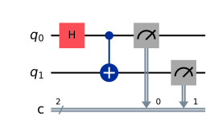
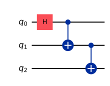

# Chapter 9. Quantum Circuits

> **Status:** prereviewed · **Phase:** 2 · **Sections drafted:** 14 / 14

[← Previous: Chapter 8](08-quantum-gates.md) · [Table of Contents](../../README.md) · [Next: Chapter 10 →](10-core-quantum-phenomena.md)

Gates are the alphabet; circuits are the sentences. This chapter introduces the **circuit model** as the standard way of describing quantum computations and as the abstraction that every quantum SDK exposes. Beyond diagram conventions, the material here covers ancilla qubits and uncomputation (the bookkeeping that makes reversible computation possible), measurement in circuits (deferred, mid-circuit, feedforward), and the metrics — depth, width, connectivity — that govern whether a circuit can actually run on a given device.

> **How to read this chapter.** §§9.1–9.6 are the working vocabulary; you cannot read any later chapter without them. §§9.7–9.9 (measurement timing and classical feedforward) are essential for error correction (Part 8) and for teleportation-based protocols. §§9.10–9.13 (depth, width, connectivity, optimization) become indispensable when targeting real hardware (Part 9) and when reading vendor documentation.

## 9.1 Circuit Diagrams and Conventions

A **quantum circuit diagram** is a directed acyclic graph drawn with time running left to right and each qubit drawn as a horizontal wire. Gates are boxes placed on the wires they act on; a multi-qubit gate is drawn as a single box spanning all the wires it touches, or as a control–target pair joined by a vertical line. Classical bits, when present, are drawn as double lines.

A handful of glyph conventions are near-universal across vendors:

- A small filled circle on a wire is a **positive control** (active on $|1\rangle$); an open circle is a **negative control** (active on $|0\rangle$).
- A "$\oplus$" target (a circle around a plus) is the CNOT/Toffoli target.
- A measurement is a meter-style box, often with a "$D$"-shaped icon, followed by a double-line classical wire carrying the outcome bit.
- Single-qubit gates are usually labeled by a letter or symbol ($H$, $X$, $T$, $R_Y(\theta)$); their box width is purely cosmetic.

Three conventions are *not* universal and trip up readers crossing between sources. **Qubit ordering**: textbooks usually put the most-significant qubit on top (this book does), but Qiskit puts the least-significant qubit (qubit 0) on top — while its printed count strings still put the most-significant classical bit leftmost, so the top wire ends up as the *rightmost* character of a printed string (§4.8). **Time direction**: most diagrams run left-to-right, but a few physics texts run right-to-left to match the algebraic order $U_n \cdots U_2 U_1$. **Endianness in bit strings**: $|q_0 q_1 q_2\rangle$ might mean either $q_0$ is the top wire or the leftmost bit of the integer — check before computing. This book uses leftmost-as-most-significant throughout (§4.2, §4.8) and matches the top-wire convention. Note these are separable conventions — diagram wire order, tensor-factor significance, classical-register mapping, and printed bit-string order — which this book deliberately aligns; Qiskit fixes them differently, and Appendix A gives the explicit index-conversion recipe for reading Qiskit output against this book's kets.

## 9.2 The Circuit Model of Computation

A **quantum circuit** on $n$ qubits is a finite sequence

$$
C \;=\; U_L \cdot U_{L-1} \cdots U_2 \cdot U_1,
$$

each $U_\ell$ being a tensor product of single- or few-qubit gates acting on disjoint qubits. (Two gates on disjoint qubits commute, so they appear at the same "time slice" or layer.) The circuit acts on an initial state — usually $|0\rangle^{\otimes n}$ — produces $C|0\rangle^{\otimes n}$, and qubits are then measured in the computational basis. When the full register is measured, repeated runs ("shots") sample the distribution $P(x) = |\langle x | C | 0^n\rangle|^2$; measuring only a subset samples the corresponding marginal — sum $P(x)$ over the unmeasured bits. (This is the basic static circuit; §9.6 generalizes to mid-circuit measurement and feed-forward.)

This model is **polynomially equivalent** to other quantum models — the quantum Turing machine, the adiabatic model (under locality, bounded-norm, and spectral-gap/runtime conditions — Chapter 32), measurement-based quantum computation with a 2D cluster state, and — with encoding and resource caveats — certain continuous-variable schemes. It is the model that maps most cleanly onto current hardware and onto the mainstream software stack (Qiskit and Cirq as SDKs; OpenQASM and Quil as circuit-level IRs; TKET as a compiler stack).

What the circuit model is not. It is not a description of analog evolution: the Hamiltonian $H$ that physically implements each gate is hidden inside the gate primitive. It is not a probabilistic computation in disguise: outcomes are sampled, but the *amplitudes* propagate through interference between gates, not via probabilities. And it is not unique: the same unitary $C$ admits exponentially many circuit decompositions, which is why compilation and optimization (§9.13, Chapter 23) are nontrivial.

## 9.3 Ancilla Qubits

An **ancilla qubit** (or **ancilla**, plural ancillae or ancillas) is a qubit introduced into the computation as scratch space, typically initialized to $|0\rangle$, used to make an operation reversible or to mediate a multi-qubit gate, and then either reset or discarded. They are the quantum analog of temporary registers in classical computing, with one crucial caveat: their final state is not free.

Three idioms come up everywhere. **Reversible classical computation**: any classical function $f$ can be lifted to a quantum oracle $U_f|x\rangle|y\rangle = |x\rangle|y \oplus f(x)\rangle$ ($\oplus$ bitwise, $y$ matching the output width), with the straightforward history construction using $O(\text{size of classical circuit})$ workspace ancillae — time–space trade-offs can shrink the workspace at the price of recomputation. **Multi-controlled gates**: $\mathrm{C}^k(U)$ for large $k$ decomposes more efficiently when $O(k)$ ancillae are available (§8.7). **Phase kickback**: an ancilla initialized in an eigenstate of $U$ "kicks" the eigenphase back onto the control register. The Quantum Fourier Transform and phase estimation (Chapter 14) live or die by phase kickback.

The cost of an ancilla is not zero. In current NISQ hardware, ancillae compete for the limited supply of physical qubits and contribute to crosstalk. In fault-tolerant designs, each logical ancilla is itself an encoded block of hundreds of physical qubits, so logical ancilla count enters resource estimates directly. Whenever an algorithm description says "with one ancilla", remember the qubit is paying rent.

## 9.4 Uncomputation

An ancilla that ends in a state correlated with the computation register is **not** free space — measuring or discarding it collapses or decoheres the computation. The fix is **uncomputation**: after using an ancilla to compute some intermediate value, run the inverse circuit on the ancilla to return it to $|0\rangle$ before measuring or releasing it. The standard pattern is

$$
\underbrace{U_{\text{compute}}^{\dagger}}_{\text{ancilla} \to 0} \;\circ\; \underbrace{U_{\text{copy}}}_{\text{store result on output}} \;\circ\; \underbrace{U_{\text{compute}}}_{\text{ancilla} \to f(x)}.
$$

The "Bennett trick" for reversible computation makes this systematic. Given a classical circuit of size $T$ depth $d$, the Bennett construction produces a reversible quantum circuit of size $O(T)$ that leaves only $|x\rangle|f(x)\rangle$ on the output and zeroes all ancillae, at the cost of extra time or extra ancillae. Variants trade time for space.

Why this matters: uncomputation is what guarantees the **no-garbage** invariant required for interference. If leftover ancillae end up entangled with the computation and are then ignored or measured away, the reduced state of the computation register is mixed and the intended interference is lost. (Entanglement with *working* registers is fine and is often the whole point of an algorithm — the hazard is specifically discarded or measured garbage.) Oracle-based algorithms with phase-kickback structure rely, at least implicitly, on the garbage associated with interfering branches being indistinguishable — clean uncomputation is the standard way to guarantee it.

## 9.5 Garbage Management

The dual hazard is **garbage** — ancillae that end up entangled with the output, polluting interference. Three idioms keep garbage under control.

**Compute–copy–uncompute** (the Bennett pattern, §9.4): compute $f(x)$ into an ancilla, copy or XOR the result into an output register (reversible fanout of a basis-encoded value, not cloning), run the compute step backwards to clear the ancilla. The workspace comes back to $|0\rangle$ as a clean tensor factor; the output register carries $f(x)$ — in superposition, still correlated with the input register, which is usually the point.

**Catalytic computation**: use ancillae that *must* return to their initial state (the "catalyst") so that the surrounding computation cannot leave traces on them. Catalytic ancillae appear in some advanced compilation techniques.

**Measurement-based release**: in some protocols (notably teleportation-based gates), garbage qubits are released by measurement followed by a classical correction on the surviving wires. This is operationally clean but requires fast feedforward (§9.9).

The recurring failure mode: assuming ancillae are "fresh" when they are not, or measuring an ancilla too early and losing the phase information. Most quantum-algorithm bugs at the textbook level reduce to one of these two mistakes.

## 9.6 Measurement in Circuits

A measurement in a circuit is a non-unitary primitive that converts a quantum register into a classical bit string sampled from the Born distribution. By default it is **destructive** in the computational basis — the measured qubit collapses to the outcome eigenstate $|x\rangle$ and the rest of the system is updated by the projection (§5.4).

Measurement in a basis other than computational is implemented by a basis-change unitary followed by computational-basis measurement: to measure in the $X$ basis, apply $H$ then measure $Z$; to measure an arbitrary single-qubit observable $\hat n \cdot \vec\sigma$, rotate the Bloch vector with a single-qubit rotation that aligns $\hat n$ with $\hat z$, then measure $Z$. To measure a multi-qubit Pauli string $P = P_1 \otimes \cdots \otimes P_n$, the same idea generalizes: rotate each qubit into its $Z$ frame, measure each, and XOR (modulo signs) to get the eigenvalue of $P$.

A small but important point: a single measurement on a single qubit yields one bit. Estimating $\langle \psi | A | \psi \rangle$ for a generic observable $A$ requires many shots and a sampling estimator; the variance scales as $\mathrm{Var}(A)/N$ where $N$ is the shot count. Algorithms that depend on expectation values (VQE and QAOA, the variational algorithms of Part 6) inherit this shot-noise floor.

## 9.7 Deferred Measurement

The **deferred-measurement principle** states that any measurement followed by classically controlled gates can be replaced by a quantum gate (controlled on the would-be measurement qubit) followed by measurement at the end. Equivalently, mid-circuit measurements can always be pushed to the end at the cost of replacing classical control with quantum control.

The principle holds because, until the measurement is actually performed, the qubit being measured remains a quantum object that the controlled gate can act on; the marginal distribution at the end is the same whether the measurement happens before or after the controlled operation. Formally, the two channels $\mathrm{Meas}_\text{ctrl} \circ \mathrm{C}(U)$ and $\mathrm{C}(U) \circ \mathrm{Meas}_\text{ctrl}$ — with the classical control of $U$ on the measured outcome in the first case, and quantum control of $U$ on the control qubit followed by measurement in the second — produce the same joint distribution over all final measurement outcomes. (The intermediate quantum states differ; the equality is statistical, not state-by-state.)

In practice this is a tool with two faces. **Theoretically**: assume all measurements happen at the end, simplifying analysis of unitary subcircuits. **Practically**: deferred measurement *increases* the number of qubits live simultaneously (since you cannot release them) and may cost more two-qubit gates. So on real hardware, you typically *undo* deferred measurement: pull measurements as early as possible, freeing qubits and reducing decoherence exposure. The principle says the two are equivalent; engineering says which to prefer.

## 9.8 Mid-Circuit Measurement

> **Moving-target warning — snapshot as of May 2026.** The platform-by-platform mid-circuit-measurement support described in this section reflects the 2026 landscape and *date quickly*. If you are reading a draft, re-check current device documentation before relying on any specific platform claim here.

A **mid-circuit measurement** is a measurement performed before the circuit ends. On platforms that support **non-demolition** readout (as of the mid-2020s, most superconducting and trapped-ion devices), the qubit survives in the post-measurement basis state and can be re-used; on destructive-readout platforms (many photonic schemes, some atom-array readout modes) the qubit is consumed and a fresh one must be supplied. The treatment below assumes non-demolition mid-circuit readout. Two regimes matter.

**Reset and reuse**: after measurement, the qubit is in a known computational-basis state ($|0\rangle$ or $|1\rangle$). Resetting it to $|0\rangle$ (by applying $X$ if the outcome was $1$, or by an unconditional reset operation) lets the qubit be re-used as a fresh ancilla. This is essential on small devices where qubit count is the bottleneck.

**Conditional logic**: the measurement outcome drives a classical decision that controls subsequent gates — for example, the Pauli correction in teleportation depends on Alice's outcome. This requires **classical feedforward** (§9.9), which is not the same primitive as a quantum-controlled gate: it requires latency-bounded classical processing between qubits.

Reset-and-reuse requires the measured qubit to survive (**non-demolition** readout) or be replaced by a fresh carrier; feed-forward onto *other* qubits requires only a reliable classical result and surviving targets — destructive photonic detection routinely drives feed-forward. Both need classical I/O **fast** relative to the protocol's latency and error budget. Hardware platforms differ widely here, and this is a fast-moving snapshot rather than a settled ranking: as of the mid-2020s, ion traps and some superconducting devices support mid-circuit measurement well, while many neutral-atom and photonic platforms historically did not — but that landscape is shifting quickly, so check current device documentation rather than relying on this paragraph.

## 9.9 Classical Feedforward

**Classical feedforward** is the loop: measure → classical computation → apply a quantum gate conditioned on the result. The classical processing must complete *within the coherence time* of the unmeasured qubits, which on superconducting devices is on the order of $100\\,\mu\mathrm{s}$ — orders of magnitude tighter than the millisecond-scale of typical kernel/userspace round-trips. Devices that advertise feedforward usually expose a dedicated low-latency classical controller and a restricted feedforward instruction set.

Three canonical uses. **Teleportation-based gates**: the $T$ gate on a logical qubit, in many surface-code schemes, is implemented by consuming a magic state (a specially prepared resource state, introduced properly in Chapter 19) and applying a measurement-conditioned Clifford correction (an $S$ gate) — not merely a Pauli. **Error correction**: every cycle of a stabilizer code (Part 8) measures syndromes and applies corrections based on the syndrome bits; the correction layer is feedforward, often with a classical decoder in between. In practice many Pauli-only corrections are not applied physically at all but are absorbed into a software-tracked **Pauli frame** that the classical control system updates and only commutes through when a non-Clifford gate or measurement makes the frame physically relevant. **Adaptive protocols**: measurement-based computation and many photonic schemes use feedforward to route between alternative branches of the computation.

The cost is real and increasingly visible in benchmarks. A feedforward operation appears in vendor documentation under names like *conditional gate*, *if statement*, or *real-time classical control*; OpenQASM 3 introduced first-class classical types and control flow; OpenQASM 2 offered only a restricted register-equality conditional (`if (creg == int)`).

## 9.10 Circuit Depth

The **depth** of a circuit is the length of the longest path through it — equivalently, the number of layers when gates are packed in parallel as tightly as the qubit-dependency DAG allows. Depth is the relevant time-cost metric on hardware: it sets the wall-clock duration of one run, which must fit inside the qubits' coherence time.

A few useful facts. Single-qubit and disjoint two-qubit gates can run in parallel, so a width-$n$ circuit of $n$ disjoint single-qubit gates has depth $1$, not $n$. But two two-qubit gates that share a qubit must serialize. Layered compilation (the "ASAP scheduler") greedily places each gate as early as its data dependencies allow; the result is a near-optimal depth assignment, modulo gate-duration heterogeneity.

Depth lower bounds are sometimes available. Preparing an $n$-qubit state from $|0^n\rangle$ generally requires depth $\Omega(n)$ on nearest-neighbor architectures (linear connectivity forces information to propagate by SWAPs); on a fully-connected architecture, depth $O(\log n)$ suffices for some families like the GHZ state. Many practical algorithms compiled into a fault-tolerant Clifford+$T$ gate set have depth scaling as $O(\mathrm{poly}(n) \cdot \log^{c}(1/\epsilon))$ for a small constant $c$ — the second factor reflecting Solovay–Kitaev synthesis of arbitrary single-qubit rotations into the discrete fault-tolerant set (§8.11). For NISQ circuits compiled directly to a hardware-native continuous gate set this discrete-synthesis $\epsilon$-dependence does not appear (calibration and pulse-level precision limits remain).

## 9.11 Circuit Width

The **width** of a circuit is the number of qubits it acts on simultaneously. For most algorithms, width equals the qubit register size; for algorithms that reuse ancillae aggressively, width can be smaller than the total number of qubit-roles played.

Width and depth trade off. A "wide, shallow" implementation uses many ancillae to keep the dependency DAG flat; a "narrow, deep" implementation reuses qubits via uncomputation and pays in depth. The right operating point depends on which resource is scarcer on the target device. On a small NISQ device with very limited qubits, narrow circuits win even at depth cost; in a fault-tolerant setting where logical qubits are extremely expensive (each is a large patch of physical qubits), width is at a premium.

Distinguished from width are the related metrics **register count**, **simultaneous gate slots** (hardware-architectural), and **effective qubit reuse rate**. Vendor performance reports often quote a circuit's width as the dominant cost, especially for compilation onto restricted-connectivity hardware (§9.12).

## 9.12 Connectivity Constraints

Real hardware has a **coupling graph**: a graph whose vertices are physical qubits and whose edges are pairs on which a native two-qubit gate can be applied. Some devices are nearly fully connected (ion traps with all-to-all Mølmer–Sørensen); others are heavily restricted (superconducting devices with planar layouts — heavy-hex, square lattices, T-shaped clusters).

A logical two-qubit gate between qubits that are not adjacent in the coupling graph must be **routed** — most commonly a sequence of SWAPs moves the data along a path until the two qubits are adjacent (bridge/remote-CNOT decompositions, shuttling, or native long-range interactions are platform alternatives), then the gate is applied. Each routing SWAP costs three CNOTs on a CNOT-native device (native iSWAP/fSim entanglers can implement it for less) and increases circuit depth and noise exposure. **Qubit routing** is the compiler problem of choosing a SWAP schedule that minimizes overhead — in its standard decision formulations it is NP-hard, but reasonable heuristics (look-ahead, A* search, simulated annealing) are now standard in production compilers.

Complementary to routing is **initial mapping**: choosing which logical qubits live on which physical qubits at the start (placement fixes the starting assignment; routing then reshapes it dynamically as the circuit runs). A good initial mapping co-locates qubits that interact often and exiles qubits that do not. Both problems get harder as the program size grows; for very large circuits, modern compilers run them iteratively in synthesis loops with the gate-decomposition step.

## 9.13 Circuit Optimization

**Circuit optimization** is the search for an equivalent or near-equivalent circuit with smaller cost — fewer gates, lower depth, smaller $T$-count, less SWAP overhead. The optimization passes used in production compilers fall into a few families.

**Peephole rewrites**: replace local patterns with shorter equivalents. Examples: $H H = I$, two adjacent CNOTs with the same control–target pair cancel, $R_Z(\alpha) R_Z(\beta) = R_Z(\alpha+\beta)$ ("rotation merging"). These passes are cheap and usually run many times until quiescent.

**Template matching**: identify subcircuits matching a known identity and rewrite to the simpler form. The library of templates (Toffoli identities, gate-cancellation patterns, identities from Chapter 8 and Appendix C) typically lives in the compiler's database.

**Synthesis-based optimization**: re-synthesize a small block of the circuit from scratch, using algorithms like KAK (§8.14), Solovay–Kitaev (§8.11), or numerical pulse-level optimization. This is more expensive but can find shorter implementations that pattern matching misses.

**Routing-aware reordering**: interleave gate scheduling and SWAP insertion to minimize total cost on a connectivity-restricted device.

In practice you do not write these passes; you call the compiler ("transpile" in Qiskit, "compile" in $\mathrm{t}|\mathrm{ket}\rangle$, "optimize" in Cirq) and tune optimization level. But knowing which passes the compiler runs is invaluable when debugging unexpected blow-ups in circuit size, and Chapter 23 takes the topic up in detail.

## 9.14 Bridge to Chapter 10

Chapter 8 fixed the gate alphabet; this chapter assembled gates into circuits, with all the operational baggage — ancillae, measurement, depth, connectivity — that comes from the gap between abstract unitary and physical execution. Chapter 10 closes Part 4 by revisiting the *phenomena* the circuit model can exhibit: superposition, interference, decoherence, channels, and the operator-sum representation that recasts noise as a circuit-level primitive. After that, Part 5 turns to measurement and quantum information, and Part 6 begins the algorithms.

**Sanity checks before moving on.**

1. Draw the Bell-state preparation circuit ($H$ on qubit 0, CNOT with qubit 0 as control) and identify its depth, width, and the time slice in which each gate fires.
2. Take a circuit whose two data qubits start in a superposition (so the correlation produced is genuine entanglement, not just classical correlation), uses one ancilla initialized to $|0\rangle$, applies a Toffoli, and measures the ancilla. Show that without uncomputation the data register is entangled with the ancilla.
3. Apply the deferred-measurement principle to teleportation: replace Alice's mid-circuit Bell measurement with a quantum operation followed by an end-of-circuit measurement. Verify the marginal statistics agree.
4. On a linear-chain coupling graph $q_0 - q_1 - q_2 - q_3$, count the minimum number of SWAPs needed to apply a CNOT between $q_0$ and $q_3$ (assume the logical states need not return to their original wires afterwards).
5. Apply rotation-merging to $R_Z(\pi/4) \cdot R_Z(-\pi/8)$ and compute the resulting single-rotation angle.

---

[← Previous: Chapter 8](08-quantum-gates.md) · [Table of Contents](../../README.md) · [Next: Chapter 10 →](10-core-quantum-phenomena.md)
