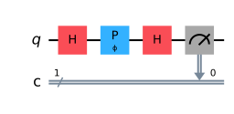

# Chapter 10. Core Quantum Phenomena from a Computational View

> **Status:** draft · **Phase:** 1 · **Sections drafted:** 13 / 13

[← Previous: Chapter 9](09-quantum-circuits.md) · [Table of Contents](../../README.md) · [Next: Chapter 11 →](../part-05-measurement-and-information/11-measurement-theory.md)

Parts 2 and 3 built the formal apparatus: Hilbert spaces and postulates in Chapter 5, the qubit in Chapter 6, multi-qubit composites and entanglement in Chapter 7. Part 4 then introduced gates and circuits as the operational vocabulary the hardware speaks. This chapter is the *phenomenology* synthesis: each of the qualitative features of quantum mechanics that an algorithm designer leans on — superposition, interference, the Born rule, measurement disturbance, no-cloning, no-signalling, contextuality, the Zeno effect, decoherence, mixed states, open-system evolution, channels, and the Kraus representation — gets a tight operational statement and a pointer back to the postulate or theorem that justifies it. Nothing in this chapter is genuinely new; everything is restated in the form algorithm and protocol designers actually use.

> **How to read this chapter.** The postulates of Chapter 5 (especially §5.4 on measurement) and the entanglement material of Chapter 7 (especially §7.10 Schmidt, §7.11 partial trace) are the operational prerequisites. §§10.1–10.4 are the core that every reader needs; §§10.5–10.7 are the no-go and structural theorems that constrain protocols; §§10.8–10.13 develop the open-system picture that becomes load-bearing in Parts 8 (error correction) and 9 (hardware). Readers who want the algorithm-side of the story without the open-system machinery can skim §§10.9–10.13 and return when reaching Chapter 19.

## 10.1 Superposition Revisited

A pure state $|\psi\rangle = \sum_x \alpha_x |x\rangle$ is a **superposition** of the basis states $|x\rangle$ whenever more than one of the $\alpha_x$ is nonzero. The popular phrasing "the qubit is in two states at once" is *not* what superposition means; it is at best a verbal stand-in that the formalism contradicts. A qubit in the state $|+\rangle = (|0\rangle + |1\rangle)/\sqrt{2}$ is in exactly one state — namely $|+\rangle$ — which happens to be a non-trivial linear combination of $|0\rangle$ and $|1\rangle$. From the computational basis it looks like a superposition; from the Hadamard basis (§6.5) it is a basis vector.

**Superposition is basis-dependent.** Every state is a superposition with respect to *some* basis (just pick a basis that does not contain it) and a basis vector with respect to *some other* basis. The Hadamard gate is the canonical illustration: $H|0\rangle = |+\rangle$ converts a $Z$-basis eigenstate into a $Z$-basis superposition, but it is simultaneously a basis-relabelling that maps the $X$-basis to the $Z$-basis. The thing that changes is which basis we have chosen to measure in, not the state.

Two operational consequences. **First**, "is the state in superposition?" is not a meaningful question without specifying a basis; "is the state in superposition with respect to the computational basis?" is. **Second**, what a single shot of measurement returns is one basis label drawn from the Born distribution (§10.3); the amplitudes themselves are not directly observable from a single qubit. Repeated preparation and measurement in *several* bases — the workflow of state tomography (Chapter 11) — is required to reconstruct them.

The computational utility of superposition is that gates apply linearly. Applying $U$ to $\sum_x \alpha_x |x\rangle$ yields $\sum_x \alpha_x U|x\rangle$ — the same matrix multiplies every component of the superposition. This is sometimes paraphrased as "the gate evaluates on every branch at once", but the popular version is misleading on its own (cf. §1.2): a single measurement still returns a single basis label, and the structural feature only becomes a computational resource once amplitudes from different branches are made to interfere (§10.2).

## 10.2 Interference

Interference is what distinguishes amplitudes from probabilities. Classical probabilities of mutually exclusive paths *add*: $P(\text{outcome}) = \sum_p P(\text{path } p)$. Quantum amplitudes of indistinguishable paths *add as complex numbers*, and the probability is the squared modulus *after* summing:

$$
P(\text{outcome } x) \;=\; \Bigl| \sum_p A_p(x) \Bigr|^2.
$$

Cross-terms of the form $2\\,\mathrm{Re}(A_p \overline{A_q})$ appear when the modulus is taken, and these cross-terms are the interference contribution. They can be positive (**constructive**) or negative (**destructive**) depending on the relative phase $\arg(A_p) - \arg(A_q)$.

The Hadamard-then-Hadamard sanity check makes this concrete. Starting from $|0\rangle$, the first $H$ produces $(|0\rangle + |1\rangle)/\sqrt{2}$. The second $H$ produces

$$
H \cdot \tfrac{1}{\sqrt 2}(|0\rangle + |1\rangle) \;=\; \tfrac{1}{2}\bigl[(|0\rangle + |1\rangle) + (|0\rangle - |1\rangle)\bigr] \;=\; |0\rangle.
$$

The amplitude for $|1\rangle$ cancelled exactly — destructive interference. Classically, two coin flips cannot guarantee returning to the start. Quantumly, the two paths $|0\rangle \to |0\rangle \to |1\rangle$ and $|0\rangle \to |1\rangle \to |1\rangle$ have opposite-sign amplitudes and cancel.

**Interference is the engine of quantum advantage.** Every quantum algorithm with a known speedup over classical can be read as: prepare a superposition of inputs, evaluate the problem coherently across the superposition, and arrange the gate sequence so that amplitudes for wrong answers destructively interfere and amplitudes for right answers constructively interfere. Deutsch–Jozsa, Grover, the QFT-based subroutines, and the HHL-family linear-systems solvers (Part 6) all fit this template. An algorithm that produces a uniform superposition and then measures immediately has performed no useful computation — there is no interference between the preparation and the readout, and the output distribution is the same as classical random sampling.

## 10.3 Born Rule in Practice

For a pure state $|\psi\rangle$ measured in an orthonormal basis $\\{|k\rangle\\}$, the **Born rule** (Postulate 3, §5.4) gives

$$
P(\text{outcome } k) \;=\; |\langle k | \psi \rangle|^2.
$$

For an observable $A$ with spectral decomposition $A = \sum_k a_k |k\rangle\langle k|$, the same rule says the eigenvalue $a_k$ is observed with probability $|\langle k|\psi\rangle|^2$. The **expectation value** averages over outcomes:

$$
\langle A \rangle \;=\; \sum_k a_k \\, P(k) \;=\; \langle \psi | A | \psi \rangle.
$$

The compact form $\langle \psi|A|\psi\rangle$ is what hardware estimates: for any Hermitian $A$ decomposed into Pauli strings, the expectation is the sum of the per-string Pauli expectations, each of which is a $\pm 1$-valued estimator measured shot by shot.

**Variance and shot noise.** Repeating the experiment $N$ times and averaging the $\pm 1$ outcomes gives an estimator $\widehat{\langle A \rangle}$ with variance

$$
\mathrm{Var}\bigl(\widehat{\langle A \rangle}\bigr) \;=\; \frac{\mathrm{Var}_\psi(A)}{N} \;=\; \frac{\langle A^2\rangle - \langle A\rangle^2}{N},
$$

so the standard error scales as $1/\sqrt{N}$. The implication is operationally severe: improving an expectation-value estimate by one decimal place costs $100\times$ more shots. Variational algorithms (§8.13, Chapter 15) live and die by this scaling. Amplitude estimation (Chapter 14) is the quantum subroutine that bends it from $1/\sqrt{N}$ to $1/N$ at the cost of running a longer coherent circuit.

Two formal points worth restating. **Non-degenerate** measurements (each $a_k$ distinct) project onto the rank-one $|k\rangle\langle k|$ and yield the post-measurement state $|k\rangle$. **Degenerate** measurements project onto the eigenprojector $\Pi_k$ of the eigenvalue $a_k$ and yield $\Pi_k|\psi\rangle / \\|\Pi_k|\psi\rangle\\|$ — Lüders' rule (§5.4). For mixed states $\rho$, the same statements with $P(k) = \mathrm{tr}(\Pi_k \rho)$ and $\langle A\rangle = \mathrm{tr}(A\rho)$.

## 10.4 Measurement Disturbance

A projective measurement is not a passive read-out; it actively changes the state. Postulate 3 says that after observing outcome $k$, the state collapses to $|k\rangle$ (non-degenerate case) or to the normalised projection $\Pi_k|\psi\rangle/\\|\Pi_k|\psi\rangle\\|$ (degenerate). Information extraction and state disturbance are inseparable.

The standard sharpening of this fact is the **uncertainty principle**. For any two observables $A, B$ and any state $|\psi\rangle$,

$$
\Delta A \\, \Delta B \;\geq\; \tfrac{1}{2} \bigl| \langle \psi | [A, B] | \psi \rangle \bigr|,
$$

where $\Delta X = \sqrt{\langle X^2\rangle - \langle X\rangle^2}$ and $[A, B] = AB - BA$. **Incompatible** observables (those with $[A, B] \neq 0$) cannot both have arbitrarily sharp values in any state.

In the continuous-variable setting (Chapter 32), the canonical commutator is $[X, P] = i\hbar I$, which gives Heisenberg's $\Delta X \\, \Delta P \geq \hbar/2$. For qubits the analogue is on the Pauli operators:

$$
[X, Z] \;=\; -2 i Y, \qquad [Y, Z] \;=\; 2 i X, \qquad [X, Y] \;=\; 2 i Z.
$$

So a state with sharp $Z$ value (an eigenstate of $Z$, i.e. $|0\rangle$ or $|1\rangle$) has $\Delta Z = 0$. A direct calculation — using $X^2 = Y^2 = I$ and $\langle X\rangle = \langle Y\rangle = 0$ on $Z$-eigenstates — gives $\Delta X = \Delta Y = 1$: maximal uncertainty in the conjugate bases. (The Robertson bound itself is vacuous on these states, since $\langle Y\rangle = 0$ on a $Z$-eigenstate makes the right-hand side zero — the strong constraint comes from the explicit second moments, of which the bound is a coarser consequence.) This is the formal version of the §6.6 mutually-unbiased-bases observation.

**Operational consequence for protocols.** Any procedure that learns about an observable disturbs every observable that does not commute with it. Quantum key distribution (Chapter 27) builds an entire cryptographic primitive on this fact: an eavesdropper who measures BB84 photons in the wrong basis disturbs the state, and the disturbance is statistically detectable in the residual bit-error rate. Mid-circuit measurement, used as a control mechanism for error correction and feed-forward (Chapter 19), is engineered to disturb only the syndrome subspace, leaving the encoded data intact.

## 10.5 No-Cloning Restated

The **no-cloning theorem** (proved in §5.13) says that no unitary $U$ exists satisfying $U(|\psi\rangle \otimes |0\rangle) = |\psi\rangle \otimes |\psi\rangle$ for every $|\psi\rangle$. The proof is one line: if it worked for two non-orthogonal states $|\psi\rangle$ and $|\phi\rangle$ with $\langle \psi|\phi\rangle \neq 0, 1$, unitarity would demand $\langle \psi|\phi\rangle = \langle \psi|\phi\rangle^2$, a contradiction. Linearity alone is enough; unitarity is a stronger constraint that gives the same conclusion.

**What no-cloning forbids.** Broadcasting an unknown quantum state to many parties; making backup copies of a quantum register; constructing a deterministic state-discrimination device for non-orthogonal states. Each of these would compose into a cloner if it existed. The theorem also rules out one naive route to faster-than-light signalling, in which Alice would use her half of an entangled pair to influence the local statistics observable by Bob (see §10.6).

**What no-cloning does not forbid.** Cloning of *orthogonal* states is possible — and is what classical computation does, since classical bits are encoded in mutually orthogonal quantum states. Approximate cloning (with bounded fidelity) is possible and is studied as its own discipline. Teleportation (§7.12) moves an unknown state from Alice to Bob, but destroys the original in the process; it is not a cloner, and Alice ends up with garbage.

The cryptographic upshot is the inversion most worth remembering: **no-cloning is what makes quantum key distribution possible**, not what makes it hard. Because an eavesdropper cannot copy a non-orthogonal signal state to read it without disturbing the original, the legitimate parties can detect tampering. The same impossibility that rules out a quantum hard-disk is the one that enables information-theoretically secure key agreement.

## 10.6 No-Signalling

The **no-signalling principle** says that local operations and measurements on one half of a multipartite state cannot change the local statistics on the other half. Concretely, if $\rho_{AB}$ is the joint state and Alice performs a measurement on $A$ with outcomes labelled by $a$, then the reduced state $\rho_B = \mathrm{Tr}_A(\rho_{AB})$ that Bob's marginal statistics depend on is *unchanged* whether or not Alice measures, and is independent of what basis she chooses.

The proof is a direct partial-trace calculation. For Alice's measurement (Kraus) operators $\\{M_a\\}$ — the POVM *effects* being $E_a = M_a^{\dagger} M_a$ — the post-measurement ensemble on Bob's side, *averaged over Alice's outcomes*, is

$$
\sum_a p_a \\, \rho_{B|a} \;=\; \sum_a \mathrm{Tr}_A\bigl((M_a \otimes I) \rho_{AB} (M_a^{\dagger} \otimes I)\bigr) \;=\; \mathrm{Tr}_A(\rho_{AB}) \;=\; \rho_B,
$$

using $\sum_a M_a^{\dagger} M_a = I$ together with cyclicity *within the A subsystem* — i.e. $\mathrm{Tr}_A((M_a \otimes I) \sigma (M_a^{\dagger} \otimes I)) = \mathrm{Tr}_A((M_a^{\dagger} M_a \otimes I)\\,\sigma)$, which is the partial-trace identity that applies when both Kraus factors act only on $A$ (full cyclicity does not hold for partial trace; this restricted form does). Bob, with no access to Alice's classical outcome, sees the same $\rho_B$ in either world.

This is the formal statement underlying the §7.11 observation that the reduced state of one half of a Bell pair is $I/2$ regardless of what Alice does. It is what reconciles the dramatic phrasing of Bell-inequality violations ("instantaneous correlations at any distance") with relativistic causality: nothing observable on Bob's side reveals Alice's measurement choice without a classical channel. Bell-inequality violations are visible only *after* the two parties pool their data.

**Why this matters for protocol design.** Any candidate protocol that requires "signalling via entanglement" — using a remote measurement basis choice to encode a bit observable on the other end — is impossible. Teleportation (§7.12) needs the two classical bits Alice sends precisely because of no-signalling: the quantum correlations alone do not carry the message. Superdense coding likewise requires Alice to physically send her qubit. The classical channel is not a redundancy; it is the only way information actually moves.

## 10.7 Contextuality

**Contextuality** is the formal feature of quantum mechanics that goes beyond Bell-style nonlocality: even *without* spatial separation, the outcome of measuring an observable $A$ can depend on which *compatible* observable is measured alongside it.

The **Kochen–Specker theorem** makes this precise. For Hilbert spaces of dimension $\geq 3$, there is no consistent assignment of pre-existing values to all projectors that respects the algebraic identities (specifically: for any orthonormal basis, exactly one projector is assigned value $1$ and the rest $0$, and an observable's value equals the function of jointly compatible projector values). The original proof used 117 vectors in $\mathbb{R}^3$; later proofs are much shorter (Cabello, Peres-Mermin). For $d = 2$ — that is, for a single qubit — the theorem fails, and a hidden-variable model exists; contextuality is a feature of $d \geq 3$, including multi-qubit systems.

**Reading.** In a multi-qubit system the same observable can sit in several different commuting contexts. The two-qubit observables $X_1 \otimes Z_2$, $Z_1 \otimes X_2$, and $Y_1 \otimes Y_2$ all commute pairwise (each pair has two local Pauli anticommutations, which cancel), and they form one row of the $3 \times 3$ **Peres–Mermin square**

$$
\begin{array}{ccc}
X_1 & X_2 & X_1 X_2 \\\\
Z_2 & Z_1 & Z_1 Z_2 \\\\
X_1 Z_2 & Z_1 X_2 & Y_1 Y_2
\end{array}
$$

in which every row and every column is a pairwise-commuting triple. Each of the three rows and the first two columns multiplies to $+I$, but the last column multiplies to $-I$. If each observable had a context-independent value $\pm 1$, multiplying those values row by row would give $+1$, while multiplying them column by column would give $-1$ — a contradiction, independent of the state. So the value an observable takes is not fixed in advance; it depends on the compatible context — the maximal commuting set — measured alongside it.

The cleanest computational manifestation is the **GHZ contradiction** (§7.6 and §7.7). For the three-qubit GHZ state $(|000\rangle + |111\rangle)/\sqrt{2}$, the four observables $X_1 X_2 X_3$, $X_1 Y_2 Y_3$, $Y_1 X_2 Y_3$, $Y_1 Y_2 X_3$ all commute pairwise on this state and have definite values $+1, -1, -1, -1$ respectively. Their product is $-1$, but the product of pre-assigned $\pm 1$ values would always yield $+1$ because each Pauli appears twice. No hidden-variable assignment is consistent; the contradiction is a single shot, not a statistical inequality.

Contextuality is widely conjectured to be a resource powering certain quantum advantages — notably magic-state distillation (Chapter 19) and measurement-based quantum computation (Chapter 32) — and the formal connection is an active research area.

## 10.8 Quantum Zeno Effect

The **quantum Zeno effect** is the observation that frequent measurement of a system can freeze its evolution. Concretely: suppose the system starts in $|\psi\rangle$ and evolves under Hamiltonian $H$. The probability of remaining in $|\psi\rangle$ after time $t$ is, from the small-$t$ expansion of $e^{-iHt}$,

$$
\bigl| \langle \psi | e^{-iHt} | \psi \rangle \bigr|^2 \;=\; 1 - (\Delta H)^2 \\, t^2 + O(t^4),
$$

where $(\Delta H)^2 = \langle \psi|H^2|\psi\rangle - \langle \psi|H|\psi\rangle^2$. Crucially, the leading correction is *quadratic* in $t$, not linear.

Now divide a total time $T$ into $N$ intervals of length $T/N$ and measure the projector $|\psi\rangle\langle\psi|$ at the end of each interval. The probability of finding the system still in $|\psi\rangle$ at every measurement is

$$
\bigl(1 - (\Delta H)^2 (T/N)^2\bigr)^N \;\longrightarrow\; 1 \quad \text{as } N \to \infty.
$$

The system gets pinned to $|\psi\rangle$ even though $H$ would normally drive it away. The mechanism is the quadratic-in-$t$ leak: shrinking $t$ by a factor of $N$ shrinks the leak by $N^2$, and only $N$ chances accumulate.

**Why this matters operationally.** The Zeno effect is the simplest example of *measurement-based error suppression*. Continuous (or frequent) syndrome extraction in stabiliser codes (Chapter 19) is partly a Zeno-style mechanism: each measurement projects onto a definite syndrome subspace — digitising the small coherent errors that environmental coupling induces — and the paired correction returns the state to the code space, suppressing the slow drift. The **dynamical decoupling** sequences used to extend $T_2$ (§10.9, Chapter 21) are coherent cousins of the Zeno effect, exploiting frequent gate operations rather than measurements to average out unwanted Hamiltonian terms. The generalised **quantum Zeno dynamics** picture says that frequent projection onto a *subspace* (rather than a single state) restricts evolution to that subspace, which is the conceptual underpinning of the **decoherence-free subspace** strategy for error mitigation.

## 10.9 Decoherence

**Decoherence** is the irreversible loss of quantum coherence due to entangling interactions with an environment that is not under experimental control. Operationally, an initially pure $|\psi\rangle$ becomes correlated with environmental degrees of freedom $|E_i\rangle$,

$$
|\psi\rangle |E_0\rangle \;\longmapsto\; \sum_i c_i |\phi_i\rangle |E_i\rangle,
$$

and the *reduced* state of the system is $\rho_S = \sum_i |c_i|^2 |\phi_i\rangle\langle \phi_i|$ once the $|E_i\rangle$ become approximately orthogonal. The off-diagonal entries of $\rho_S$ in the $\\{|\phi_i\rangle\\}$ basis decay; their loss is the loss of interference (§10.2) between branches.

**Pointer states and einselection.** The basis $\\{|\phi_i\rangle\\}$ in which decoherence appears as diagonalisation is not arbitrary: the environmental interaction selects a preferred basis — the **pointer basis** — of states that are most stable under the interaction. Zurek's *einselection* (environment-induced superselection) explains why macroscopic quantum superpositions are not observed: the pointer basis for a macroscopic degree of freedom is essentially the classical-configuration basis, and superpositions of distinct configurations decohere on timescales far below any experimentally accessible window.

**T1 and T2.** On a qubit, two effective timescales dominate the practical noise budget.

- $T_1$ (**relaxation time**, or "amplitude damping" time) is the timescale on which the excited state $|1\rangle$ decays to $|0\rangle$ via energy loss to the environment. Diagonal populations relax: $\rho_{11}(t) \approx \rho_{11}(0)\\, e^{-t/T_1}$.
- $T_2$ (**dephasing time**, or "coherence time") is the timescale on which the off-diagonal coherence $\rho_{01}$ decays. It contains both $T_1$ contributions and *pure dephasing* $T_\varphi$: $1/T_2 = 1/(2T_1) + 1/T_\varphi$.

Always $T_2 \leq 2 T_1$. The ratio $T_2 / T_1$ measures how much of the dephasing comes from pure phase noise (as opposed to amplitude relaxation). The hardware-side discussion of how $T_1$ and $T_2$ are measured, what limits them on each platform, and how dynamical decoupling extends $T_2$ towards $2 T_1$ belongs to Chapter 21.

## 10.10 Mixed States in Practice

A **mixed state** is a probabilistic ensemble of pure states, represented by a density matrix

$$
\rho \;=\; \sum_i p_i \\, |\psi_i\rangle\langle \psi_i|, \qquad p_i \geq 0, \qquad \sum_i p_i = 1.
$$

(See §5.9.) Two operational sources of mixedness must be distinguished.

**Proper mixtures.** A classical preparation device flips a $p_i$-weighted coin and prepares pure state $|\psi_i\rangle$. The experimenter does not learn $i$ but in principle could. The density matrix $\rho$ summarises everything observable about the resulting state.

**Improper mixtures.** The system is part of a larger entangled state $|\Phi\rangle_{SE}$, and tracing out the environment yields $\rho_S = \mathrm{Tr}_E(|\Phi\rangle\langle\Phi|_{SE})$. No classical record of "which pure state" exists, because the question is meaningless — the system never *was* in a pure state in isolation.

**The key operational fact.** Proper and improper mixtures *cannot be distinguished by any measurement performed on the system alone*. They are operationally identical: every observable, every channel, every protocol yields the same statistics. This is the content of §5.10 and the reason the density matrix is the right object: $\rho$ encodes everything that matters and forgets the rest.

**Practical consequence.** The decomposition $\rho = \sum_i p_i |\psi_i\rangle\langle \psi_i|$ is *not unique*. The maximally mixed single-qubit state $I/2$ admits decompositions as $\tfrac{1}{2}(|0\rangle\langle 0| + |1\rangle\langle 1|)$, as $\tfrac{1}{2}(|+\rangle\langle +| + |-\rangle\langle -|)$, and as a uniform distribution over Bloch-sphere points. No experiment on the qubit alone selects among these decompositions. Quantum tomography reconstructs $\rho$, not its hidden ensemble.

For a single qubit, the Bloch-vector parametrisation (§6.8) $\rho = (I + \vec{r}\cdot\vec{\sigma})/2$ makes the geometry concrete: pure states sit on the Bloch sphere, mixed states inside the ball, and $\\|\vec{r}\\|_2$ is the purity measure.

## 10.11 Open System Dynamics

A closed-system evolves by the Schrödinger equation $i \\, d|\psi\rangle/dt = H |\psi\rangle$, or equivalently the von Neumann equation $\dot{\rho} = -i [H, \rho]$ for density matrices. An **open system** exchanges energy or information with an environment, and its reduced dynamics is generally non-unitary. Under Markovian assumptions (memoryless environment, separation of timescales), the reduced dynamics is generated by the **Lindblad master equation**:

$$
\frac{d\rho}{dt} \;=\; -i [H, \rho] + \sum_k \Bigl( L_k \rho L_k^{\dagger} - \tfrac{1}{2} \\{ L_k^{\dagger} L_k, \rho \\} \Bigr).
$$

The first term is the unitary (Hamiltonian) part, governed by an effective Hermitian $H$ that may include environment-induced energy shifts (Lamb shifts). The sum is the **dissipator**: each $L_k$ is a **jump operator** (or **Lindblad operator**) representing one channel of system-environment exchange, and $\\{A, B\\} = AB + BA$ is the anticommutator.

Two features make Lindblad the canonical form. **Trace preservation**: $\mathrm{tr}(\dot\rho) = 0$, so $\rho$ remains a valid density matrix. **Complete positivity**: the induced map $\rho(0) \mapsto \rho(t) = e^{\mathcal{L} t}(\rho(0))$ is CPTP (§10.12). Lindblad evolution is the most general continuous-time evolution consistent with both.

**Canonical examples on a single qubit.**

- **Amplitude damping** (spontaneous emission, models $T_1$): $L = \sqrt{\gamma} \\, |0\rangle\langle 1|$. The excited state decays at rate $\gamma = 1/T_1$.
- **Pure dephasing** (models $T_\varphi$): $L = \sqrt{\gamma_\varphi/2} \\, Z$. Off-diagonal coherences decay; populations unchanged.
- **Depolarising** (isotropic Pauli noise): three jump operators $L_k = \sqrt{\gamma}\\, \sigma_k$ for $\sigma_k \in \\{X, Y, Z\\}$, with depolarising rate $\gamma$. The Bloch vector shrinks toward the origin uniformly.

The non-Markovian generalisations (when the environment retains memory) require integro-differential equations and richer machinery; Chapter 21 returns to when the Markov approximation breaks down on real hardware.

## 10.12 Quantum Channels

A **quantum channel** is the most general physically realisable transformation a quantum state can undergo. Formally, a channel is a map $\mathcal{E}: \mathcal{B}(\mathcal{H}_A) \to \mathcal{B}(\mathcal{H}_B)$ on density operators that is

1. **Linear**: $\mathcal{E}(\alpha \rho + \beta \sigma) = \alpha \mathcal{E}(\rho) + \beta \mathcal{E}(\sigma)$.
2. **Completely positive** (CP): for any auxiliary system $R$, the extension $\mathcal{E} \otimes \mathrm{id}_R$ maps positive operators on $\mathcal{H}_A \otimes \mathcal{H}_R$ to positive operators on $\mathcal{H}_B \otimes \mathcal{H}_R$. Mere positivity is not enough — the partial transpose is positive but not completely positive, and is not a physical channel.
3. **Trace-preserving** (TP): $\mathrm{tr}(\mathcal{E}(\rho)) = \mathrm{tr}(\rho)$.

Together, **CPTP**: completely positive, trace-preserving. Every CPTP map is a valid quantum channel and every valid quantum channel is CPTP.

**Catalogue of qubit channels.** Each is parameterised by a single noise rate $p \in [0, 1]$ unless stated otherwise.

- **Depolarising channel**: $\mathcal{E}(\rho) = (1 - p)\rho + p \cdot I/2$. With probability $p$, the qubit is replaced by the maximally mixed state. Equivalently — using $I/2 = (\rho + X\rho X + Y\rho Y + Z\rho Z)/4$ — the qubit is left alone with probability $1 - 3p/4$ and each Pauli error $X, Y, Z$ is applied with probability $p/4$, giving Kraus operators $\sqrt{1 - 3p/4}\\, I$ and $\sqrt{p/4}\\, X$, $\sqrt{p/4}\\, Y$, $\sqrt{p/4}\\, Z$.
- **Amplitude damping**: models $T_1$ relaxation. Acts on the Bloch sphere by contracting toward the north pole $|0\rangle$. The Kraus operators are $K_0 = |0\rangle\langle 0| + \sqrt{1-p}\\, |1\rangle\langle 1|$ and $K_1 = \sqrt{p}\\, |0\rangle\langle 1|$.
- **Phase damping** (equivalently, pure dephasing): models $T_\varphi$. Diagonal entries of $\rho$ are preserved; off-diagonals shrink by $\sqrt{1 - p}$. Equivalent at the channel level to a probabilistic $Z$ application — i.e. $\mathcal{E}(\rho) = (1 - q)\rho + q Z \rho Z$ with $q = (1 - \sqrt{1-p})/2$ chosen so that off-diagonals shrink by the same factor $\sqrt{1-p}$ (a uniformly random $Z$-rotation angle gives a different shrink factor).
- **Bit-flip / phase-flip / bit-phase-flip**: probabilistic application of $X$, $Z$, $Y$ respectively.

The depolarising and amplitude-damping channels are the two workhorses of error-correction analysis (Chapter 19): depolarising because of its symmetry across the Pauli group, amplitude damping because of its physical accuracy as a $T_1$ model.

## 10.13 Operator-Sum Representation (Kraus)

Every CPTP map admits an **operator-sum** (**Kraus**) representation: there exist operators $\\{K_i\\}_{i=1}^{r}$ — the **Kraus operators** — such that

$$
\mathcal{E}(\rho) \;=\; \sum_i K_i \\, \rho \\, K_i^{\dagger}, \qquad \sum_i K_i^{\dagger} K_i \;=\; I.
$$

The completeness relation $\sum_i K_i^{\dagger} K_i = I$ enforces trace preservation; the sum-of-conjugations form enforces complete positivity. The number of Kraus operators $r$ — the **Kraus rank** — is at most $\dim(\mathcal{H}_A) \cdot \dim(\mathcal{H}_B)$.

The Kraus representation is *not* unique: any unitary mixing $K'_j = \sum_i U_{ji} K_i$ gives an equivalent operator-sum form. The minimal Kraus rank, however, is an invariant of the channel.

**Connection to environment dilation (Stinespring).** Every CPTP map can be realised as unitary evolution on a system + ancilla followed by tracing out the ancilla. Concretely, there exist a Hilbert space $\mathcal{H}_E$, an initial state $|0_E\rangle \in \mathcal{H}_E$, and a unitary $U_{SE}$ such that

$$
\mathcal{E}(\rho) \;=\; \mathrm{Tr}_E\bigl[ U_{SE} \\, (\rho \otimes |0_E\rangle\langle 0_E|) \\, U_{SE}^{\dagger} \bigr].
$$

The Kraus operators are $K_i = \langle i_E | U_{SE} | 0_E\rangle$ — the partial matrix elements of $U_{SE}$ on the environment indexed by an orthonormal basis $\\{|i_E\rangle\\}$. This **Stinespring dilation** is the precise statement of "noise is just unobserved entanglement": every channel is a unitary on a larger Hilbert space, with the bath traced out. It is the formal device underlying every analysis of decoherence (§10.9), every derivation of the Lindblad master equation (§10.11), and the operational picture of an error-correcting code as a subspace that survives a known set of $K_i$ (Chapter 19).

**Connection to Lindblad.** A Markovian channel for time $dt$ has Kraus operators approximately $K_0 = I - (i H + \tfrac{1}{2} \sum_k L_k^{\dagger} L_k) dt$ and $K_k = \sqrt{dt} \\, L_k$ for $k \geq 1$. Expanding $\rho(t + dt) = \sum_i K_i \rho K_i^{\dagger}$ to first order in $dt$ recovers the Lindblad equation of §10.11. The three pictures — operator-sum, Stinespring dilation, and Lindblad — are equivalent descriptions of CPTP evolution; which to use is a matter of which question is being asked.

## 10.14 Bridge to Chapter 11

Chapters 5 through 10 have built the static and dynamical pictures: states (pure and mixed), unitary evolution (gates and circuits), and now the open-system extensions that govern any real device. The next part of the book turns to **measurement and information** as primary objects of study rather than as endpoints of a calculation. Chapter 11 develops projective and POVM measurements, the operational interpretation of the Born rule, and the measurement-tomography programme. Chapter 12 turns to quantum information theory: entropies, mutual information, channel capacities, the Holevo bound, and the channel-coding theorems that quantify what quantum channels (§10.12) can and cannot transmit. Part 6 then opens the algorithmic programme — the place where superposition, interference, entanglement, and contextuality are deployed as computational resources for concrete speedups.

**Sanity checks before moving on.**

1. For $|\psi\rangle = \cos(\theta/2)|0\rangle + e^{i\varphi}\sin(\theta/2)|1\rangle$, compute $\langle Z\rangle$, $\langle X\rangle$, $\langle Y\rangle$ and verify each equals the corresponding Bloch-vector component $r_z, r_x, r_y$ from §6.8.
2. Verify the Hadamard interference cancellation explicitly: write out $H H |0\rangle$ as a sum of four amplitude terms and identify which two cancel.
3. Confirm $[X, Z] = -2iY$ from the Pauli matrices of §8.2, then check it is consistent with the qubit uncertainty relation $\Delta X \\, \Delta Z \geq |\langle Y\rangle|$ on the state $|+\rangle$.
4. For the amplitude-damping channel with parameter $p$, compute $\sum_i K_i^{\dagger} K_i$ using the Kraus operators in §10.12 and confirm it equals $I$.
5. Starting from the Kraus form of the depolarising channel, derive the Bloch-vector contraction $\vec{r} \mapsto (1 - p)\\, \vec{r}$ and identify the fixed point.

---

[← Previous: Chapter 9](09-quantum-circuits.md) · [Table of Contents](../../README.md) · [Next: Chapter 11 →](../part-05-measurement-and-information/11-measurement-theory.md)
