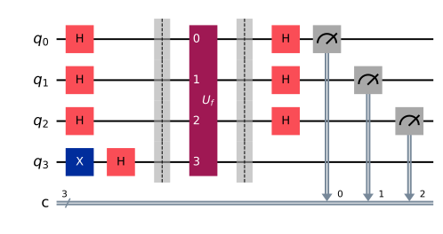
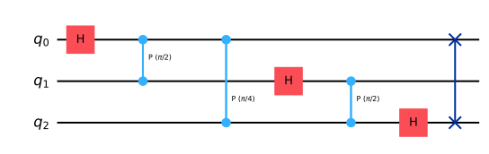

# Chapter 14. Foundational Algorithms

[← Previous: Chapter 13](13-quantum-algorithms-mindset.md) · [Table of Contents](../../README.md) · [Next: Chapter 15 →](15-landmark-quantum-algorithms.md)

> **Status:** draft · **Phase:** 1 · **Sections drafted:** 9 / 9

This chapter walks through the algorithms that established the quantum-algorithms field as a real subject — Deutsch, Deutsch–Jozsa, Bernstein–Vazirani, and Simon — and the two general-purpose primitives that almost every later algorithm builds on: the quantum Fourier transform (with phase estimation) and amplitude amplification (with amplitude estimation). It closes with the hidden subgroup problem, the framework that unifies many of the exponential speedups including the order-finding subroutine of Shor's algorithm.

> **How to read this chapter.** §§14.1–14.4 are tutorial: short circuits, clean speedups, and the right mental model for "phase kickback as the engine of quantum advantage". §14.5 (QFT) and §14.6 (phase estimation) are the workhorses you will see again in Chapter 15 and again throughout the rest of Part 6. §§14.7–14.8 (amplitude amplification and estimation) are the Grover-style toolset. §14.9 is structural; skim on first pass and return when reading Shor.

## 14.1 Deutsch's Algorithm

The Deutsch problem is the smallest case where a quantum algorithm provably beats a classical one in the query model. The input is a function $f: \\{0,1\\} \to \\{0,1\\}$, given as an oracle $U_f|x\rangle|y\rangle = |x\rangle|y \oplus f(x)\rangle$. The task is to decide whether $f$ is **constant** ($f(0) = f(1)$) or **balanced** ($f(0) \neq f(1)$).

Classically you need two queries — evaluate $f(0)$ and $f(1)$, compare. Deutsch's algorithm answers in one query. The circuit prepares $|0\rangle|1\rangle$, applies $H \otimes H$, then $U_f$, then $H$ on the first qubit, and measures the first qubit:

$$
|0\rangle|1\rangle \;\xrightarrow{H\otimes H}\; \tfrac{1}{2}(|0\rangle+|1\rangle)(|0\rangle-|1\rangle).
$$

The oracle's action on this state factors thanks to **phase kickback**: $U_f|x\rangle(|0\rangle - |1\rangle)/\sqrt 2 = (-1)^{f(x)}|x\rangle (|0\rangle - |1\rangle)/\sqrt 2$. The eigenvalue $(-1)^{f(x)}$ is "kicked back" onto the data register. After the second $H$ on the first qubit and measurement, the outcome is $0$ iff $f$ is constant, $1$ iff balanced.

Deutsch's algorithm is small but it is *the* exhibit for the mechanism. Almost every speedup in this chapter and the next uses the same primitive: prepare a superposition, query the oracle so its values become phases, interfere those phases through a Fourier-like transform, measure.

## 14.2 Deutsch–Jozsa Algorithm

The Deutsch–Jozsa problem generalises Deutsch to $n$ bits: given $f: \\{0,1\\}^n \to \\{0,1\\}$ that is *promised* to be either constant or balanced (exactly half of the inputs map to $0$, half to $1$), decide which. Classically, you might be unlucky for $2^{n-1}$ queries and only on query $2^{n-1}+1$ get a distinguishing answer; in the worst case the deterministic complexity is $2^{n-1}+1$. The Deutsch–Jozsa algorithm answers in one query.

The circuit is the natural generalisation: prepare $|0^n\rangle|1\rangle$, apply $H^{\otimes (n+1)}$, query $U_f$, apply $H^{\otimes n}$ on the data register, measure. The data register collapses to $|0^n\rangle$ iff $f$ is constant — so a single all-zero outcome confirms constant, anything else confirms balanced.



Two remarks. **The exponential separation is artificial**: it disappears if you allow bounded-error classical algorithms, since a few random samples distinguish constant from balanced with high probability. Deutsch–Jozsa was historically important as the first oracle exponential gap, not as a practical speedup. **The mechanism, however, is universal**: this is a poster child for "Hadamard sandwich + phase kickback", and the same template reappears in Bernstein–Vazirani, Simon, Shor's period-finding subroutine, and the QFT itself.

This runs end to end (`examples/deutsch_jozsa.py`). With a balanced oracle $f(x) = x_0 \oplus x_1 \oplus x_2$ — a CNOT from each input into the ancilla — the data register never returns all-zero, so a single shot already decides "balanced":

```python
from qiskit import QuantumCircuit
from qiskit.primitives import StatevectorSampler

def dj_circuit(n, oracle):
    qc = QuantumCircuit(n + 1, n)
    qc.x(n)
    qc.h(range(n + 1))
    oracle(qc, n)
    qc.h(range(n))
    qc.measure(range(n), range(n))
    return qc

def balanced_oracle(qc, n):
    for q in range(n):
        qc.cx(q, n)

qc = dj_circuit(3, balanced_oracle)
counts = StatevectorSampler().run([qc], shots=1000).result()[0].data.c.get_counts()
print(counts)  # {'111': 1000} -> not all-zero -> balanced
```

## 14.3 Bernstein–Vazirani Algorithm

The Bernstein–Vazirani problem: given an oracle for $f_s(x) = s \cdot x \pmod 2$ where $s \in \\{0,1\\}^n$ is a hidden bit-string and $s \cdot x$ is the bitwise inner product, recover $s$. Classically you need $n$ queries (query the standard basis vectors $e_i$); the Bernstein–Vazirani algorithm needs *one*.

The circuit is identical to Deutsch–Jozsa: $|0^n\rangle|1\rangle \to H^{\otimes (n+1)} \to U_{f_s} \to H^{\otimes n} \to$ measure. After the oracle, the data register is

$$
\tfrac{1}{\sqrt{2^n}}\sum_x (-1)^{s\cdot x} |x\rangle,
$$

which is exactly $H^{\otimes n}|s\rangle$ by the Hadamard-transform identity. Applying the second $H^{\otimes n}$ inverts the transform, and the measurement yields $s$ with probability $1$.


This is the cleanest example of a Hadamard-based **transform-then-read** pattern: encode the unknown into phases, apply the Hadamard transform (which is its own inverse), read the encoding directly. It is also the cleanest way to see why "exponential parallelism" is the wrong slogan — the algorithm uses $2^n$ amplitudes during the run but extracts only $n$ bits at the end. The structure of the problem (linear inner-product oracle, group structure $\mathbb{Z}_2^n$) is what makes Hadamard the right transform.

## 14.4 Simon's Algorithm

Simon's problem is the first instance of an *exponential* quantum speedup over *any* classical algorithm, not just deterministic ones. Given $f: \\{0,1\\}^n \to \\{0,1\\}^n$ promised to satisfy $f(x) = f(y) \iff x \oplus y \in \\{0, s\\}$ for some unknown $s \in \\{0,1\\}^n \setminus \\{0\\}$, find $s$. Classically this requires $\Omega(2^{n/2})$ queries (a birthday-collision argument). Simon's algorithm needs $O(n)$ quantum queries plus $O(n^3)$ classical post-processing (Gaussian elimination over $\mathbb{F}_2$).

The circuit prepares $|0^n\rangle|0^n\rangle$, applies $H^{\otimes n}$ on the input register, queries $U_f$ into the output register, applies $H^{\otimes n}$ on the input register, and measures the input register. Each measurement yields a uniformly random $y \in \\{0,1\\}^n$ with $y \cdot s = 0 \pmod 2$ — that is, a random vector orthogonal to $s$ in $\mathbb{F}_2^n$. After $O(n)$ runs, $n-1$ independent such $y$'s pin down $s$ via Gaussian elimination.

Simon's algorithm is the direct ancestor of Shor's. The hidden-subgroup-problem framework (§14.9) formalises this: Simon is HSP over $\mathbb{Z}_2^n$ with subgroup $\\{0, s\\}$; Shor's factoring is HSP over $\mathbb{Z}_N$ with cyclic subgroup. Same template, different group, different transform.

## 14.5 Quantum Fourier Transform

The **quantum Fourier transform** over $\mathbb{Z}_N$ (with $N = 2^n$) is the unitary $F_N$ defined by

$$
F_N |x\rangle \;=\; \frac{1}{\sqrt N}\sum_{y=0}^{N-1} e^{-2\pi i\\, xy / N} |y\rangle.
$$

This is the negative-exponent ("QFT-sign-minus") convention fixed in §4.13; some sources and SDKs use the opposite sign, so check before porting phase angles. For $N = 2$ the QFT is just the Hadamard gate. For general $N$, the QFT factors into an elegant circuit of single-qubit Hadamards and controlled phase gates: on $n$ qubits, $n$ Hadamards interleaved with $O(n^2)$ controlled rotations $\mathrm{C}R_k$, where $R_k = \mathrm{diag}(1, e^{-2\pi i / 2^k})$ (conjugated relative to the positive-exponent convention, to match the negative-exponent definition above). The total gate count is $O(n^2)$, exponentially better than the $O(N \log N) = O(n 2^n)$ of the classical FFT.



That said, the QFT does not produce the Fourier coefficients in a *read-out* sense: the amplitudes are the Fourier coefficients but you cannot extract them all, only sample. So the QFT is useful precisely when the structure to be exploited *concentrates* the amplitudes — typically because the input state was the output of some structured periodic computation. This is the situation in phase estimation (§14.6) and in Shor's order-finding (§15.2).

A useful sanity check: $F_N^{-1}$ is just the QFT with $e^{-2\pi i xy / N}$ replaced by $e^{+2\pi i xy / N}$, implemented by the same circuit run in reverse with conjugate phases. The Solovay–Kitaev caveat (§8.11) bites here too: the controlled phase gates $\mathrm{C}R_k$ have angles $2\pi/2^k$, which must be discretely synthesised in a fault-tolerant compilation. The cost is $O(n^2 \log(n/\epsilon))$ instead of $O(n^2)$ when $\epsilon$-accuracy is required.

## 14.6 Quantum Phase Estimation

Phase estimation is the workhorse subroutine: given a unitary $U$ and an eigenstate $|u\rangle$ with eigenvalue $e^{2\pi i \varphi}$, estimate $\varphi$ to $t$ bits of precision. The circuit uses two registers: an estimation register of $t$ qubits and a system register holding $|u\rangle$. Apply $H^{\otimes t}$, then a cascade of $\mathrm{C}U^{2^k}$ controls (the $k$-th estimation qubit controls $U^{2^k}$), then the forward QFT $F_t$, then measure the estimation register. The outcome is an integer whose value divided by $2^t$ is $\varphi$ rounded to $t$ bits with probability $\geq 4/\pi^2$.

Why it works, in one line: the cascade of controlled $U^{2^k}$ writes the phase $\varphi$ into the estimation register in the form $\sum_x e^{2\pi i \varphi x}|x\rangle/\sqrt{2^t}$, which is exactly $F_t^{-1}|2^t \varphi\rangle$ in the book's negative-exponent convention; applying the forward QFT $F_t$ reads $2^t\varphi$ off the register. (With the opposite QFT-sign convention this step is the *inverse* QFT — a frequent source of off-by-a-conjugation bugs.)

The catch lives in the **controlled exponentials** $\mathrm{C}U^{2^k}$. If $U$ is a simple gate, $U^{2^k}$ can be implemented in $O(1)$ gates by squaring. If $U$ is a general unitary, $U^{2^k}$ generally requires $2^k$ applications of $U$, blowing up the gate count. This is why phase estimation is most useful when $U$ admits an efficient power structure (e.g., $U = e^{-iHt}$ via Trotterised simulation, Chapter 16) and not as a universal black-box subroutine. The required precision $t = O(\log(1/\epsilon))$ on the estimation register gives the standard $\epsilon^{-1}$-scaling that distinguishes phase estimation from amplitude estimation.

## 14.7 Amplitude Amplification

Grover's search problem: given an oracle $O_f$ that marks elements $x$ with $f(x) = 1$, and a uniform superposition $|\psi\rangle = H^{\otimes n}|0^n\rangle$, find a marked element. Suppose there are $M$ marked elements out of $N = 2^n$ total. Classically requires $\Theta(N/M)$ queries; Grover's algorithm requires $\Theta(\sqrt{N/M})$.

The mechanism is **amplitude amplification**. Define the Grover operator $G = (2|\psi\rangle\langle\psi| - I)(2P_{\text{good}} - I)$ where $P_{\text{good}}$ is the projector onto marked basis states (implemented by phase-flipping marked $|x\rangle$ via $O_f$). $G$ is a rotation in the 2D subspace spanned by $|\psi_{\text{good}}\rangle$ and $|\psi_{\text{bad}}\rangle$, rotating by angle $2\theta$ where $\sin\theta = \sqrt{M/N}$. After $k$ applications, the amplitude in $|\psi_{\text{good}}\rangle$ is $\sin((2k+1)\theta)$, peaking at $k \approx \pi/(4\theta) = \Theta(\sqrt{N/M})$.

The generalisation does not require the initial state to be a uniform superposition: any state preparation $A|0^n\rangle = |\psi\rangle$ with marked-amplitude $\sin\theta$ admits the same $\Theta(1/\sin\theta)$ amplification scheme via $G = -A S_0 A^{-1} S_f$, where $S_0 = 2|0^n\rangle\langle 0^n| - I$ and $S_f = 2P_{\text{good}} - I$. This is the form that appears in countless quantum-algorithm sub-routines as a generic "boost-the-success-probability-to-1" tool.

## 14.8 Amplitude Estimation

Amplitude estimation combines Grover's mechanism with phase estimation to *estimate* the marked-amplitude $a = \sin\theta$ rather than just find a marked element. The Grover operator $G$ has eigenvalues $e^{\pm 2i\theta}$ on the 2D subspace; running phase estimation with $G$ as the unitary recovers $\theta$ (and hence $a$) to precision $\epsilon$ with $O(1/\epsilon)$ Grover iterations.

Compared to classical Monte-Carlo estimation of $a$, which needs $O(1/\epsilon^2)$ samples to hit precision $\epsilon$, amplitude estimation gives a **quadratic speedup**: $O(1/\epsilon)$ queries instead. This is the source of many quantum advantages in numerical computation, including quantum Monte-Carlo, option pricing (with caveats — Chapter 29), and partition function estimation.

Several iteration-friendly variants exist. **Iterative amplitude estimation** drops the QFT and uses adaptive Grover iterations with classical post-processing, trading a $\log$ factor for shallower circuits — easier to run on near-term hardware. **Maximum-likelihood amplitude estimation** uses repeated Grover iterations with varying counts and fits the success probabilities to recover $a$. The shallow variants are the standard route on present-day devices, where deep phase-estimation circuits are infeasible.

## 14.9 Hidden Subgroup Problem Framework

The **hidden subgroup problem (HSP)** generalises Simon, Bernstein–Vazirani, Deutsch–Jozsa, and Shor's order-finding under one umbrella. Given a group $G$ and a function $f: G \to S$ for some set $S$ promised to be constant on cosets of an unknown subgroup $H \leq G$ and distinct on different cosets, find generators for $H$.

- $G = \mathbb{Z}_2^n$, $H = \\{0, s\\}$: Simon's algorithm.
- $G = \mathbb{Z}_2^n$, $H = \\{x : s \cdot x = 0\\}$ (codimension-1): Bernstein–Vazirani.
- $G = \mathbb{Z}_N$, $H = \langle r\rangle$: order-finding (Shor).
- $G = $ a function over $\mathbb{Z}^n$ encoding integer factoring: factoring reduces here.
- $G = $ a semidirect product of groups: dihedral HSP, lattice problems and the **CVP/SVP** lineage — *no* known polynomial-time quantum algorithm; an open problem driving research on quantum algorithms for lattice problems.

The general HSP algorithm template is **Fourier sampling**: prepare $\sum_x |x\rangle|f(x)\rangle$, measure the second register, apply the QFT over $G$ to the first, measure. For *abelian* $G$, this gives random elements of the dual subgroup $H^{\perp}$ with each query, and $O(\log |G|)$ queries plus polynomial classical post-processing solve HSP. For *nonabelian* $G$, the picture is wide open. Two structurally interesting cases: the **symmetric group** HSP would imply a polynomial quantum algorithm for graph isomorphism (status: open, but progress is slow); the **dihedral group** HSP would imply efficient solutions for some lattice problems (open, but Kuperberg has subexponential algorithms).

The unifying message: every known exponential quantum speedup outside Hamiltonian simulation either fits the abelian HSP template or factors through it. Whether new templates exist — and whether nonabelian HSP can be cracked — is one of the central questions of quantum algorithms research in 2026.

## 14.10 Bridge to Chapter 15

This chapter assembled the **primitives**: Hadamard sandwich, phase kickback, QFT, phase estimation, amplitude amplification, amplitude estimation, abelian HSP. Chapter 15 turns to the **landmark algorithms** that combine these — Shor's factoring, Grover's search in its complete form, the HHL linear-systems algorithm, quantum walks, and the near-term variational algorithms (VQE, QAOA) — each of which uses one or more of the primitives above as subroutines. Chapter 16 then covers the modern frontier: Hamiltonian simulation, block encoding, qubitization, and the quantum singular value transformation that unifies much of the post-2010 toolbox.

**Sanity checks before moving on.**

1. Run through Deutsch–Jozsa on $n=2$ with $f(x) = x_0$ (balanced) and verify the data register measurement is non-zero with probability $1$.
2. Show $H^{\otimes n}|s\rangle = 2^{-n/2}\sum_x (-1)^{s\cdot x}|x\rangle$, the Bernstein–Vazirani identity.
3. Verify $\mathrm{QFT}_4|1\rangle$ by hand; confirm the four amplitudes are $\tfrac{1}{2}, -\tfrac{i}{2}, -\tfrac{1}{2}, \tfrac{i}{2}$ (using the negative-exponent definition above).
4. For phase estimation on $U = R_Z(\theta)$ with eigenstate $|1\rangle$ and $\varphi = \theta/(4\pi)$, write out the controlled-$U^{2^k}$ cascade and verify the estimation register's pre-QFT state.
5. For Grover with $N = 16$, $M = 1$, compute the optimal number of iterations and the resulting success probability.

---

[← Previous: Chapter 13](13-quantum-algorithms-mindset.md) · [Table of Contents](../../README.md) · [Next: Chapter 15 →](15-landmark-quantum-algorithms.md)
