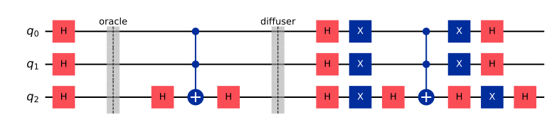

# Chapter 15. Landmark Quantum Algorithms

> **Status:** prereviewed · **Phase:** 3 · **Sections drafted:** 11 / 11

[← Previous: Chapter 14](14-foundational-algorithms.md) · [Table of Contents](../../README.md) · [Next: Chapter 16 →](16-modern-algorithmic-frontier.md)

Chapter 14 set up the primitives. This chapter is about the **algorithms** built from them — the named, citable, well-studied algorithms that practitioners reach for when sketching what a fault-tolerant or NISQ-era quantum computer could plausibly do. Grover and Shor are the canonical pair; HHL is the linear-systems analogue with subtle preconditions; quantum walks generalise random walks for graph problems; VQE and QAOA are the variational workhorses of the near-term era; and the chapter closes with a level-headed survey of quantum machine learning, which is the most over-promised and under-delivered subarea in the field.

> **How to read this chapter.** §§15.1–15.4 are mandatory if you want to understand the cryptographic stakes of quantum computing. §15.5 (HHL) is where most "quantum exponential speedup" stories outside cryptography live, and the section emphasises the assumptions that often make those speedups disappear in practice. §15.6 is optional on first pass. §§15.7–15.9 are essential for anyone running experiments on a 2026-era device, and §15.10 frames the genuine outlook for quantum ML.

## 15.1 Grover's Algorithm

Grover's algorithm solves **unstructured search**: given an oracle $O_f$ for a boolean function $f: \\{0,1\\}^n \to \\{0,1\\}$ with $M$ marked inputs out of $N = 2^n$ total, find a marked input. The full algorithm wraps the amplitude amplification machinery of §14.7: initialise to the uniform superposition $|\psi\rangle = H^{\otimes n}|0^n\rangle$, apply the Grover operator $G$ a total of $k$ times — the near-optimal choice is $k = \mathrm{round}(\pi/(4\theta) - 1/2)$, often abbreviated to $\lfloor \pi/(4\theta) \rfloor$ in the small-$\theta$ limit, with $\sin\theta = \sqrt{M/N}$ — then measure. After $k$ iterations the probability of measuring a marked item is *exactly* $\sin^2\bigl((2k+1)\theta\bigr)$. With the rounded choice $k = \mathrm{round}\bigl(\pi/(4\theta) - 1/2\bigr)$ the angle $(2k+1)\theta$ lands within $\theta$ of $\pi/2$, so the success probability is at least $\cos^2\theta = 1 - M/N$; the query count is $\Theta(\sqrt{N/M})$. (The small-$\theta$ floor variant $k = \lfloor \pi/(4\theta) \rfloor$ gives a comparable but slightly weaker guarantee.)



Two extensions are worth knowing. **Unknown $M$**: run Grover with successively doubled iteration counts; expected total queries remain $O(\sqrt{N/M})$ even without knowing $M$ in advance. **Quantum minimum-finding (Dürr–Høyer)**: $O(\sqrt{N})$ queries to find the minimum of $f$ over $\\{0,1\\}^n$, via iterated Grover with the current best as the marking threshold.

What Grover *is not*. It is not a way to "solve NP in $\sqrt{\text{search space}}$"; it gives a quadratic speedup, not an exponential one, and once you account for the overhead of a fault-tolerant Grover query (Toffoli-heavy circuits, magic-state distillation), the constant factors are substantial. The current consensus is that Grover provides a useful speedup for problems with very large search spaces and cheap oracles (e.g., parts of cryptanalysis, branch-and-bound search), and that the *NP* picture is roughly: $\sqrt{\text{search space}}$ is what you get under unstructured search; algorithmic structure can do much better classically and is rarely tractable to import into the Grover model. Bennett–Bernstein–Brassard–Vazirani showed Grover's $\sqrt N$ is optimal in the oracle model.

The amplification is easy to see in code (`examples/grover.py`): searching $N = 8$ for the marked item $|111\rangle$, the optimal $\lfloor \tfrac{\pi}{4}\sqrt{8} \rfloor = 2$ iterations concentrate almost all the probability on the answer.

```python
from qiskit import QuantumCircuit
from qiskit.primitives import StatevectorSampler

n = 3
qc = QuantumCircuit(n, n)
qc.h(range(n))
for _ in range(2):                     # ~ floor(pi/4 * sqrt(8)) iterations
    qc.h(n - 1); qc.mcx([0, 1], n - 1); qc.h(n - 1)        # oracle: mark |111>
    qc.h(range(n)); qc.x(range(n))                          # diffusion
    qc.h(n - 1); qc.mcx([0, 1], n - 1); qc.h(n - 1)
    qc.x(range(n)); qc.h(range(n))
qc.measure(range(n), range(n))

counts = StatevectorSampler().run([qc], shots=1000).result()[0].data.c.get_counts()
print(dict(sorted(counts.items(), key=lambda kv: -kv[1])))
```

Output (stochastic, but `111` dominates at roughly 95%):

```text
{'111': 950, '001': 9, '010': 9, '000': 9, '011': 8, '101': 7, '110': 5, '100': 3}
```

## 15.2 Shor's Algorithm

Shor's algorithm factors an $n$-bit integer $N$ in polynomial time on a quantum computer. The structure is: a classical reduction from factoring to **order-finding** modulo $N$, followed by a quantum order-finding subroutine, followed by classical post-processing.

The classical reduction (Miller 1976): pick a random $a$ coprime to $N$; find the multiplicative order $r$ of $a$ modulo $N$ (the smallest $r > 0$ with $a^r \equiv 1 \pmod N$); if $r$ is even and $a^{r/2} \not\equiv -1 \pmod N$, then $\gcd(a^{r/2} \pm 1, N)$ gives a nontrivial factor of $N$ with probability $\geq 1/2$. Iterate over a few random $a$'s; expected $O(1)$ rounds find a factor.

The quantum order-finding subroutine: prepare two registers of $2n$ and $n$ qubits; apply $H^{\otimes 2n}$ to the first; query $U_a |x\rangle|y\rangle = |x\rangle|a^x y \mod N\rangle$ controlled on the first register; apply the QFT $F_{2^{2n}}$ (in the book's negative-exponent convention, §14.5) to the first register; measure. The measurement returns a value close to a rational $s/r$ with $s \in \\{0, 1, \ldots, r-1\\}$; continued-fraction expansion recovers $r$ with high probability. Total quantum gate count is $O(n^2 \log n \log\log n)$ using Schönhage–Strassen modular exponentiation, dominated by the modular-exponentiation step (the QFT is "only" $O(n^2)$).

The implication, when (if) fault-tolerant quantum computers exist at the relevant scale, is that RSA and the discrete-log family of public-key cryptosystems are broken. This is the motivation for **post-quantum cryptography** (Chapter 27) and for the NIST standardisation effort that in 2024 finalised its first post-quantum standards — ML-KEM (FIPS 203) and ML-DSA (FIPS 204), derived from CRYSTALS-Kyber and CRYSTALS-Dilithium respectively.

## 15.3 Factoring

> **Moving-target warning — snapshot as of May 2026.** The factoring resource estimates in this section (physical-qubit counts, runtimes) reflect the best published sources as of 2026 and *date quickly* — they have fallen by orders of magnitude over the past decade and will keep moving. If you are reading a draft, treat every figure as provisional and re-verify it against current preprints and journal sources before relying on it.

Factoring deserves a section beyond Shor's statement because the resource cost is the central number cited in "when will quantum computers be a threat" discussions. The relevant resource is the **number of physical qubits** and the **runtime in wall-clock hours** required to factor a cryptographically relevant integer (RSA-2048: 2048 bits) under realistic noise.

Two anchor estimates frame the 2025–2026 picture, both at a physical gate error of $10^{-3}$ (these are the published anchors as of their dates and remain a moving target — treat the specific figures as a dated snapshot, not a fixed threshold):

- **Gidney–Ekerå (2019; *Quantum* 2021):** $\sim 20$ million physical qubits, $\sim 8$ hours of runtime, magic-state distillation dominating the cost.
- **Gidney (arXiv 2505.15917, May 2025):** under 1 million physical qubits, under one week — a $>20\times$ qubit reduction without weakening the assumptions, driven by approximate residue arithmetic (Chevignard–Fouque–Schrottenloher 2024), yoked surface codes (Gidney–Newman–Brooks–Jones 2023), and a smaller magic-state-distillation budget.

In both estimates the logical circuit lives on the order of a few thousand logical qubits; the surface-code overhead — roughly $2d^2$ physical qubits per logical, with $d$ in the high twenties — is what inflates that to the millions of physical qubits above.

These numbers have come down by orders of magnitude over the last decade through algorithmic improvements (window arithmetic, semi-classical Fourier, Ekerå's modifications) and through surface-code improvements (lattice surgery, magic-state cultivation, $T$-count optimisation in modular adders). They will probably come down further. Current physical devices in 2026 have $\sim 10^2$–$10^3$ qubits with error rates around $10^{-3}$. The gap is large but is a difference of degree, not kind: for long-lived secrets (TLS sessions intercepted now and stored, root certificates, long-lifetime signing keys) the migration question is "*when* will a cryptographically relevant quantum computer (CRQC) arrive" rather than "whether such a machine is possible in principle" — which is what motivates the NIST PQC standardisation timeline and the "harvest now, decrypt later" framing.

Two non-Shor approaches deserve mention. **Variational factoring** via QAOA-style algorithms: encouraging on toy instances, but no evidence of asymptotic speedup over classical methods. **Lattice-reduction hybrids**: Claus-Peter Schnorr's 2021 classical lattice-factoring claim, and the 2023 Yan et al. proposal that combined Schnorr's method with a small QAOA subroutine to factor with a few hundred qubits; the consensus by 2025 is that neither delivers the claimed speedup on relevant instance sizes.

## 15.4 Discrete Logarithm

The discrete-logarithm problem (DLP) — given a group $G$, generator $g$, and element $h \in \langle g\rangle$, find $x$ with $g^x = h$ — also admits a polynomial-time quantum algorithm via Shor's framework. The reduction is to two coupled order-findings: prepare a superposition over pairs $(a, b)$, query $g^a h^{-b}$ into an output register, and run a 2D QFT. The measurement output is concentrated on $(a, b)$ pairs satisfying $a \equiv bx \pmod r$ where $r$ is the order of $g$; classical post-processing recovers $x$ by modular inversion — a sampled pair with $\gcd(b, r) = 1$ gives $x = a\\,b^{-1} \bmod r$. (Ekerå's refined variants use lattice-based post-processing instead.)

DLP underpins Diffie–Hellman key exchange, ElGamal encryption, DSA signatures, ECDSA (in elliptic-curve groups), and the Schnorr signatures used in modern cryptocurrencies. All fall to Shor in the same regime as factoring. Pairing-based cryptography (BLS signatures, identity-based encryption) reduces to discrete log in the bilinear-group setting and falls just as cleanly.

In elliptic-curve groups, the implementation cost of $g^x$ is lower (no modular exponentiation; just elliptic-curve point multiplication), which makes Shor-DLP on ECDLP somewhat cheaper than Shor-factoring on RSA — roughly half the qubits and gate count for comparable security (Roetteler–Naehrig–Svore–Lauter 2017; Häner–Jaques–Naehrig–Roetteler–Soeken 2020). The post-quantum migration story is therefore identical: any deployed asymmetric primitive must be replaced with a post-quantum scheme (lattice-based or code-based or hash-based) before fault-tolerant quantum computers come online.

## 15.5 HHL Algorithm for Linear Systems

The **HHL algorithm** (Harrow–Hassidim–Lloyd, 2008) solves linear systems $Ax = b$ on a quantum computer, given an $N \times N$ Hermitian matrix $A$ and a vector $b$, in time $O((\log N) \cdot s^2 \kappa^2 / \epsilon)$ where $s$ is the sparsity, $\kappa$ is the condition number, and $\epsilon$ is the precision. The classical complexity for a general dense linear system is $O(N^3)$; for a sparse system it is $O(N s \kappa)$. The HHL exponential speedup is in $N$. The $\kappa^2$ shown here is the original-HHL scaling; subsequent block-encoded and quantum-singular-value-transformation-based algorithms (Childs–Kothari–Somma 2017 and follow-ups; QSVT, Chapter 16) achieve essentially linear $\kappa$-dependence.

The algorithm works by applying $A$'s spectral decomposition **coherently** via phase estimation — it never produces an explicit eigendecomposition or learns the individual eigenvalues/eigenvectors. Prepare $|b\rangle$ in a quantum register; apply phase estimation with $U = e^{iAt}$; the result is a superposition $\sum_j \beta_j |u_j\rangle|\lambda_j\rangle$ where $|u_j\rangle$ are eigenstates of $A$ with eigenvalues $\lambda_j$ and $\beta_j = \langle u_j | b\rangle$. Rotate an ancilla, conditioned on the eigenvalue register, so that its $|1\rangle$ amplitude is $C/\lambda_j$ for some constant $C$ (a rotation by angle $2\arcsin(C/\lambda_j)$); post-select on the ancilla being $|1\rangle$; uncompute the phase estimation. The remaining state is proportional to $\sum_j (\beta_j/\lambda_j)|u_j\rangle = A^{-1}|b\rangle$.

Three caveats are crucial and make HHL applications subtle.

1. **You get $|x\rangle$, not $x$.** Reading out $x$ classically requires $\Theta(N)$ measurements and erases the speedup. HHL is useful only when the *answer to your question* is a property of $x$ extractable from $|x\rangle$ in $O(\mathrm{poly}\log N)$ measurements — e.g., $\langle x | M | x \rangle$ for some efficiently-measurable observable $M$.
2. **You need an efficient $b$-preparation circuit.** Loading classical data $b \in \mathbb{R}^N$ into a quantum state $|b\rangle$ generically takes $\Theta(N)$ gates; "QRAM" proposals would reduce this to $O(\log N)$ but no scalable QRAM has been demonstrated.
3. **Dependence on $\kappa$ is unavoidable.** A condition number $\kappa = \Omega(N)$ kills the speedup.

The verdict: HHL is the prototype for "block-encoded linear algebra" and its successors (Chapter 16), but most explicitly proposed HHL applications — quantum financial modelling, quantum machine learning, etc. — have been *dequantised* by Tang and follow-ups, showing classical algorithms with comparable polylogarithmic dependence under the same access assumptions.

## 15.6 Quantum Walks

A **quantum walk** is the unitary analogue of a classical random walk: instead of probabilistic moves on a graph, amplitudes propagate along edges. The two main models are **discrete-time** quantum walks (a coin operator on an internal degree of freedom, a shift operator on the graph) and **continuous-time** quantum walks ($e^{-iLt}$ with $L$ the graph Laplacian or adjacency).

Quantum walks give polynomial speedups for several graph-search problems. The signature result: a quantum walk on a "glued-trees" graph traverses from root to root in polynomial time, while any classical algorithm — given the same oracle access to graph adjacency — requires exponential time. This is an *oracle-model* (query-complexity) separation, Childs–Cleve–Deotto–Farhi–Gutmann–Spielman (2003) — the first exponential separation by a quantum walk. **Element distinctness** on $n$ inputs: $O(n^{2/3})$ queries quantum versus $\Omega(n)$ classical, due to Ambainis. **Triangle finding** in graphs: $\tilde O(n^{1.3})$ quantum queries via the Magniez–Santha–Szegedy quantum-walk algorithm (2005), since improved to $\tilde O(n^{5/4})$ by later work (Belovs; Lee–Magniez–Santha; Le Gall).

The unifying framework, **Szegedy quantization** of Markov chains, converts a stochastic matrix $P$ into a unitary walk $W_P$ on a doubled state space whose spectrum encodes the mixing properties of $P$. Quantum walk applied to a Markov chain achieves a quadratic speedup in the spectral-gap dependence of hitting/search problems (an analogous speedup for *mixing* is established only case-by-case and remains open in general), which underpins amplitude-amplification-of-Monte-Carlo-style quantum algorithms (Chapter 16). Quantum walks are also the backbone of modern Hamiltonian simulation (qubitization, §16.5) and quantum signal processing.

## 15.7 Variational Quantum Algorithms

**Variational quantum algorithms (VQAs)** are the dominant class of algorithms targeted at near-term, noisy quantum hardware. The recipe: parameterise a quantum circuit $U(\vec\theta)$ — usually a hardware-efficient ansatz of single-qubit rotations and a fixed entangling pattern — prepare a state $|\psi(\vec\theta)\rangle = U(\vec\theta)|0^n\rangle$, measure to estimate a cost function $C(\vec\theta) = \langle \psi(\vec\theta)|H|\psi(\vec\theta)\rangle$ for some problem Hamiltonian $H$, and let a classical optimiser update $\vec\theta$ to minimise $C$.

Two design choices dominate. The **ansatz**: hardware-efficient (shallow, decoherence-friendly, but prone to barren plateaus), problem-inspired (Hamiltonian-variational, ADAPT-VQE, unitary coupled cluster — deeper, more expressive, harder to optimise), or symmetry-preserving (encodes problem symmetries directly). The **optimiser**: gradient-based with parameter-shift gradients (§8.13), gradient-free (COBYLA, SPSA, Nelder–Mead), or natural-gradient / quantum-imaginary-time-evolution variants.

The notorious obstacle is the **barren-plateau phenomenon**: for many circuit families, the variance of the gradient decays exponentially in $n$, making the cost landscape flat and unoptimisable. McClean–Boixo–Smelyanskiy–Babbush–Neven (2018) showed this for random hardware-efficient ansatze. Mitigations include problem-inspired ansatze, layer-wise training, and circuit "initialisation tricks" that start in a region with non-trivial gradient. Whether VQA can deliver real quantum advantage — versus being merely a hybrid-classical heuristic — is one of the central open questions of the NISQ era.

## 15.8 Variational Quantum Eigensolver

> **Moving-target warning — snapshot as of May 2026.** The shot-count and near-term-practicality figures in this section reflect 2026-era hardware and *date quickly*. If you are reading a draft, treat them as provisional order-of-magnitude estimates and re-verify against current sources before relying on them.

The **Variational Quantum Eigensolver (VQE)** is the prototype VQA, targeting the ground-state energy of a molecular or material Hamiltonian. Mapping the Hamiltonian to qubits — Jordan–Wigner or Bravyi–Kitaev — gives a sum of Pauli strings $H = \sum_k c_k P_k$. The cost function is $\langle H \rangle = \sum_k c_k \langle P_k\rangle$, with each $\langle P_k\rangle$ estimated by basis-rotating and measuring (§9.6).

VQE's appeal is that the ansatz can be tailored to the chemistry: **unitary coupled cluster (UCCSD)** uses excitation operators from coupled-cluster theory; **ADAPT-VQE** grows the ansatz one operator at a time based on largest gradient; **hardware-efficient** ansatze ignore chemistry and just minimise depth. UCCSD captures static correlation accurately but has deep circuits; ADAPT-VQE achieves comparable accuracy with shorter circuits at the cost of more classical orchestration.

The practical bottleneck in 2026 is **measurement cost**: a Hamiltonian with $K$ Pauli strings and target precision $\epsilon$ requires $O(K \mathrm{Var}/\epsilon^2)$ shots in the naive scheme. Pauli-string grouping, classical-shadows-based estimation (§11.5), and adaptive measurement allocation reduce this substantially — sometimes by an order of magnitude — but VQE on a 50-orbital active space still requires on the order of $10^9$–$10^{12}$ shots (an order-of-magnitude estimate; exact counts are problem- and ansatz-dependent), which is several days of real-time device usage. These are current-hardware figures that should fall as measurement-reduction techniques and devices improve; read them as a 2026 snapshot. Hardware-noise mitigation via zero-noise extrapolation and probabilistic error cancellation (Chapter 18) tames bias but worsens variance.

## 15.9 Quantum Approximate Optimization Algorithm

The **Quantum Approximate Optimization Algorithm (QAOA)** applies the VQA pattern to combinatorial optimisation problems. Given a cost Hamiltonian $H_C$ diagonal in the computational basis (encoding the objective of, say, Max-Cut or constraint satisfaction) and a mixing Hamiltonian $H_M = \sum_i X_i$, the depth-$p$ QAOA ansatz is

$$
|\psi(\vec\gamma, \vec\beta)\rangle \;=\; e^{-i\beta_p H_M}\\,e^{-i\gamma_p H_C}\cdots e^{-i\beta_1 H_M}\\,e^{-i\gamma_1 H_C}\\,|+\rangle^{\otimes n},
$$

with $2p$ real parameters. Classical optimisation tunes $(\vec\gamma, \vec\beta)$ to maximise $\langle H_C\rangle$; sampling from the optimised state then yields candidate solutions.

For $p = 1$, QAOA on Max-Cut on 3-regular graphs already achieves an approximation ratio of $0.6924\ldots$, beating naive random assignment. As $p \to \infty$, with a parameter schedule that interpolates adiabatically slowly, QAOA provably converges to the exact ground state (via the adiabatic theorem); arbitrary optimised finite-$p$ schedules carry no such guarantee. The question is the rate of convergence and whether the optimal $\vec\gamma, \vec\beta$ are efficiently learnable.

Empirical and theoretical results from 2020–2025 are sobering. For most natural instance distributions, QAOA at small $p$ does not beat the best classical approximation algorithms (Goemans–Williamson for Max-Cut, etc.). At larger $p$, the parameter optimisation becomes hard. Recent positive results on specific instance families (low-autocorrelation binary sequences, certain dense problems) keep QAOA in the conversation, but the early "QAOA will give near-term quantum advantage on combinatorial optimisation" hope has not materialised.

## 15.10 Quantum Machine Learning Overview

> **Moving-target warning — snapshot as of May 2026.** The status assessments in this section are a 2026 snapshot of a fast-moving research area, and specific verdicts may shift. If you are reading a draft, re-check the current literature before treating any judgment here as settled.

**Quantum machine learning (QML)** is a broad umbrella covering: (a) quantum algorithms for classical ML problems (training, inference, sampling), (b) machine learning of quantum data (state tomography, learning Hamiltonians), and (c) variational "quantum neural networks" trained by gradient descent on quantum hardware.

The 2026 picture, in plain language (a fast-moving research area — the status claims below are a dated snapshot and the specific verdicts may shift):

- **Speedups for classical ML via HHL-style algorithms** (linear regression, kernel methods, recommendation systems, principal-component analysis): essentially all dequantised by Tang and follow-ups under the same data-access assumptions. The exponential speedups were artefacts of the QRAM assumption.
- **Quantum kernel methods**: kernels evaluated by inner products of quantum-state-encoded inputs. Polynomial advantage on artificial problems is provable; generic-data advantage is empirically modest.
- **Variational quantum neural networks**: subject to barren plateaus and to the absence of evident advantage over classical NNs on most tasks. Useful as a research framework for "what is the expressive power of parameterised quantum circuits", less so as production ML.
- **Learning quantum data** (state tomography, learning Pauli expectations, learning Hamiltonians from time evolutions): genuinely a quantum task, and here QML methods (shadow tomography, learning theory of quantum states) do beat naive baselines.

The honest takeaway: most quantum advantages claimed for QML evaporate under closer inspection of data-access models, and most NISQ-era QML experiments are demonstrations of feasibility rather than benchmarks of advantage. The genuine open territory is in QML of *quantum* problems — characterising states and processes — where quantum methods have natural structural advantages.

## 15.11 Bridge to Chapter 16

This chapter covered the landmark algorithms of the first three decades of the field. Chapter 16 covers the **modern frontier** — block-encoding and qubitization, quantum signal processing, the linear combination of unitaries (LCU) framework, advanced Hamiltonian simulation, and the algorithms developed in 2020–2025 that supersede HHL and the early Hamiltonian-simulation toolbox. Many of these are subroutine-level improvements rather than new top-level algorithms, but they reshape resource estimates substantially.

**Sanity checks before moving on.**

1. For Grover with $N = 256$ and $M = 4$, compute the optimal iteration count and success probability.
2. Sketch the order-finding circuit for $a = 7$, $N = 15$ (so $r = 4$) and verify the QFT-output peaks at multiples of $2^{2n}/4 = 2^{2n-2}$.
3. For HHL on a $2\times 2$ Hermitian matrix $A$, write out the eigenvalues and the conditional rotation angle.
4. For QAOA at $p=1$ on the two-vertex Max-Cut (trivially optimisable), compute the optimal $(\gamma, \beta)$ analytically.
5. Look up a current resource estimate for factoring RSA-2048 (Gidney–Ekerå or a 2024–2025 refinement) and identify which line item dominates — magic-state distillation, lattice surgery, or arithmetic. Use the baseline figures already tabulated in §15.3 as your starting point.

---

[← Previous: Chapter 14](14-foundational-algorithms.md) · [Table of Contents](../../README.md) · [Next: Chapter 16 →](16-modern-algorithmic-frontier.md)
