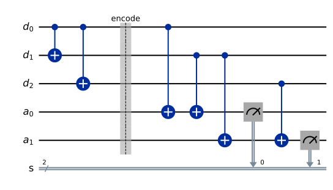

# Chapter 19. Quantum Error Correction and Fault Tolerance

> **Status:** draft · **Phase:** 4 · **Sections drafted:** 23 / 23

[← Previous: Chapter 18](18-noise-decoherence-and-errors.md) · [Table of Contents](../../README.md) · [Next: Chapter 20 →](../part-09-hardware-and-software/20-quantum-hardware-platforms.md)

Chapter 18 catalogued the ways physical qubits go wrong: $T_1$ decay, dephasing, coherent miscalibration, leakage, readout error. Chapter 19 is about the response. Classical computers tolerate noisy components because every bit is implemented by a macroscopic voltage with huge margin to its nearest neighbour, and because a flipped bit can simply be copied and majority-voted. Quantum computers have neither margin: the state lives in a continuous Hilbert space, an arbitrary rotation of one amplitude is an error, and the no-cloning theorem (§5.7) forbids the obvious copy-and-vote. The miracle is that quantum error correction is nevertheless possible — not as a clever encoding here and there, but as a complete theory with stabiliser formalism, code families, threshold theorems, and a fault-tolerant compilation pipeline that turns noisy physical hardware into arbitrarily reliable logical qubits at a polylog overhead. This chapter walks that pipeline end to end.

> **How to read this chapter.** §§19.1–19.5 are the conceptual core: why classical tricks fail, the discretisation insight that rescues them, and the three- and nine-qubit codes that make the theory concrete. §§19.6–19.11 develop the stabiliser formalism and the CSS construction that organise all known codes. §§19.12–19.18 turn to topological codes — the surface code in particular — which dominate near-term and medium-term proposals and set the resource estimates that hardware roadmaps quote. §§19.19–19.23 are the fault-tolerance layer: the threshold theorem, transversal gates, magic state distillation, and lattice surgery. A first read can skim §§19.13–19.15 (color, qLDPC) and §§19.22–19.23 (lattice surgery, logical gate implementation), but every estimate of "how many physical qubits per logical qubit" lives there, so they cannot be skipped on the second pass.

## 19.1 Why Quantum Error Correction Is Harder Than Classical

A classical bit has two stable values, and a noisy environment perturbs the analogue voltage that represents the bit. Provided the noise stays below the discriminator threshold, the bit refreshes itself at every gate. When noise occasionally exceeds the threshold and a flip occurs, **classical error correction** restores the bit by encoding it redundantly and majority-voting. Two facts make the classical case easy. First, the value can be *copied* without disturbing it. Second, the only error to worry about is a discrete bit flip; small analogue perturbations decay back into the discriminator's basin of attraction without intervention.

Neither holds quantum-mechanically. A qubit's state $\alpha|0\rangle + \beta|1\rangle$ is a point on the Bloch sphere, perturbed continuously by any environmental coupling. Copying it is forbidden by the **no-cloning theorem**: there is no unitary $U$ with $U(|\psi\rangle \otimes |0\rangle) = |\psi\rangle \otimes |\psi\rangle$ for all $|\psi\rangle$. Measuring it to vote majority would collapse the superposition and destroy the very feature the encoding is supposed to protect. And quantum errors are not just bit flips: $X$, $Y$, $Z$, $\tfrac{1}{2}(I+iZ)$, and arbitrary continuous rotations all count.

So quantum error correction has to thread three needles at once: spread the information across multiple qubits without literally copying it, detect errors without measuring the encoded state, and handle a continuous error space. The solutions to all three were worked out in the 1990s and form the substance of this chapter. They rest on a single key observation — the **discretisation theorem** of §19.3 — that reduces the continuous error space to a finite syndrome problem.

## 19.2 Classical Coding Recap

Classical error-correcting codes are the right warm-up because the structural ideas survive almost intact into the quantum case; only the implementation has to change to respect linearity and no-cloning.

The simplest classical code is the **3-bit repetition code**: encode $0$ as $000$ and $1$ as $111$. A single bit flip in the channel takes $000 \to 001$, $010$, or $100$; majority vote recovers $0$. Two flips cause a logical error. The code corrects 1 error out of 3 bits because its **minimum distance** — the smallest Hamming distance between two codewords — is $d = 3$, and a code of distance $d$ corrects $\lfloor (d-1)/2 \rfloor$ errors.

A more efficient classical construction is the **parity-check code**. Encode $k$ message bits into $n > k$ codeword bits using a generator matrix $G \in \mathbb{F}_2^{n \times k}$; the codewords are the column space of $G$. Equivalently, $G$ has a **parity-check matrix** $H \in \mathbb{F}_2^{(n-k) \times n}$ with $H G = 0$, so a vector $c$ is a codeword iff $H c = 0$. A received word $r = c + e$ for some error pattern $e$ has **syndrome** $s = H r = H e$, depending only on the error and not on the codeword. Decoding amounts to finding the most likely $e$ consistent with $s$.

Three structural lessons carry over. First, the codewords form a linear subspace; encoded states live in a *code subspace* and errors map them out of it. Second, error detection happens via *measurements that depend only on the error*, not on which codeword is encoded — exactly what we need quantum-mechanically to avoid disturbing the encoded state. Third, the redundancy is real but bounded: the **Hamming bound** and **Singleton bound** constrain how many errors can be corrected for given $n$ and $k$. Both bounds have direct quantum analogues.

## 19.3 Why Naive Quantum Error Correction Fails

A first guess at quantum repetition would be $|\psi\rangle = \alpha|0\rangle + \beta|1\rangle \mapsto \alpha|0\rangle \otimes |0\rangle \otimes |0\rangle + \beta|1\rangle \otimes |1\rangle \otimes |1\rangle$, which we abbreviate $\alpha|000\rangle + \beta|111\rangle$. This is *not* cloning (the amplitudes $\alpha, \beta$ are preserved, not duplicated as separate states), and it is implementable by two CNOTs from the data qubit to two fresh $|0\rangle$ ancillae.

The encoding handles a single $X$ error correctly. If qubit $2$ flips, the state becomes $\alpha|010\rangle + \beta|101\rangle$, and a syndrome measurement of $Z_1 Z_2$ and $Z_2 Z_3$ returns the parity pair $(-1, -1)$, identifying qubit $2$ as the flipped one. Applying $X_2$ restores the encoded state without ever measuring $\alpha$ or $\beta$. So bit flips can be corrected.

But the encoded state is *not* protected against phase errors. A $Z$ error on any one of the three qubits applies $|0\rangle\langle 0| - |1\rangle\langle 1|$ to its component, and because the encoding has the same amplitude on $|000\rangle$ and $|111\rangle$, a single $Z$ on (say) qubit $1$ turns the state into $\alpha|000\rangle - \beta|111\rangle$, which is a *logical* phase flip on the encoded qubit. Worse, $Z_1$, $Z_2$, and $Z_3$ all do the same thing on the code subspace — they are indistinguishable. The bit-flip code amplifies phase errors instead of suppressing them.

The fix is the **discretisation theorem**. Suppose a code corrects every Pauli error on some set $\mathcal{E} = \\{E_1, E_2, \ldots\\}$ of single-qubit positions. Then it corrects every *linear combination* of those errors — and since the Pauli operators $\\{I, X, Y, Z\\}$ span the $2\times 2$ complex matrices, every single-qubit operation, unitary or not, is a linear combination of Paulis. Concretely: if a noisy channel applies an arbitrary $E = \sum_k c_k E_k$ to a single qubit and the syndrome circuit projects onto the subspace where exactly $E_k$ occurred (or no error did), the measurement leaves a definite Pauli error, which the recovery circuit then corrects. The continuous error space collapses to a discrete syndrome.

> **Discretisation theorem (informal).** A quantum code that corrects every error in a set $\\{E_1, \ldots, E_m\\}$ of operators automatically corrects every operator in their linear span. In particular, correcting all single-qubit $X$, $Y$, $Z$ errors suffices to correct every single-qubit error, however small or however continuous.

This is the structural reason QEC is even possible. A discrete code can defeat a continuous adversary because syndrome measurement projects the continuous error onto one of finitely many discrete outcomes, and the same recovery handles every error in the equivalence class of that outcome.

## 19.4 Bit-Flip Codes

The **3-qubit bit-flip code** encodes one logical qubit into three physical qubits via

$$
|0_L\rangle = |000\rangle, \qquad |1_L\rangle = |111\rangle, \qquad \alpha|0\rangle + \beta|1\rangle \;\mapsto\; \alpha|000\rangle + \beta|111\rangle.
$$

The encoding circuit is two CNOTs from the data qubit (initially in the arbitrary state $\alpha|0\rangle + \beta|1\rangle$) to two ancillae prepared in $|0\rangle$.

The **stabilisers** (anticipating §19.8) of this code are the two operators

$$
S_1 = Z_1 Z_2, \qquad S_2 = Z_2 Z_3.
$$

Both have eigenvalue $+1$ on the code subspace, because $Z|0\rangle = +|0\rangle$ and $Z|1\rangle = -|1\rangle$ so $Z \otimes Z$ has eigenvalue $+1$ on $|00\rangle$ and on $|11\rangle$ alike. An $X$ error on qubit $i$ anticommutes with any $S_j$ that touches qubit $i$ and commutes with the others, so the eigenvalues of $S_1, S_2$ after the error encode *which* qubit flipped:

- No error or $X_1$: $(s_1, s_2) = (+1, +1)$ vs $(-1, +1)$.
- $X_2$: $(s_1, s_2) = (-1, -1)$.
- $X_3$: $(s_1, s_2) = (+1, -1)$.

Measuring $S_1$ and $S_2$ (each implemented as a CNOT cascade onto an ancilla, followed by a $Z$-basis measurement of the ancilla) reveals the syndrome without revealing $\alpha$ or $\beta$. The recovery flips whichever qubit the syndrome identifies. The code has distance $d = 3$ for bit flips and corrects one $X$ error. Phase errors are *not* corrected, as §19.3 showed.

## 19.5 Phase-Flip Codes

The **3-qubit phase-flip code** is the bit-flip code conjugated by Hadamards. Recall that $H X H = Z$ and $H Z H = X$, so if a code protects against $X$ errors in the computational basis, conjugating every qubit by $H$ produces a code that protects against $Z$ errors. Explicitly:

$$
|0_L\rangle = |+\!+\!+\rangle, \qquad |1_L\rangle = |-\!-\!-\rangle,
$$

with stabilisers

$$
S_1 = X_1 X_2, \qquad S_2 = X_2 X_3.
$$

A single $Z$ on qubit $i$ in this basis flips $|+\rangle \leftrightarrow |-\rangle$ at position $i$, anticommutes with the stabilisers touching qubit $i$, and is identified by exactly the same syndrome pattern as before. The code protects against one phase flip and fails against bit flips. Neither code on its own is useful; the question is whether the two ideas can be combined.

## 19.6 Shor Code

The **9-qubit Shor code**, proposed by Peter Shor in 1995, is the first quantum code to correct an arbitrary single-qubit error. The construction is a **concatenation** of the phase-flip code (outer) with the bit-flip code (inner): take the phase-flip encoding $|0_L\rangle = |+\!+\!+\rangle$, $|1_L\rangle = |-\!-\!-\rangle$, then replace each $|+\rangle$ and $|-\rangle$ by a bit-flip-encoded version. Writing $|\pm\rangle_b = \tfrac{1}{\sqrt 2}(|000\rangle \pm |111\rangle)$ for the bit-flip-encoded $\pm$ states, the Shor encoding is

$$
|0_L\rangle = \tfrac{1}{2\sqrt 2}(|000\rangle + |111\rangle)(|000\rangle + |111\rangle)(|000\rangle + |111\rangle),
$$

$$
|1_L\rangle = \tfrac{1}{2\sqrt 2}(|000\rangle - |111\rangle)(|000\rangle - |111\rangle)(|000\rangle - |111\rangle).
$$

Read it as a $3 \times 3$ block: three groups of three qubits, each group bit-flip-encoded internally to defeat $X$ errors within the group, and the three groups phase-flip-encoded across to defeat $Z$ errors across groups. A single $X$ error within group $g$ is identified by the intra-group bit-flip syndrome and corrected. A single $Z$ error anywhere is identified by the inter-group phase-flip syndrome and corrected (because a $Z$ on any qubit of group $g$ flips the sign of $|\pm\rangle_b$ for that group). A single $Y = iXZ$ is corrected by the same machinery — the bit-flip syndrome detects the $X$ part and the phase-flip syndrome detects the $Z$ part, independently.

The code has eight stabilisers: six $ZZ$ stabilisers (two within each of the three groups) plus two $X^{\otimes 6}$ stabilisers spanning pairs of groups. The logical operators (minimal-weight representatives) are $\bar X = Z_1 Z_4 Z_7$ — one $Z$ per group, which flips the relative sign inside each group and so maps $|0_L\rangle \leftrightarrow |1_L\rangle$ — and $\bar Z = X_1 X_2 X_3$ — the three $X$'s on a single group, which sends $|1_L\rangle \to -|1_L\rangle$ while fixing $|0_L\rangle$. (Note both have weight $3$, consistent with distance $3$; the all-$X$ operator $X_1 \cdots X_9$ is *not* $\bar X$ — it acts as $\bar Z$ — and $Z_1 Z_2 Z_3$ is not a logical operator at all, since it anticommutes with the $X_1 \cdots X_6$ stabiliser.) These logical operators, together with the eight stabilisers, generate the relevant group. The Shor code has parameters $[[9, 1, 3]]$ (nine physical qubits, one logical qubit, distance three) and corrects any single-qubit error. It is *not* the most efficient nine-qubit code, but it is the cleanest illustration of the concatenation idea, which §19.19 elevates to a general construction.

## 19.7 Steane Code

The **7-qubit Steane code**, due to Andrew Steane (1996), encodes one logical qubit into seven physical qubits and corrects any single-qubit error. Like the Shor code it is distance-3, but it uses fewer physical qubits and — more importantly — sits inside a structural family (CSS, §19.11) that admits *transversal* Clifford gates (§19.20).

The construction borrows directly from the classical Hamming $[7, 4, 3]$ code. The classical Hamming code has parity-check matrix

$$
H_{\mathrm{Ham}} = \begin{pmatrix} 0 & 0 & 0 & 1 & 1 & 1 & 1 \\\\ 0 & 1 & 1 & 0 & 0 & 1 & 1 \\\\ 1 & 0 & 1 & 0 & 1 & 0 & 1 \end{pmatrix},
$$

a $3\times 7$ matrix whose columns are the binary representations of $1$ through $7$. The Steane code uses two copies of this classical code — one to detect $X$ errors, one to detect $Z$ errors — encoded as quantum stabilisers:

$$
S_1^X = X_4 X_5 X_6 X_7, \quad S_2^X = X_2 X_3 X_6 X_7, \quad S_3^X = X_1 X_3 X_5 X_7,
$$

$$
S_1^Z = Z_4 Z_5 Z_6 Z_7, \quad S_2^Z = Z_2 Z_3 Z_6 Z_7, \quad S_3^Z = Z_1 Z_3 Z_5 Z_7.
$$

Six stabilisers on seven qubits cut the $2^7$-dimensional space down to $2^{7-6} = 2$ dimensions: one encoded qubit. The logical operators are $\bar X = X_1 X_2 X_3 X_4 X_5 X_6 X_7$ and $\bar Z = Z_1 Z_2 Z_3 Z_4 Z_5 Z_6 Z_7$ (or any equivalent representatives modulo the stabiliser group).

The Steane code has parameters $[[7, 1, 3]]$. Two features make it the workhorse of textbook fault tolerance. First, the $X$ and $Z$ stabilisers come from the *same* classical code, which means the encoded $H$ gate is implemented transversally: $\bar H = H^{\otimes 7}$. The same holds for $\bar S$, $\bar X$, $\bar Z$, $\bar{\mathrm{CNOT}}$ — the entire Clifford group is transversal on the Steane code (§19.20). Second, it generalises naturally: any classical $[n, k, d]$ code that contains its dual gives a quantum CSS code with parameters $[[n, 2k - n, d]]$, as §19.11 spells out.

## 19.8 Stabilizer Formalism

The codes of §§19.4–19.7 share a structural pattern: each is specified by a small set of mutually commuting Pauli operators (the stabilisers), and the code subspace is their joint $+1$ eigenspace. The **stabiliser formalism**, due to Daniel Gottesman, makes this systematic.

The **Pauli group** $\mathcal{P}_n$ on $n$ qubits is the group generated by $\\{I, X, Y, Z\\}^{\otimes n}$ together with phases $\\{\pm 1, \pm i\\}$. Any two elements of $\mathcal{P}_n$ either commute or anticommute, never anything else — a consequence of the single-qubit anticommutation relations $XZ = -ZX$ etc. A **stabiliser group** $S \subseteq \mathcal{P}_n$ is an abelian subgroup of $\mathcal{P}_n$ not containing $-I$. The **code subspace** stabilised by $S$ is

$$
C(S) \;=\; \\{|\psi\rangle \in (\mathbb{C}^2)^{\otimes n} \;:\; g|\psi\rangle = +|\psi\rangle \text{ for all } g \in S\\}.
$$

If $S$ has $r$ independent generators, $C(S)$ has dimension $2^{n-r}$ — it encodes $k = n - r$ logical qubits.

The **normaliser** $N(S)$ is the set of Pauli operators that commute with every stabiliser, $N(S) = \\{P \in \mathcal{P}_n : Pg = gP \text{ for all } g \in S\\}$. Because $\mathcal{P}_n$ is "almost abelian" (every pair either commutes or anticommutes), the normaliser coincides with the centraliser. Elements of $N(S) \setminus S$ map the code subspace to itself but act *nontrivially* on encoded states — they are the **logical operators**. The minimum weight (number of qubits acted on nontrivially) of any non-stabiliser element of $N(S)$ is the **code distance** $d$.

A code is summarised by its parameters $[[n, k, d]]$: $n$ physical qubits, $k$ logical qubits, distance $d$. The 3-qubit bit-flip code is $[[3, 1, 3]]$ (but only against bit flips); the Shor code is $[[9, 1, 3]]$; the Steane code is $[[7, 1, 3]]$; the surface code (§19.12) has $[[d^2 + (d-1)^2, 1, d]]$ for odd $d$. A distance-$d$ code corrects any error of weight $\le \lfloor (d-1)/2 \rfloor$.

The stabiliser formalism is the right language for everything that follows. Codes are specified by their stabiliser generators; syndrome measurement is the joint measurement of those generators; the Pauli error commuting with a syndrome equivalence class is the recovery operator; transversal gates (§19.20) are exactly the Clifford operations that map stabilisers to stabilisers. The formalism also makes the **Gottesman–Knill theorem** explicit: stabiliser states (states in $C(S)$ for some $S$) plus Clifford gates plus computational-basis measurement can all be tracked in $O(n^2)$ time per operation by updating the generators of $S$ — they are classically simulable.

## 19.9 Syndrome Measurement

Detecting an error means measuring the stabilisers without disturbing the encoded state. Each stabiliser $g \in S$ has eigenvalues $\pm 1$; the code subspace is the $+1$ joint eigenspace. After a Pauli error $E$, the state lies in the joint eigenspace whose eigenvalue pattern $(s_1, \ldots, s_r)$ tells which stabilisers $E$ anticommutes with. That eigenvalue pattern is the **syndrome**.

The standard implementation uses one ancilla per stabiliser generator. For a stabiliser $g = P_1 \otimes \cdots \otimes P_n$ (each $P_i \in \\{I, X, Y, Z\\}$):

1. Prepare an ancilla in $|+\rangle$.
2. For each $i$ such that $P_i \ne I$, apply a controlled-$P_i$ from ancilla to qubit $i$.
3. Measure the ancilla in the $X$ basis; the outcome is the eigenvalue $s$ of $g$ on the data.

The construction generalises a basic interference trick: the controlled operations entangle the ancilla's phase with the eigenvalue of $g$, and the $X$-basis measurement reads out that phase. Because $g$ commutes with the stabilisers of the code, the measurement disturbs only the *error subspace*, not the encoded state itself.

In practice the syndrome circuit is itself noisy — the ancilla can be wrong, the CNOTs can fail, and the measurement can misread. So syndrome extraction is repeated $d$ times and the *history* of syndromes is decoded. Repetition turns the spatial code into a 2+1-dimensional spacetime decoding problem (§19.12). Repeated syndromes are how fault tolerance survives noisy syndrome extraction; the threshold theorem (§19.19) assumes this is done.

## 19.10 Decoding

A decoder is the classical algorithm that maps a syndrome to a recovery operation. Given the observed syndrome $(s_1, \ldots, s_r)$, find an error pattern $E$ with that syndrome and minimum weight (under the chosen noise model). Apply $E^{\dagger}$ to recover.

Three decoders dominate practice. The **maximum-likelihood decoder** is optimal: it picks the recovery that maximises $\Pr(\text{recovery} \mid \text{syndrome})$ summed over all errors equivalent modulo the stabiliser. It is generally $\mathsf{\#P}$-hard, so it is used only as a benchmark. The **minimum-weight perfect matching (MWPM) decoder**, due to Edmonds and adapted to QEC by Dennis, Kitaev, Landahl, and Preskill, exploits the planar structure of topological codes (§19.12) to find the most likely matching of syndrome defects in $O((nT)^3)$ time, where $T$ is the number of syndrome rounds. MWPM is the canonical surface-code decoder. **Neural-network decoders**, **union-find decoders**, and **belief-propagation decoders** trade some accuracy for speed; the union-find decoder of Delfosse and Nickerson runs in almost-linear time and is competitive with MWPM at threshold.

The decoder's job is harder than it looks because the syndrome is itself noisy. A wrong syndrome can lead the decoder astray; the standard fix is to extract syndromes for $d$ rounds and decode the *space-time* syndrome history. This makes the decoding problem grow with code distance, but only polynomially, and parallel and streaming decoders keep up with real-time hardware in modern experiments.

## 19.11 CSS Codes

The **Calderbank–Shor–Steane (CSS) construction** builds quantum codes out of pairs of classical linear codes. Take two classical binary linear codes $C_1, C_2 \subseteq \mathbb{F}_2^n$ with $C_2 \subseteq C_1$. Construct a quantum code with $X$-stabilisers from the parity-check matrix of $C_1$ and $Z$-stabilisers from the parity-check matrix of $C_2^{\perp}$ (the dual of $C_2$). The condition $C_2 \subseteq C_1$ is exactly what makes the $X$- and $Z$-stabilisers commute. The resulting CSS code has parameters $[[n, k_1 - k_2, d]]$ where $k_i = \dim C_i$ and $d$ is the minimum-weight non-trivial logical operator.

CSS codes are special because their stabiliser generators split cleanly into $X$-type and $Z$-type — there are no $Y$-type generators. That separation buys several practical conveniences:

- **Independent syndrome extraction**: bit-flip and phase-flip errors are detected by disjoint sets of stabilisers, which simplifies syndrome circuits.
- **Transversal CNOT**: a bitwise CNOT from one CSS-encoded block to another implements the logical $\bar{\mathrm{CNOT}}$, with no need for ancilla blocks.
- **Easy state preparation**: $|0_L\rangle$ and $|+_L\rangle$ are stabiliser states with explicit Pauli-frame representations.
- **Easy decoding**: $X$ and $Z$ errors can be decoded independently using two copies of a classical decoder.

The Steane code is the CSS code arising from the Hamming $[7, 4, 3]$ code paired with itself. The Shor code is also CSS, less symmetrically (its $X$- and $Z$-stabilisers come from different classical codes). The surface code (§19.12) is CSS. **Quantum low-density parity-check (qLDPC) codes** (§19.15) are large families of CSS codes whose parity-check matrices are sparse; recent constructions achieve constant-rate and linear-distance simultaneously, a milestone the surface code cannot reach.

## 19.12 Surface Codes

The **surface code**, introduced by Kitaev and developed by Bravyi and Kitaev, Dennis et al., and Fowler et al., is the leading candidate for near-term fault tolerance. It is a CSS stabiliser code on a 2D planar lattice, designed to be implementable with nearest-neighbour interactions and to tolerate physical error rates around 1% — one to two orders of magnitude above what any other code family has achieved at comparable distance.

Geometrically: place data qubits on the edges of a $d \times d$ square lattice (one common convention; "rotated" surface codes pack the qubits on vertices and faces of a $\sqrt 2$-rotated lattice for better qubit count). Place an ancilla qubit at each face (a **plaquette**) and at each vertex (a **star**). Define the stabilisers as

$$
A_v \;=\; \prod_{e \ni v} X_e \qquad \text{(star: product of $X$ on the four edges meeting at vertex $v$),}
$$

$$
B_f \;=\; \prod_{e \in \partial f} Z_e \qquad \text{(plaquette: product of $Z$ on the four edges bounding face $f$).}
$$

Star and plaquette stabilisers always overlap on an even number of edges (zero or two), so they commute. The code subspace is their joint $+1$ eigenspace, with one logical qubit per "hole" or pair of rough/smooth boundaries on the surface. A code patch with one rough boundary pair and one smooth boundary pair encodes one logical qubit.

The **logical operators** are products of $X$ along an "$X$-string" from one rough boundary to the other, and products of $Z$ along a "$Z$-string" from one smooth boundary to the other. Both strings have length proportional to $d$, so the code distance is $d$ — the minimum length of a non-trivial homological cycle. The total qubit count is $\sim 2d^2$ (or $d^2 + (d-1)^2$ for the rotated variant), with a 1:1 ratio of data to ancilla qubits.

Errors create syndrome defects in pairs: an $X$ error on a data qubit flips two adjacent plaquettes; a $Z$ error flips two adjacent stars. Chains of errors create defects only at their endpoints. Decoding is finding the most-likely pairing of defects, which MWPM solves efficiently. The **threshold** of the surface code under standard depolarising noise is approximately 1% per physical gate — the highest of any code family currently known with implementable syndrome circuits.

The surface code is the reference design that every hardware roadmap quotes. IBM, Google, and most academic groups target it as the first scalable code; alternatives such as colour codes (§19.14), qLDPC codes (§19.15), and bosonic codes (Chapter 32) are active research, but the surface code remains the comparison baseline.

## 19.13 Topological Codes

Topological codes are a family of stabiliser codes in which the logical operators are non-trivial elements of some topology — homology classes of a 2D or higher-dimensional manifold, in the case of the surface code. The class includes the surface code, the toric code (a periodic variant on the torus with no boundaries), colour codes (§19.14), 3D fracton models, hyperbolic codes, and qLDPC codes derived from algebraic-geometric constructions (§19.15).

What unites them: stabilisers are **geometrically local** — each generator acts on a $O(1)$ neighbourhood of qubits — and logical operators are **non-contractible**, meaning they cannot be reduced to the identity by multiplying by stabilisers. The geometry forces the distance to scale with system size, and the locality makes syndrome extraction implementable with short-range gates.

Two structural advantages drive the topological choice. First, local stabilisers tolerate higher physical noise: if an error on qubit $i$ can only propagate to its neighbours during one round of syndrome extraction, then the gate-error threshold can be estimated from the percolation properties of the lattice and tends to come out around 1%. Second, locality is compatible with realistic hardware: superconducting and neutral-atom platforms have planar or near-planar connectivity, and a code that *requires* long-range couplings cannot be implemented with their current architectures.

The cost is rate: the surface code uses $O(d^2)$ physical qubits per logical qubit, so its rate $k/n$ tends to zero with distance. Constant-rate codes exist (qLDPC, §19.15), but at the cost of non-local stabilisers that require either physical qubit movement or long-range couplings to extract syndromes.

## 19.14 Color Codes

**Colour codes**, introduced by Bombin and Martin-Delgado in 2006, are a topological CSS code family defined on a 3-colourable lattice (typically the honeycomb lattice's medial graph). Each face of the colourable lattice carries both an $X$-stabiliser and a $Z$-stabiliser — twice as many stabilisers per face as the surface code — and the code distance equals the lattice side length, similarly to the surface code.

The defining advantage of colour codes is their **transversal gate set**: the 2D colour code admits a transversal implementation of the entire Clifford group, including $S$ and $H$ (the Steane code is a small example of this property). The 3D colour code goes one step further and admits a transversal $T$ gate, which would in principle make magic state distillation unnecessary — except that the 3D code requires three-dimensional connectivity to syndrome-extract, which no current hardware provides.

The disadvantages of 2D colour codes: their syndrome circuits are more complex than the surface code's (six-qubit stabilisers instead of four-qubit), their threshold is typically lower in practical noise models (0.1% to 0.5%), and their experimental development lags the surface code by a few years. The 3D variant has no near-term hardware path. Colour codes remain an active research direction because their gate set is closer to fault-tolerant universality "for free", and because **code switching** between 2D and 3D variants can shortcut magic state distillation if 3D resources are available transiently.

## 19.15 qLDPC Codes

**Quantum low-density parity-check (qLDPC) codes** are CSS codes whose parity-check matrices have $O(1)$ non-zeros per row and column — that is, every stabiliser generator acts on $O(1)$ qubits and every qubit is touched by $O(1)$ stabilisers. The defining property is *sparsity*, not geometric locality: a qLDPC code can have long-range stabilisers but small ones.

The breakthrough of recent years (Panteleev–Kalachev 2022, Leverrier–Zémor 2022, and several subsequent works) is the construction of **asymptotically good qLDPC codes**: families with constant rate $k/n = \Omega(1)$ *and* linear distance $d = \Omega(n)$ *and* sparse stabilisers. These three properties together violate no known bound and dramatically improve on the surface code's $k = 1$, $d = O(\sqrt n)$ scaling. A logical qubit in an asymptotically good qLDPC family costs $O(1)$ physical qubits asymptotically, not $O(d^2)$.

The catch is implementation. Asymptotically good qLDPC codes have stabilisers connecting qubits that are not nearest neighbours on any 2D lattice. Implementing them requires either physical qubit transport (trapped ions and neutral atoms can move qubits, superconducting circuits cannot) or long-range couplers. Their thresholds under realistic noise are still being characterised, and their syndrome circuits are more involved than the surface code's. As of 2026, no qLDPC code has been demonstrated at the scale where its asymptotic advantage manifests — but the constructions exist on paper, and IBM has announced roadmap milestones explicitly targeting qLDPC implementation by the late 2020s. The bet is that the surface code is the right code for the first generation of fault-tolerant hardware, and qLDPC codes for the second.

## 19.16 Logical Qubits

A **logical qubit** is the encoded two-dimensional subsystem $|0_L\rangle$, $|1_L\rangle$ of the code subspace, manipulated through logical operators $\bar X$, $\bar Y$, $\bar Z$ rather than through any single physical Pauli. The whole point of QEC is that the logical qubit can be *reliable* — its logical error rate $p_L$ decays exponentially in code distance — even when the underlying physical qubits are noisy.

Formally, for a distance-$d$ stabiliser code under a noise model with physical error rate $p$ below threshold $p_{\text{th}}$,

$$
p_L \;\lesssim\; A \left(\frac{p}{p_{\text{th}}}\right)^{(d+1)/2},
$$

where $A$ is an $O(1)$ constant depending on the decoder and the noise model. Cutting $p_L$ in half typically requires increasing $d$ by 2; cutting it by $10^{-3}$ requires roughly doubling $d$ for $p/p_{\text{th}} \sim 0.1$. So **how much error suppression you want** drives **how big the code patch has to be**.

This sets the resource estimation problem of fault-tolerant computing. A Shor-factoring run on a 2048-bit RSA modulus needs around $10^{10}$ logical gates, each of which must succeed with probability $\gtrsim 1 - 10^{-11}$ for the algorithm to terminate without a logical error. That implies a per-logical-operation error $p_L \lesssim 10^{-11}$, which at $p / p_{\text{th}} = 0.1$ puts the code distance in the low-to-mid 20s (the simple per-operation budget gives $d \approx 21$; full spacetime-volume accounting, since each logical operation spans on the order of $d$ syndrome-extraction rounds, tightens this toward $d \approx 27$). At $\sim 2d^2$ physical qubits per logical qubit this is roughly $1000$–$1500$ physical qubits per logical qubit on a surface code, plus a comparable factory overhead for magic states (§19.21). So millions of physical qubits to factor RSA-2048 — a number consistently quoted in fault-tolerant resource estimates and refined steadily downward as decoders and magic-state protocols improve (§19.18).

## 19.17 Code Distance

The **distance** $d$ of a stabiliser code is the minimum weight of any non-stabiliser element of the normaliser — the minimum number of physical qubits any logical operator must touch. A code of distance $d$ corrects every error of weight $\le \lfloor (d-1)/2 \rfloor$ and detects every error of weight $\le d - 1$.

Code distance plays two roles. First, it sets the *protective* power of the code: the logical error rate decays as $(p/p_{\text{th}})^{(d+1)/2}$, so each two-unit increase in $d$ exponentially suppresses logical errors at fixed physical error rate. Second, it sets the *operational* requirement on syndrome extraction: a distance-$d$ code generally requires $d$ rounds of syndrome measurement to correctly decode the space-time error history, so circuit depth grows with $d$ as well.

Practical surface-code distances reported in 2025–2026 experiments range from $d = 3$ to $d = 7$, with **distance-scaling experiments** demonstrating exponential suppression of $p_L$ as $d$ increases at fixed $p$. Google's 2024 distance-3, distance-5, and distance-7 experiments on a 105-qubit superconducting device showed $p_L$ dropping by a factor of $\sim 2.14$ per increase in $d$ — the first below-threshold demonstration with consistent scaling. Reaching the $d \approx 21$ to $d \approx 27$ regime needed for cryptographically interesting algorithms is the major hardware milestone of the late 2020s.

## 19.18 Physical-to-Logical Overhead

The **physical-to-logical overhead** is the number of physical qubits required to implement one fault-tolerant logical qubit at a given logical error rate. It is the headline number that distinguishes practical from speculative QEC schemes.

For the surface code at physical error rate $p \approx 10^{-3}$ (one to two orders of magnitude below threshold), achieving $p_L \approx 10^{-10}$ requires code distance $d \approx 21$ to $27$, depending on noise model details. The corresponding physical qubit count is $2 d^2 \approx 900$ to $1500$ per logical qubit *for data storage alone*. Add the **magic state factory** overhead (§19.21) — at standard 15-to-1 distillation protocols and current circuit depths, factories typically eat another $1 \times$ to $4\times$ the data-qubit budget — and the total overhead climbs to **roughly 1000 to 10000 physical qubits per logical qubit** for cryptographically useful workloads. Recent magic-state cultivation protocols and improved distillation routines push the low end of that range downward, but the order of magnitude is stable.

Three trends are reshaping this budget. First, **better decoders** (neural, belief-propagation, parallel MWPM) extract more from the same code distance, sometimes saving 20%–30% in qubit count for the same $p_L$. Second, **better physical qubits** — Google reaching $p \approx 10^{-3}$ on two-qubit gates, IBM reaching similar in 2024–2025 — reduce the required $d$ at fixed $p_L$. Third, **alternative codes**: bivariate-bicycle qLDPC codes (IBM 2024) achieve $\sim 10\times$ better encoding rate than the surface code at distance 12, which could reduce the asymptotic overhead per logical qubit by a comparable factor if their syndrome extraction can be realised on real hardware.

A 2025-era number to anchor against: a Shor-factoring run on a 2048-bit RSA key, fully fault-tolerant, costs an estimated $\sim 10^6$ to $10^7$ physical qubits, $\sim 10^{10}$ surface-code cycles, and around a day of wall-clock time on superconducting hardware at $p = 10^{-3}$. The exact figure depends on choices of magic state protocol, decoder, and lattice surgery scheduling, but the order of magnitude has been stable across resource-estimate papers for nearly a decade.

## 19.19 Threshold Theorem

The **threshold theorem** is the central existence result of fault-tolerant quantum computing. It states that there is a constant $p_{\text{th}} > 0$ — the **threshold** — such that if every physical operation (gate, preparation, measurement, idle) fails with probability $p < p_{\text{th}}$, then arbitrarily long quantum computations can be performed with arbitrarily small logical error rate, at an overhead that is *polylogarithmic* in the desired precision.

Concretely: to achieve logical error $\varepsilon$ on a $T$-gate computation, the threshold theorem guarantees a fault-tolerant implementation using $O(T \cdot \mathrm{polylog}(T/\varepsilon))$ physical operations on $O(\mathrm{polylog}(T/\varepsilon))$ ancilla blocks per logical qubit, provided $p < p_{\text{th}}$. The polylog comes from the fact that **concatenated codes** suppress error doubly-exponentially in concatenation level: one level of a distance-3 code reduces $p$ to $\sim C p^2$ for some constant $C$, two levels to $\sim C^3 p^4$, $\ell$ levels to $\sim p^{2^\ell} / C^{2^\ell - 1}$. Asking for $p_L < \varepsilon$ gives $\ell = O(\log \log (1/\varepsilon))$ levels, each multiplying the qubit count and gate count by a constant factor, so the total overhead is $\mathrm{polylog}(1/\varepsilon)$.

Three subtleties. First, $p_{\text{th}}$ depends on the noise model: independent stochastic Pauli noise, biased noise, and adversarial noise yield different thresholds for the same code. The standard surface-code threshold of 1% assumes independent depolarising noise on every gate; under more realistic noise (correlated errors, leakage, crosstalk) the effective threshold drops, sometimes by $2\times$ or more. Second, $p_{\text{th}}$ depends on the *whole* fault-tolerant construction — the code, the decoder, the syndrome circuit, the magic-state protocol — not on the code alone. Third, the threshold theorem is an *asymptotic* statement; achieving sub-threshold operation in practice has taken three decades of hardware progress and only crossed the line decisively in 2023–2024 experiments.

> **Threshold theorem (informal).** If the physical error rate per operation is below a code- and circuit-dependent threshold $p_{\text{th}}$, the logical error rate can be made arbitrarily small with polylog overhead per logical qubit and per logical gate. Above threshold, larger codes make things *worse*: errors are introduced faster than they can be corrected.

## 19.20 Fault-Tolerant Gates

Encoding a qubit is only half the problem. The other half is implementing logical *gates* in a way that does not allow a single physical error to propagate into a logical error — that is, **fault-tolerantly**.

The cleanest fault-tolerant construction is the **transversal gate**: a logical operation implemented by applying the same single-qubit (or pairwise) physical gate to every qubit of the encoded block (or to corresponding qubits of two encoded blocks). Transversal gates are automatically fault-tolerant: a single physical error remains a single error after the gate, because each physical operation touches only one qubit of the encoded block and cannot spread within the block.

Which gates are transversal depends on the code. For the **Steane code** (and any self-dual CSS code), the full Clifford group $\\{\bar H, \bar S, \bar{\mathrm{CNOT}}\\}$ is transversal — $\bar H = H^{\otimes 7}$, $\bar S = S^{\otimes 7}$ up to a Pauli correction, and $\bar{\mathrm{CNOT}}$ is bitwise CNOT between two encoded blocks. For the **surface code**, only $\bar{\mathrm{CNOT}}$ between separate patches is straightforwardly transversal-like; $\bar H$ and $\bar S$ require either lattice surgery (§19.22) or fold-and-rotate operations. For 3D **colour codes**, even the $\bar T$ gate is transversal — but the third dimension is the obstacle.

The unavoidable obstruction is the **Eastin–Knill theorem**.

> **Eastin–Knill theorem.** No quantum error-correcting code with a non-trivial code space admits a universal *transversal* gate set. Equivalently: for any stabiliser code, the set of transversal logical gates is a finite group, and in particular does not generate a dense subgroup of $\mathrm{SU}(2^k)$.

The theorem says you cannot have your cake (full transversal implementation) and eat it (universal computation). Something else has to supply the non-transversal piece of a universal gate set. For surface and colour codes, that something else is **magic state distillation** (§19.21) plus **gate teleportation**: prepare a special non-stabiliser "magic state" $|T\rangle$, then teleport a $T$ gate into the encoded register using the magic state as fuel. Each $T$ gate costs one magic state; the entire fault-tolerant overhead of a typical algorithm reduces to its $T$-count (Chapter 8) plus the cost of producing enough magic states.

## 19.21 Magic State Distillation

A **magic state** is a non-stabiliser state — a state outside the orbit of any Pauli–Clifford operator on the computational basis — that, when consumed by a stabiliser circuit, implements a non-Clifford gate. The canonical magic state is

$$
|T\rangle \;=\; T|+\rangle \;=\; \tfrac{1}{\sqrt 2}\bigl(|0\rangle + e^{i\pi/4}|1\rangle\bigr),
$$

an eigenstate of the operator $T X T^{\dagger}$. With one copy of $|T\rangle$, two CNOTs, an $S$ gate, and a measurement-conditioned correction, one can apply a $T$ gate to an arbitrary input qubit — the **gate teleportation** of Nielsen and Chuang, lifted to the encoded setting.

Encoded magic states are not perfect, however. A magic state prepared by a *noisy* state-preparation circuit on encoded qubits will inherit some logical error rate; consuming it inflicts that error on the encoded data. **Magic state distillation** is the protocol that takes many noisy encoded magic states and produces a smaller number of much cleaner ones, suppressing logical error exponentially.

The canonical scheme is **15-to-1 distillation**, introduced by Bravyi and Kitaev (2005). Starting with 15 noisy $|T\rangle$ states each with logical error $p$, the protocol applies a Steane-code error-detection circuit and post-selects on a successful outcome. The output is one $|T\rangle$ state with logical error $\sim 35 p^3 + O(p^4)$. Cascading $\ell$ levels of 15-to-1 produces error $\sim p^{3^\ell}$ at cost $15^\ell$ inputs — exponential improvement in error, exponential cost in qubits. Better protocols (**block codes** at higher input counts, **magic state cultivation** introduced 2024) reduce the overhead by factors of 5 to 10, but the asymptotic structure is the same.

The cost is significant. In 2026 numbers, a single fault-tolerant $T$ gate on a surface code at distance 17 costs the equivalent of $5{,}000$ to $20{,}000$ physical-qubit-cycles in the magic state factory — i.e. **50× to 200× the cost of a logical Clifford gate**. Algorithms with high T-count (Shor's, quantum chemistry, most large-scale circuits) are gated entirely by magic-state production. Practical fault-tolerant resource estimates spend more qubits on magic-state factories than on the algorithm's own logical qubits.

Recent progress has focused on (a) **smaller distillation circuits**: cultivation and "$T$-state recycling" protocols at lower overhead, (b) **better encoded primitives**: certain codes (notably 3D colour codes and gauge colour codes) admit fault-tolerant $T$ gates directly via dimension jumping, sidestepping distillation, and (c) **magic state mixing**: combining low-fidelity factories with on-the-fly error checking. Whether the cost ratio drops below 10× by 2030 is one of the most-watched open questions in fault-tolerant computing.

## 19.22 Lattice Surgery

For surface codes, the operational primitive used to implement logical gates between encoded patches is **lattice surgery**, introduced by Horsman, Fowler, Devitt, and Van Meter in 2012. Lattice surgery replaces "transversal CNOT between patches" (which requires patches to be physically adjacent and identically oriented) with a more flexible **merge-and-split** protocol that can connect any two patches sharing a boundary.

The two primitives are:

- **Merge**: convert two adjacent surface-code patches into a single, larger patch by measuring the stabilisers that span their shared boundary. This implements a joint logical Pauli measurement ($\bar Z_1 \bar Z_2$ for a smooth-boundary merge, $\bar X_1 \bar X_2$ for a rough-boundary merge) without physically moving any qubits.
- **Split**: convert one patch back into two adjacent patches by stopping the measurement of the boundary stabilisers and re-extracting the original two patches' stabilisers.

A logical CNOT between two patches is then a sequence: merge along an $\bar X \otimes \bar X$ boundary, split, measure, condition on the outcome, possibly apply a Pauli correction. The whole operation takes $O(d)$ syndrome rounds and uses an ancillary patch of comparable size. A logical $T$ gate is similar but consumes a magic state: prepare an encoded $|T\rangle$ patch, merge it with the target patch via lattice surgery, measure the appropriate logical operator, condition on the outcome.

Lattice surgery has become the standard model of surface-code computation. Resource estimates count "logical patches", "ancilla patches", and "factory patches", and the spacetime cost of an algorithm is the sum of merge-and-split operations rather than of physical gates. Surface-code architecture papers (Litinski 2019, "A Game of Surface Codes") layer this further into **logical block** diagrams that compile circuit-level descriptions directly into lattice-surgery operations.

## 19.23 Logical Gate Implementation

The full fault-tolerant pipeline — from a circuit written in Clifford+T over abstract qubits to a sequence of physical gates on encoded blocks — pulls together everything in this chapter.

1. **Compile** the algorithm into Clifford+T using Solovay–Kitaev / gridsynth (§8.11). The output is a circuit with explicit $T$-count.
2. **Choose a code**: surface code with distance $d$ determined by the target logical error rate and the achievable physical error rate (§19.16).
3. **Lay out logical qubits** as code patches on the physical lattice, plus magic-state factory patches scaled to the algorithm's $T$-count throughput.
4. **Implement Clifford operations** transversally where possible (Steane-style codes) or via lattice surgery (surface code, §19.22).
5. **Implement $T$ gates** by distilling magic states in the factory (§19.21), then teleporting each $T$ into the data via lattice surgery.
6. **Decode** the syndrome stream in real time, applying Pauli-frame corrections rather than physical corrections where possible (the Pauli frame is a classical book-keeping register; corrections only apply physically when they would otherwise propagate).

Modern fault-tolerant compilers — Google's Stim and PyMatching, the IBM Qiskit FT toolbox, the academic OpenSurgery and LSL stacks — automate steps 3 through 6. Resource-estimation tools (Microsoft's "Resource Estimator", Quantinuum's "tket FT") emit physical qubit counts, runtime estimates, and factory layouts for a given algorithm and noise model. As of 2026, the typical output for a Shor-factoring of RSA-2048 is in the range of **$10^6$ to $10^7$ physical qubits** and **a day to a week of wall-clock time** at $p = 10^{-3}$.

The 2025 era has produced the first credible end-to-end demonstrations of fault tolerance below threshold. Google's distance-7 surface-code experiment on the 105-qubit Willow processor (2024) showed an order-of-magnitude logical error suppression from $d = 3$ to $d = 7$, with a logical qubit lifetime exceeding the underlying physical $T_1$ by $\sim 2\times$ — the first demonstration that an encoded qubit can outlive its raw hardware. IBM, Quantinuum, and several academic groups have published comparable distance-scaling and logical-gate demonstrations on ion-trap and superconducting platforms. The road from $d = 7$ to $d = 27$ is the road of the next five years.

**Sanity checks before moving on.**

1. Show that the stabiliser group of the 3-qubit bit-flip code, $\langle Z_1 Z_2, Z_2 Z_3\rangle$, has exactly four elements (including the identity) and that the encoded subspace has dimension $2$.
2. Verify the syndrome table of §19.4 by checking which of $Z_1 Z_2$ and $Z_2 Z_3$ anticommutes with each of $X_1$, $X_2$, $X_3$.
3. For the Steane code, count: there are $7 - 6 = 1$ encoded qubits; the logical $\bar X$ and $\bar Z$ each have weight $7$; verify that $\bar X$ commutes with every $X$-stabiliser and with every $Z$-stabiliser, and similarly for $\bar Z$.
4. Show that if a stabiliser code has distance $d$, then it corrects every error of weight $\le \lfloor (d-1)/2 \rfloor$. Sketch: two errors of weight $\le \lfloor (d-1)/2 \rfloor$ with the same syndrome would differ by a normaliser element of weight $\le d - 1$, contradicting distance $d$.
5. Estimate the surface-code distance required to reach $p_L = 10^{-15}$ at physical error rate $p = 10^{-3}$, taking $p_{\text{th}} = 10^{-2}$. Use $p_L \approx A (p/p_{\text{th}})^{(d+1)/2}$ with $A = 0.1$ and solve for the smallest odd $d$ that suffices. (Answer: $(d+1)/2 = 14$, so $d = 27$.)

Chapter 20 takes the resource estimates of this chapter as inputs and asks which physical platforms — superconducting transmons, trapped ions, neutral atoms, photonics, topological — are best positioned to deliver the $10^6$-to-$10^7$-qubit, sub-threshold devices that the Shor-RSA, quantum-chemistry, and quantum-simulation workloads of the late 2020s demand. Every hardware comparison from this point on assumes the QEC overhead picture developed here.

---

[← Previous: Chapter 18](18-noise-decoherence-and-errors.md) · [Table of Contents](../../README.md) · [Next: Chapter 20 →](../part-09-hardware-and-software/20-quantum-hardware-platforms.md)
