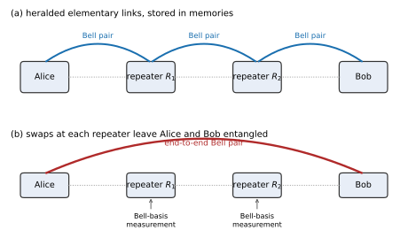

# Chapter 33. Quantum Communication and Networking

> **Status:** prereviewed · **Phase:** 5 · **Sections drafted:** 6 / 6

[← Previous: Chapter 32](32-adjacent-computational-models.md) · [Table of Contents](../../README.md) · [Next: Chapter 34 →](../part-13-perspective-and-direction/34-bridging-to-familiar-engineering-ideas.md)

Computation is one use of quantum mechanics; *communication* is the other, and it is the one that has reached the field earlier. The ideas trace back to the same resource — entanglement — but flow through different infrastructure: not a processor, but a *channel*. A photon traveling through fiber or vacuum can carry a qubit between two laboratories, and two laboratories sharing one Bell pair can do things — superdense coding and teleportation (§7.12), cryptographic key distribution, distributed sensing — that no classical channel between them can do. The trouble is loss. Optical fiber attenuates a photon by roughly $0.2\\,\mathrm{dB/km}$, satellites can punch through atmosphere but cannot keep a quantum memory in low-earth orbit forever, and the no-cloning theorem (§5.13) forbids the classical fix of amplification. Practical quantum networking is therefore an exercise in distributing entanglement against the loss budget — and the architectural ideas (repeaters, swapping, distillation, twin-field protocols, satellites) are all answers to that one constraint.

> **How to read this chapter.** §33.1 collects the two foundational primitives — teleportation and superdense coding — as bidirectional conversions among qubits, ebits, and classical bits, recapping §7.12 in transport language. §33.2 walks through quantum key distribution: BB84, E91, B92, decoy-state, and the rate-distance limit. §33.3 introduces the loss problem and the repeater architectures (DLCZ, entanglement swapping, purification, three repeater generations, memory-assisted vs memoryless). §33.4 covers satellite QKD and the twin-field protocols that have stretched the achievable distance into the $10^3\\,\mathrm{km}$ regime. §33.5 lifts the picture into a *network* of nodes — protocol stacks, topology, primitives, simulators, and the 2026 status of pilot deployments. §33.6 surveys applications beyond key distribution and bridges to Chapter 34. Readers who only want the security story should focus on §33.2 and §33.4; readers interested in the network architecture itself should focus on §33.3 and §33.5.

## 33.1 Communication via Quantum: Teleportation and Superdense Coding

The two foundational communication primitives are introduced in §7.12 in their state-language form. The transport-language framing matters too: each protocol converts among three resources — a *qubit channel*, a *classical bit channel*, and an *ebit* (one maximally entangled pair shared between sender and receiver) — and the conversion rates set the bookkeeping for everything later in the chapter.

**Teleportation.** Resources: $1$ ebit and $2$ classical bits. Effect: transmits $1$ unknown qubit. Alice and Bob share the Bell pair $|\Phi^+\rangle = (|00\rangle + |11\rangle)/\sqrt{2}$. Alice holds an unknown qubit $|\psi\rangle = \alpha|0\rangle + \beta|1\rangle$. The combined three-qubit state factors as

$$
|\psi\rangle \otimes |\Phi^+\rangle = \tfrac{1}{2}\\,\bigl(\\,|\Phi^+\rangle (\alpha|0\rangle + \beta|1\rangle) + |\Phi^-\rangle (\alpha|0\rangle - \beta|1\rangle) + |\Psi^+\rangle (\alpha|1\rangle + \beta|0\rangle) + |\Psi^-\rangle (\alpha|1\rangle - \beta|0\rangle)\\,\bigr),
$$

where the first ket in each term is the Bell-basis state on Alice's two qubits and the second is Bob's qubit. Alice measures her two qubits in the Bell basis, obtaining two classical bits indexing which of the four Bell states she projected onto. She transmits those two bits to Bob over a classical channel. Bob applies one of $\\{I, X, Z, XZ\\}$ keyed by the bits and now holds $|\psi\rangle$ exactly. No qubit traveled; the ebit was consumed, and the classical channel was the only one carrying information. The *cost* of teleportation is therefore one ebit per qubit transmitted, plus two classical bits.

**Superdense coding.** Resources: $1$ ebit and $1$ transmitted qubit. Effect: communicates $2$ classical bits. Alice and Bob again share $|\Phi^+\rangle$. To send bits $b_1 b_2$, Alice applies $Z^{b_1} X^{b_2}$ to her half, mapping the shared state to one of the four Bell states $|\Phi^+\rangle$, $|\Phi^-\rangle$, $|\Psi^+\rangle$, $|\Psi^-\rangle$ depending on $b_1 b_2$. She sends her qubit to Bob through a *quantum* channel. Bob now holds both halves and measures in the Bell basis to recover $b_1 b_2$. One qubit transmission, aided by one ebit, carries two classical bits — twice the Holevo capacity of an unaided qubit channel (§12.5).

**The ebit-qubit-cbit conversion table.** Reading the two protocols together gives a compact picture: an ebit *plus* two classical bits converts to one transmitted qubit (teleportation); an ebit *plus* one transmitted qubit converts to two classical bits (superdense coding). Neither protocol violates the no-signaling theorem (the classical bits or the transmitted qubit are necessary in each case) and neither beats Holevo without the prior entanglement. The lesson generalizes: every protocol later in this chapter — QKD, repeaters, blind computation — is a structured conversion among these three resources, and the rate budgets of practical systems are essentially accounting on this conversion table.

**Why teleportation is the workhorse primitive.** Teleportation does not move quantum information faster than light, and it does not duplicate it (Alice's copy is destroyed by the Bell-basis measurement, in accordance with no-cloning). What it *does* do is decouple the quantum and classical legs of transmission. A pre-distributed pool of ebits, accumulated when channel conditions were favorable, lets Alice transmit a logical qubit later using only a classical channel. This is why entanglement *distribution* — not direct qubit transmission — is the engineering target of every quantum network architecture in §33.3 and §33.5.

## 33.2 Quantum Key Distribution

If two parties share a uniformly random secret key, they can communicate with perfect secrecy via the one-time pad. The hard part is establishing the key. Quantum key distribution (QKD) uses a quantum channel plus an authenticated classical channel to let Alice and Bob agree on a shared random key whose secrecy is guaranteed by the laws of physics rather than by computational hardness assumptions. Chapter 27 sketches QKD as a cryptographic primitive; this section gives the protocol-level picture relevant to network engineering.

**BB84 (Bennett–Brassard 1984).** Alice prepares a sequence of single-photon qubits, each picked uniformly at random from $\\{|0\rangle, |1\rangle, |+\rangle, |-\rangle\\}$ — half encoded in the $Z$ basis, half in the $X$ basis. She sends them one by one to Bob over a quantum channel. Bob measures each photon in either the $Z$ or $X$ basis, chosen uniformly at random and independently of Alice. After transmission, they announce their basis choices on a public classical channel and *discard* every position where the bases disagree, keeping the rest as the *sifted key*. They sacrifice a random subset of sifted bits to estimate the quantum bit-error rate (QBER); below threshold (typically $11\%$ for asymptotic BB84), they apply classical error correction and privacy amplification to extract a final key. Any eavesdropper Eve who attempts to measure a photon in transit must guess a basis; the wrong-basis guesses introduce errors that show up in the QBER estimate.

**E91 / Ekert (1991).** The entanglement-based reformulation. A source (which may be operated by Eve) emits pairs of photons in the Bell state $|\Phi^+\rangle$, sending one photon to Alice and one to Bob. Each party measures their photon in one of several pre-agreed bases (typically three, chosen to form a CHSH-style inequality test). They sift on matched-basis rounds for key generation and use the mismatched-basis rounds to estimate a CHSH-style Bell parameter. A maximal violation of the CHSH inequality (§7.9) certifies that the source genuinely produced an entangled pair — which by self-testing arguments (§31.5) certifies the *measurements* up to local isometry, and forecloses an intercept-resend attack regardless of what Eve actually built into the source. E91 is the conceptual ancestor of *device-independent QKD*, where the security proof requires no assumption about the internal workings of Alice's or Bob's devices. In practice that ideal is demanding: a deployed device-independent proof must also close the detection-efficiency and locality loopholes and survive a finite-key analysis — conditions far harder to meet than for prepare-and-measure BB84, which is why fielded QKD is overwhelmingly BB84-type rather than fully device-independent.

**B92 (Bennett 1992).** A two-state protocol: Alice sends one of two *non-orthogonal* states (e.g., $|0\rangle$ and $|+\rangle$) with equal probability, and Bob performs an unambiguous-state-discrimination measurement that either identifies the state correctly or produces an inconclusive outcome. The inconclusive rounds are discarded; the rest become the sifted key. B92 is simpler than BB84 to implement (only two states to prepare) but more sensitive to loss and more wasteful of photons.

**Decoy-state QKD.** Real photon sources are not single-photon emitters; they are weak coherent pulses with Poisson photon statistics, occasionally containing two or more photons. A photon-number-splitting attack lets Eve siphon off the extra photons from multi-photon pulses without disturbing the single-photon ones, defeating the original BB84 security argument. The decoy-state protocol (Hwang 2003, Lo et al. 2005, Wang 2005) randomizes Alice's mean photon number across several values (the signal intensity and one or two decoy intensities), interleaved at random. Eve cannot tell which pulse is which, so any photon-number-splitting attack she launches affects all intensities equally — and the relative count rates across intensities let Alice and Bob bound the single-photon contribution to the sifted key. Decoy states close the photon-number loophole and are now standard in every deployed BB84 system.

**Rate-distance scaling: the PLOB bound.** Pirandola, Laurenza, Ottaviani, and Banchi (2017) proved that any QKD protocol over a *direct* lossy channel of transmittance $\eta$ has secret-key rate at most

$$
R_{\mathrm{PLOB}} = -\log_2(1 - \eta) \quad\text{bits per channel use}.
$$

For optical fiber at the standard $0.2\\,\mathrm{dB/km}$ attenuation, $\eta = 10^{-L/50}$ at distance $L$ km, so the asymptotic rate decays *exponentially* with distance: a factor of $10$ per $50$ km. At $200$ km the rate is of order $10^{-4}$ bits per channel use; at $500$ km, of order $10^{-10}$. This is a hard ceiling — no protocol-level cleverness in BB84, B92, or E91 can beat it on a direct channel. Beating PLOB requires *adding infrastructure*: intermediate nodes that relay entanglement (repeaters, §33.3), a satellite link that bypasses fiber (§33.4), or a clever measurement geometry that breaks the direct-channel assumption (twin-field QKD, also §33.4).

**Deployed BB84.** Commercial BB84 boxes (ID Quantique, Toshiba, QuantumCTek, KEEQuant) operate at clock rates of several GHz over metropolitan distances of $50$–$100$ km of dark fiber, with secret-key rates in the $\mathrm{kbit/s}$–$\mathrm{Mbit/s}$ range. The Beijing–Shanghai backbone, the EuroQCI pilot lines, and several US testbeds all run decoy-state BB84 in production today. The integration question is not whether QKD works — it does, routinely — but whether it earns its keep against post-quantum cryptographic alternatives (§27.4) in a given threat model.

## 33.3 Distance Limits and Quantum Repeaters

Fiber loss is the central engineering antagonist of quantum networking. A photon launched into single-mode fiber at $1550\\,\mathrm{nm}$ — the telecom wavelength chosen precisely because it sits in the silica absorption minimum — survives a length $L$ km of fiber with probability $\eta = 10^{-0.02\\, L}$. At $L = 100\\,\mathrm{km}$, $\eta \approx 1\%$. The classical fix would be a repeater that amplifies the signal; the quantum world forbids cloning, so a no-cloning-compatible substitute must be found.

**Entanglement swapping: the core trick.** Suppose Alice and Bob each share a Bell pair with an intermediate node Charlie — Alice with Charlie's first qubit, Bob with Charlie's second. Charlie performs a Bell-basis measurement on his two qubits. The measurement outcome (one of four outcomes, i.e. two classical bits) projects Alice's and Bob's qubits into a Bell state determined by the outcome, and the entanglement Alice and Bob no longer share with Charlie is now shared *between Alice and Bob directly*. Entanglement has been *swapped* through Charlie without any quantum information traversing the full Alice–Bob path. Iterating: a chain of intermediate nodes, each sharing Bell pairs with its neighbors, can swap end-to-end entanglement across an arbitrary number of hops — provided each elementary link succeeds with high enough probability and the qubits stay coherent long enough to participate in the swap.

**The repeater problem.** Elementary link generation is probabilistic in any realistic photonic implementation (loss, dark counts, finite source brightness). A naive chain of $n$ probabilistic links has end-to-end success probability $p^n$, exponentially small in $n$. The whole point of a *repeater* is to break that exponential by inserting quantum memories at the intermediate nodes: each link generates entanglement asynchronously and stores it until its neighbor also has a stored ebit, at which point the swap fires. The expected end-to-end generation time scales polynomially (not exponentially) in $n$, at the price of needing quantum memories with coherence times longer than the network's classical signaling delay.

**DLCZ (Duan–Lukin–Cirac–Zoller 2001).** The foundational memory-assisted repeater protocol. Each node is an atomic ensemble (originally a cold-atom cloud, more recently a rare-earth-doped crystal or a nitrogen-vacancy ensemble) coupled to an optical cavity. A Raman pulse on the ensemble — a laser pulse that scatters one photon (the *Stokes* photon) off the atom cloud while flipping one collective spin — leaves that photon entangled with the stored spin excitation — a *spin-photon ebit* stored half in the ensemble and half in the emitted photon. The photon from one node and the photon from a neighboring node interfere on a 50:50 beam splitter at a midpoint station; a single click at one of the two output detectors heralds entanglement *between the two ensembles* via a swap of the photonic mode. Stored ensembles at adjacent nodes are then swapped pairwise to extend the entanglement, with the swap implemented by retrieving the spin excitations back into photons and interfering them. DLCZ established the architectural template — memory plus heralded link generation plus swapping — that every subsequent repeater proposal inherits.

**Purification (entanglement distillation).** Real ebits are mixed, not pure: channel noise, source imperfections, and memory decoherence all degrade the fidelity of stored Bell pairs. *Entanglement purification* (Bennett–Brassard–Popescu–Schumacher–Smolin–Wootters 1996, Deutsch et al. 1996) consumes two noisy ebits of fidelity $F$ at each end to produce one higher-fidelity ebit of fidelity $F' > F$, conditional on a classical announcement of measurement outcomes. The recurrent application of purification — two noisy ebits in, one cleaner ebit out, repeated — drives the fidelity toward $1$ at the cost of an exponentially shrinking yield. A repeater chain interleaves swaps (which extend distance but compound fidelity loss) with purification rounds (which restore fidelity at the price of yield), and the design problem is to schedule swaps and purifications so the end-to-end rate is maximized against the available memory and link-success budgets.

**Three repeater generations.** Briegel, Dür, Cirac, Zoller (1998) introduced the first-generation classification; later refinements (Muralidharan et al. 2016) give the modern three-tier picture.

- *First-generation* repeaters use heralded link generation, quantum memories, entanglement swapping, and *probabilistic* purification with two-way classical communication between nodes. The end-to-end rate is polynomial in distance, but limited by the round-trip classical signaling time between adjacent nodes during the purification rounds. DLCZ and all current laboratory demonstrations fall in this class.
- *Second-generation* repeaters replace probabilistic purification with *deterministic* quantum-error-correcting codes (small block codes, surface-code patches) that correct memory and gate errors locally. Two-way classical communication is still required for the swap, but not for the within-node error correction. The rate ceiling rises because the slow purification rounds drop out of the critical path.
- *Third-generation* repeaters drop two-way classical communication entirely. Each link transmits an *encoded* qubit (a logical photon in a multi-photon error-correcting code such as the cat-code, GKP code, or parity code) and applies one-way error correction at the receiving node. The bottleneck becomes the encoding overhead at each station, not the round-trip time. Third-generation repeaters approach the rate of a classical amplifier in scaling, at the cost of needing logical-qubit error correction on every link.

The current laboratory state of the art is solidly first-generation: heralded entanglement between two nitrogen-vacancy nodes over several kilometers of fiber (Delft, $2021$–$2024$), trapped-ion node-to-node links over $\sim 200\\,\mathrm{m}$ of free space (Innsbruck, Oxford), and rare-earth-doped crystal memories with coherence times approaching $1\\,\mathrm{s}$ (Geneva, Caltech). No deployed network yet runs even a single first-generation repeater node in the wild.

**Memory-assisted vs memoryless.** A distinction that matters in practice: a *memoryless* repeater performs only entanglement swapping without local storage, requiring all elementary links along the chain to succeed simultaneously. This restores the exponential-in-distance scaling and is useful only for short chains or for measurement-device-independent protocols (see §33.4). A *memory-assisted* repeater (DLCZ and all subsequent designs) stores entanglement until both adjacent links are ready, decoupling the success-probability product and giving the polynomial scaling that motivates the whole architecture. The memory's coherence time, retrieval efficiency, and multimode capacity are the figures of merit that determine which physical platform can host a repeater node.

## 33.4 Satellite QKD and Twin-Field Protocols

Beyond a few hundred kilometers of fiber, the PLOB bound makes direct QKD impractical, and no quantum repeater is yet deployable. Two architectural detours have nonetheless extended quantum communication into the intercontinental and the $10^3\\,\mathrm{km}$-fiber regimes.

**Satellite QKD.** A photon traveling from a low-earth-orbit satellite down to a ground station passes through most of the atmosphere in the lowest $10\\,\mathrm{km}$; above that, vacuum is essentially loss-free. The end-to-end transmittance of a $500\\,\mathrm{km}$-altitude downlink at $1550\\,\mathrm{nm}$ is around $10$–$30\\,\mathrm{dB}$ depending on weather, pointing accuracy, and telescope aperture — *less* loss than $300\\,\mathrm{km}$ of fiber. The Chinese **Micius** satellite, launched in $2016$ and operational since $2017$, demonstrated decoy-state BB84 between the satellite and ground stations at Xinglong, Nanshan, and Graz; the satellite-relayed protocol delivered a shared key between Beijing and Vienna over $7600\\,\mathrm{km}$, enabling the first intercontinental QKD-secured videoconference. Subsequent Micius demonstrations distributed Bell-pair entanglement between two ground stations separated by $1200\\,\mathrm{km}$ — the source on the satellite, both photons sent down through atmosphere — and ran entanglement-based E91 over the same link.

By $2026$ several commercial and national satellite-QKD missions have followed: SpeQtre and SpeQtral-1 (Singapore), QEYSSat (Canada), the EAGLE-1 mission (ESA/EU), and the QUBE-II and CAPSat technology demonstrators. The $2024$–$2026$ window has seen the first non-experimental satellite-QKD service offerings — limited-bandwidth, mostly point-to-point, but operational — primarily to government and financial customers. Constellations of QKD satellites with optical inter-satellite links are funded but not yet flying.

**Twin-field QKD.** Lucamarini, Yuan, Dynes, and Shields ($2018$) introduced a measurement-device-independent variant of BB84 that beats the PLOB bound for *direct* fiber links. Alice and Bob each prepare phase-randomized weak coherent pulses encoding the key bit in the optical phase, and send them to an *untrusted* relay at the midpoint. The relay interferes the two pulses on a 50:50 beam splitter and announces single-photon detection events at one of its two output ports. Because the signal travels only half the total distance from each user to the midpoint, the secret-key rate scales as $\sqrt{\eta}$ in the total channel transmittance $\eta$ rather than $\eta$ itself — a *quadratic* improvement that lifts the rate-distance ceiling without quantum memories or repeaters.

Twin-field QKD has been demonstrated over $511\\,\mathrm{km}$, $605\\,\mathrm{km}$, $658\\,\mathrm{km}$, $830\\,\mathrm{km}$, and (as of recent demonstrations) more than $1000\\,\mathrm{km}$ of installed and ultra-low-loss fiber by groups in Shanghai, Hefei, Toshiba Cambridge, and the Beijing–Tianjin testbed. The relay is *measurement-device-independent*: any tampering at the relay affects both arms identically, and the security proof does not need to trust the midpoint hardware. Twin-field is the only QKD protocol that beats PLOB without inserting a quantum memory anywhere in the link, and it is the leading near-term candidate for backbone fiber QKD beyond the $300\\,\mathrm{km}$ threshold where BB84 collapses.

**MDI-QKD.** Lo, Curty, and Qi ($2012$) had already introduced *measurement-device-independent* QKD (without the twin-field rate boost): both users send BB84 states to a central, untrusted relay that performs a Bell-state measurement. MDI-QKD removes all detector-side attacks (the dominant practical attack surface in commercial QKD boxes) by making the detector untrusted by design. Twin-field can be viewed as a single-photon-interference refinement of MDI-QKD that recovers $\sqrt{\eta}$ scaling.

## 33.5 Quantum Networks: Stacks, Topology, and the Q-Internet

A *network* is more than two parties with a channel; it is a routable, multi-user, layered system. The quantum-network research community has spent the past decade adapting the OSI/TCP-IP layering discipline to a substrate whose primitive is the ebit rather than the bit.

**The Wehner–Elkouss–Hanson stack.** Wehner, Elkouss, and Hanson ($2018$, *Science*) and subsequent work define a four-layer model that has become the reference architecture for quantum-network protocols.

- The *physical* layer drives one elementary link: heralded entanglement generation between two adjacent nodes via the channel-specific photonic protocol (DLCZ, single-click, two-click, photon-number-resolving). Outputs: classical heralding signals and a stored ebit at each end.
- The *link* layer turns the probabilistic, lossy physical link into a *robust* entanglement-generation service. It batches requests, retries failed attempts, and exposes a queue-and-acknowledge interface much like Ethernet's MAC layer.
- The *network* layer routes entanglement across multi-hop paths by coordinating swaps at intermediate nodes. It is the analog of IP: a path-selection algorithm picks a chain of nodes, requests link-layer ebits along each hop, and schedules swaps to deliver end-to-end entanglement to the requesting application.
- The *transport* layer composes purification, distillation, and end-to-end fidelity guarantees, exposing high-level primitives — "give me an ebit of at least fidelity $F$ to node $B$" — to applications such as QKD, distributed computation, and clock synchronization.

The five-layer extension (adding an *application* layer at the top) is the working framing in most current research, with QKD, blind quantum computing, and distributed quantum sensing each sitting as named application protocols.

**Simulators and tooling.** Several research-grade simulators implement this stack today: **NetSquid** (TU Delft, discrete-event, hardware-detailed), **SeQUeNCe** (Argonne, discrete-event, focused on scheduling and topology), **QuISP** (Keio, scalable network-level simulation), **SimQN** (network-level abstraction, easier scripting), **SimulaQron** (TU Delft, application-layer), and the **Quantum Network Explorer** (QNE, QuTech — a NetSquid-backed platform used in the European quantum-internet effort). The simulator question is not yet settled — each is in active development — but the existence of tooling that lets a network engineer simulate end-to-end entanglement distribution over arbitrary topology at $10^3$-node scale is itself a $2022$-onwards development that did not exist when DLCZ was published.

**Network primitives.** Independent of which simulator one uses, the same five operational primitives recur:

- *Entanglement generation*: produce a heralded ebit on a single physical link.
- *Entanglement swapping*: extend an end-to-end ebit by Bell-measuring at an intermediate node.
- *Entanglement distillation*: combine two noisy ebits into one higher-fidelity ebit, sacrificing yield for fidelity.
- *Multipartite-entanglement distribution*: produce a GHZ or graph state shared across more than two nodes, by sequenced swaps and local Clifford operations on a coordinated set of ebits.
- *Quantum-state transfer*: deliver an arbitrary $|\psi\rangle$ from one node to another, almost always implemented as ebit distribution followed by teleportation.

GHZ distribution deserves a separate note: a three-party GHZ state shared across nodes $A$, $B$, $C$ enables conference-key agreement (a generalized QKD with a single shared key among $\geq 3$ parties), anonymous voting protocols, and distributed-sensing tasks (§33.6). The standard recipe is to generate Bell pairs along a star topology centered on $A$, then have $A$ entangle them via a local $\mathrm{CNOT}$-and-measure pattern; the procedure generalizes straightforwardly to any graph state.

**Topology.** Three canonical topologies recur in pilot deployments and research designs.

- *Star*: one hub node holds direct ebits with each of $n$ leaves. Adding a new leaf is cheap; routing is trivial. The hub is a single point of failure and a single point of trust (in any protocol where the hub participates in the entanglement, not just relays it).
- *Linear chain*: a one-dimensional sequence of repeater nodes between two endpoints. The natural topology for long-distance backbone QKD or for any point-to-point service over a fiber-loss-dominated path. Every interior node is on the critical path.
- *Mesh*: a graph with multiple paths between endpoint pairs, enabling load balancing, fault tolerance, and shorter-path routing. Mesh is the goal of any city-scale quantum-network deployment but is also the hardest to schedule — entanglement requests across overlapping paths contend for the same intermediate-node memory slots.

The pilot fiber QKD networks running in $2026$ — the Beijing–Shanghai backbone (China), the EuroQCI testbeds (Italy, Spain, Germany, France, the Netherlands), the Tokyo metropolitan QKD network, and several US testbeds (Chicago–Argonne–Fermilab, the Brookhaven–Stony Brook Long Island testbed, MIT Lincoln Lab) — are mostly star or short linear chains with trusted-node relays at intermediate points. Trusted-node operation means the intermediate nodes decrypt and re-encrypt the key in classical memory between each hop, which sacrifices the end-to-end physical-security guarantee in exchange for *immediate* operability without repeaters. A true repeater-based network is the next-generation goal; no large-scale untrusted-relay quantum internet exists in $2026$.

**Practical state in 2026.** Several pieces are operational at production-engineering quality: decoy-state BB84 over metropolitan fiber, twin-field QKD over long fiber, satellite-relayed QKD for intercontinental keys, commercial QKD boxes in financial and government deployment. Other pieces are at the late-prototype stage: $2$–$3$-node NV-center repeaters in the laboratory, rare-earth-crystal memories at second-scale coherence, GHZ-state distribution among three nodes. The integration of the prototype repeater hardware with the operational QKD backbone — i.e., the transition from trusted-node relays to memory-assisted repeaters — is the central engineering milestone that has *not* yet happened anywhere in the world. The vocabulary of a quantum internet, an entanglement-as-a-service backbone, and routed multi-user quantum protocols is therefore well-developed; the deployed substrate is still patchy.

## 33.6 Applications Beyond QKD and Bridge to Chapter 34

QKD is the headline application of quantum networking, but it is not the only one — and several of the others have already moved into pilot demonstrations.

**Distributed quantum sensing.** Multiple sensor nodes sharing a GHZ or NOON-type entangled state can estimate a *global* parameter (the average magnetic field over a region, the phase profile of a coherent source) at Heisenberg-limited precision, even when each node individually observes only local information. The protocol mirrors §31.1's GHZ Fisher-information calculation but with the GHZ state physically distributed across the sensor array via a quantum network. Demonstrations between three or four nodes connected by short fiber links exist as of $2024$–$2026$; field deployment over kilometer-scale baselines is the goal of several ongoing programs, with applications to long-baseline interferometric telescopes (a Heisenberg-limited successor to the Event Horizon Telescope's classical VLBI), distributed clock comparison, and dark-matter searches.

**Blind quantum computing.** Broadbent, Fitzsimons, and Kashefi ($2009$) introduced a protocol in which a client with only single-qubit-preparation capabilities can delegate a quantum computation to an untrusted server, with the server learning *nothing* about the input, the algorithm, or the output. The client prepares random single qubits, sends them to the server, instructs the server to run a measurement-based computation on them (§32 covers MBQC), and receives the encrypted measurement outcomes. A network-enabled variant lets clients access a remote quantum cloud while keeping their workloads cryptographically hidden — the quantum analog of homomorphic encryption. The protocol composes cleanly with QKD-secured channels.

**Distributed quantum computing.** Two or more small quantum processors, connected by a quantum network, can in principle simulate a larger processor whose Hilbert-space dimension is the product of the local dimensions — provided non-local gates between processors can be executed at acceptable fidelity. The standard non-local-gate primitive is *gate teleportation*: a $\mathrm{CNOT}$ between qubits at different nodes can be implemented by consuming one ebit, two single-qubit measurements, two classical bits, and one local correction at each node. The cost is one ebit per non-local two-qubit gate, which sets the bandwidth requirement of any distributed quantum computer: the ebit-generation rate of the network must exceed the non-local-gate rate of the distributed algorithm. Several proposals scale up modular trapped-ion and superconducting architectures by linking modules via short photonic interconnects rather than running monolithic chips; the first proof-of-principle two-module logical-qubit demonstrations appeared in $2024$–$2025$.

**Anonymous voting and other multiparty primitives.** A GHZ state shared among $n$ parties enables anonymous-broadcasting protocols (a sender can broadcast a bit to all $n$ parties without revealing their identity), anonymous voting (each party announces a vote without revealing which vote came from whom), and Byzantine agreement variants with stronger security than the classical achievables. None of these is deployed at scale, but each has reached small-network laboratory demonstration, and each motivates the multipartite-entanglement-distribution primitive of the network stack.

**Other primitives.** Clock synchronization by entangled-state distribution improves the timing-transfer precision past the standard quantum limit; *secret sharing* with quantum states gives an information-theoretically secure analog of Shamir's scheme; *coin flipping* and *bit commitment* admit quantum variants with security guarantees that depend subtly on which subset of the no-go theorems (Mayers–Lo–Chau) apply to the model in use. The catalog grows — most additions are research demonstrations rather than deployed protocols, but each anchors the case that quantum networks will be more than long-distance key-distribution pipes.

---

### Bridge to Chapter 34

This chapter and Chapter 32 close the *adjacent computational models* part of the book by widening the scope past the gate-model, single-machine picture that dominated Parts II–X. Chapter 32 covered alternative *computational* models (measurement-based, adiabatic, continuous-variable, topological). This chapter covered the *communication* substrate that lets independent quantum systems cooperate — teleportation and superdense coding as the foundational primitives, QKD as the leading application, repeaters as the central engineering problem, satellites and twin-field protocols as the operational workarounds for fiber loss, network stacks and topologies as the architectural framing, and distributed sensing, blind computation, distributed computation, and anonymous voting as the applications beyond key distribution.

Chapter 34 turns from quantum specifics back outward, bridging the material of this book to *engineering intuitions* that experienced software engineers, distributed-systems architects, and security professionals already carry. The threads of this chapter map naturally: a quantum network is a layered protocol stack with a different physical primitive; a quantum repeater is a router under a no-cloning constraint; QKD is a key-agreement protocol with an information-theoretic rather than computational security model; gate teleportation is RPC where the call cost is paid in entanglement rather than in latency. Reading the next chapter alongside this one is the recommended way to assemble the engineering picture.

**Sanity checks before moving on.**

1. Teleportation consumes one ebit and two classical bits per qubit transmitted. Verify by counting resources used in the four-term Bell-basis expansion of §33.1: which terms supply the classical bits, which the ebit, and how do they convert into Bob's single-qubit correction?
2. The PLOB bound caps the secret-key rate of any direct lossy-channel QKD protocol at $-\log_2(1-\eta)$ bits per channel use. At $0.2\\,\mathrm{dB/km}$ fiber attenuation, what is $\eta$ at $L = 100\\,\mathrm{km}$, and what is the maximum asymptotic key rate per channel use at that distance? Twin-field QKD scales as $\sqrt{\eta}$ instead of $\eta$ — by how many orders of magnitude does the rate improve at $L = 500\\,\mathrm{km}$?
3. A first-generation memory-assisted repeater with $n$ segments has end-to-end entanglement-generation time scaling polynomially in $n$, while a memoryless chain of $n$ probabilistic links each succeeding with probability $p$ has end-to-end success probability $p^n$. For $p = 0.01$ and $n = 10$, compare the two scalings explicitly: how many trials does the memoryless chain need on average, and how does the memory-assisted version compare given a memory coherence time longer than the round-trip time?
4. Superdense coding sends two classical bits using one qubit transmission and one ebit, against the Holevo bound of one classical bit per qubit without entanglement. Where does the *second* bit's information physically reside between Alice's encoding and Bob's measurement? (It is not in either qubit individually — verify this by computing the single-qubit reduced density matrices.)
5. A satellite-to-ground QKD link at $500\\,\mathrm{km}$ altitude has approximate transmittance $\eta_{\mathrm{sat}} \sim 10^{-2}$, while $500\\,\mathrm{km}$ of fiber has $\eta_{\mathrm{fiber}} = 10^{-10}$. Express the satellite advantage in dB and explain why this single number is the architectural justification for hundred-million-dollar-class QKD satellite missions over still-larger ground repeater networks.

---

[← Previous: Chapter 32](32-adjacent-computational-models.md) · [Table of Contents](../../README.md) · [Next: Chapter 34 →](../part-13-perspective-and-direction/34-bridging-to-familiar-engineering-ideas.md)
